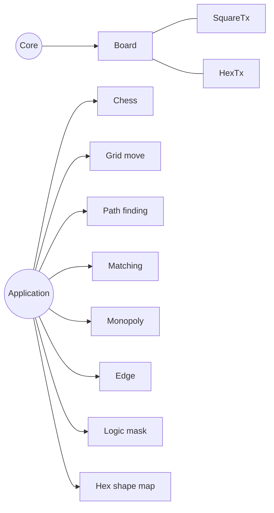
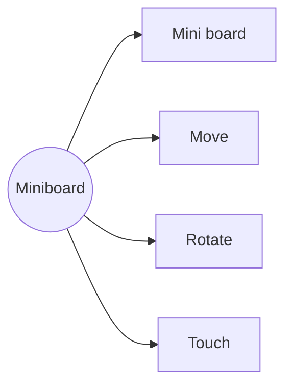
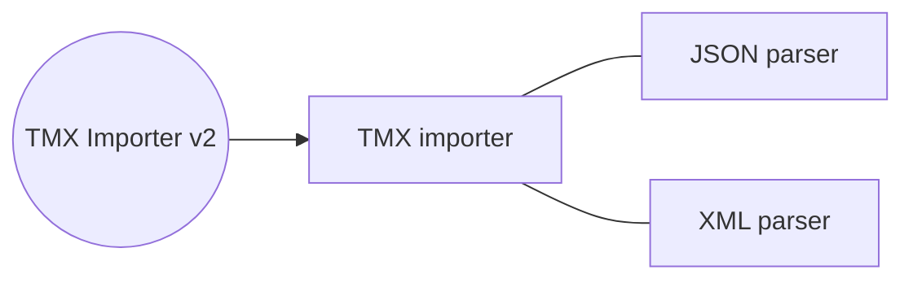
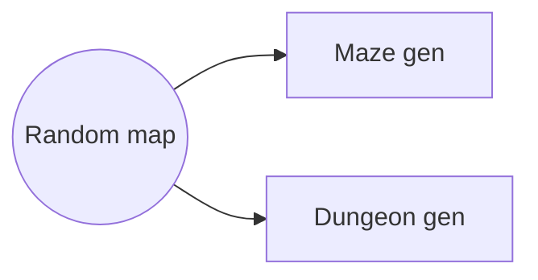

# [Index](index.html) > Board

## Board

- Core
  - [Board](rex_board.html)
  - SquareTx
  - HexTx
- Application
  - Chess
  - Grid Move
  - Path finding
  - Matching
  - Edge
  - Logic mask
  - Hex shape

## Mini board

## TMX

## Random map

