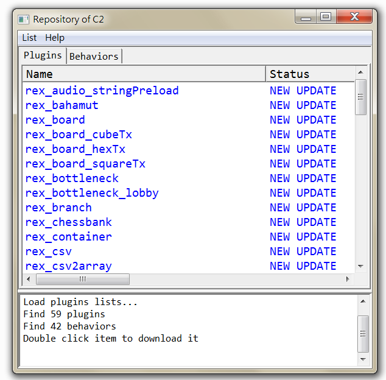

# [Home](index.html) > My plugins repository v3

## Introduction

This tool could help C2 designers to get my plugins and behaviors -- download and unzip them into their C2 folder from my [github](https://github.com/rexrainbow/C2RexDoc/blob/master/repo/index.md).

## Links

- [Tool](https://1drv.ms/u/s!Am5HlOzVf0kHlnTQ68zSnmnOe3X9)

  ​

------

[TOC]

## Usage

### Install and Run

Just download this tool, unzip it, double click **app.exe**.
For first running, the tool will pop-up a dialog to assign the C2 root path. After that, it will show plugins and behaviors lists.
There are three kinds of plugin status.

- **NEW ARRIVING** : this plugin only on server.
- **NEW UPDATE** : this plugin has been updated, so that user might need download it.
- **LATEST** : this plugin has not been updated. So it is latest.

Drag the button scroll bar to right side to see the **Description** fields of each plugin.

### Download

Double click plugin to download it. Or click **menu bar -> List -> Download all** to download all  plugins and behaviors excepted **LATEST** plugins.
**Run C2Repo in administer mode if your C2 root path is on `C:\Program Files\Construct 2\`**.

### Other features

**menu bar -> List -> Ignored updated** will change all status to **LATEST**.