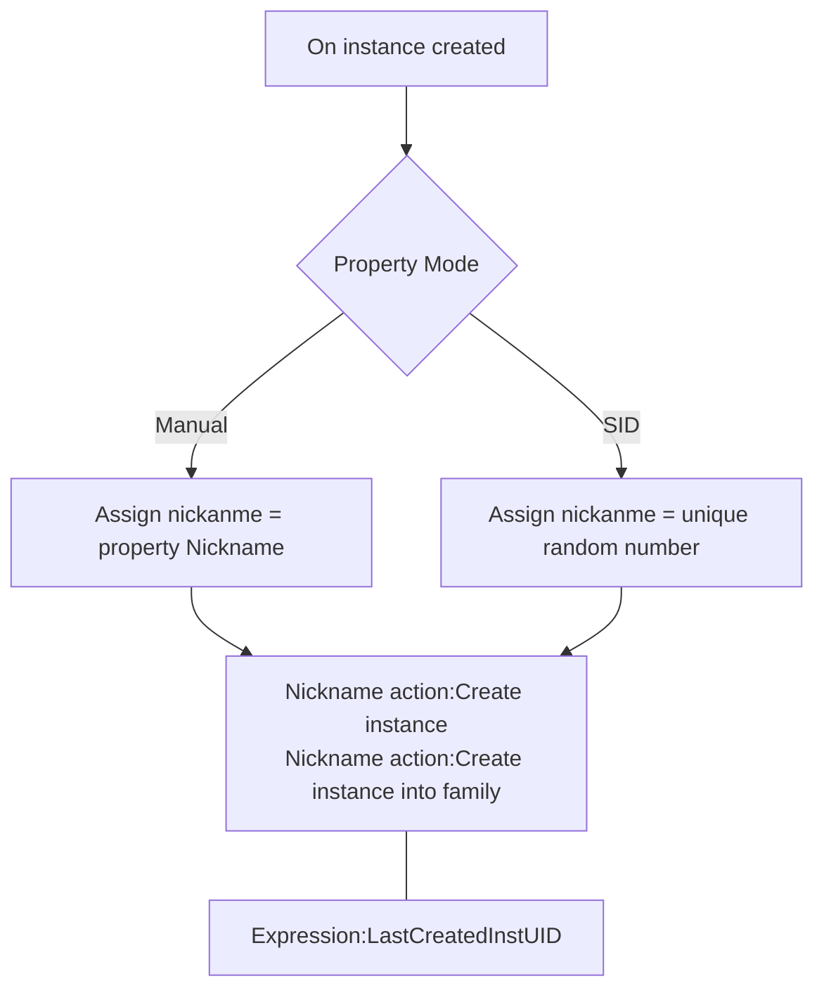

# [Categories](categories.index.html) > [System](system.index.html) > rex_bnickname

## Introduction

Assign a nickname of this object

## Links

- [Plugin](https://dl.dropboxusercontent.com/u/5779181/C2Repo/Zip/plugins/rex_nickname.7z)
- [ACE table](https://rexrainbow.github.io/C2RexDoc/c2rexpluginsACE/plugin_rex_nickname.html)
- [Discussion thread](https://www.scirra.com/forum/plugin-nickname-behavior-nickname_t74522)

----

[TOC]

## Dependence

- [rex_nickname](rex_nickname.html)

## Usage

[Sample capx](https://onedrive.live.com/redir?resid=7497FD5EC94476E!256&authkey=!AH5dJV3CHDMMfh4&ithint=file%2c.capx)

1. Assign nickname, when instance created
   - Equal to `Action:Assign nickname` in [rex_nickname](rex_nickname.html)
   - Property `Mode`
     - `Manual` : nickname = property `Nickname`
     - `SID` : nickname = an unique random number  ([Sample capx](https://onedrive.live.com/redir?resid=7497FD5EC94476E!471&authkey=!AA7oz2AgtPy4GAA&ithint=file%2c.capx))
2. Create instance by action in [rex_nickname](rex_nickname.html)
   - `Action:Create instance`
   - `Action:Create instance into family`