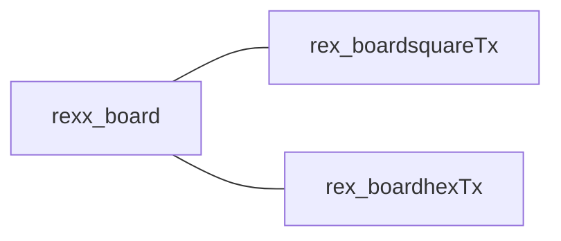
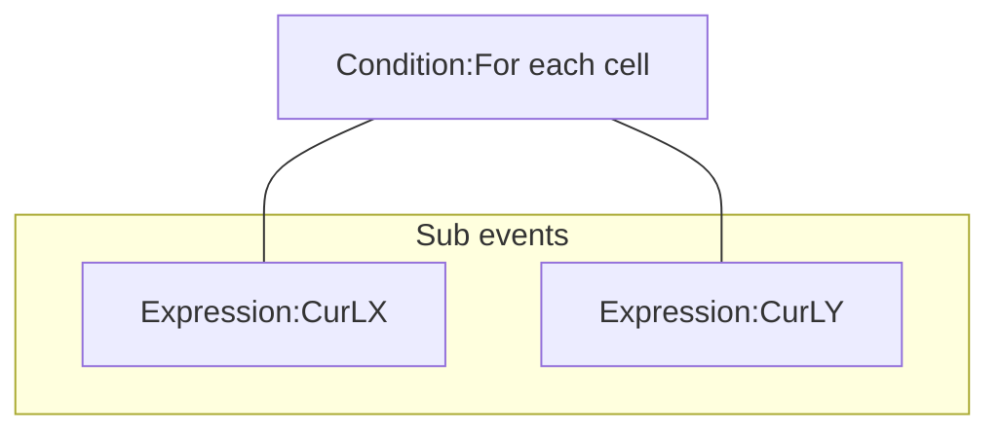

# [Index](index.html) > [Board](board.index.html) > rex_board

[TOC]

## Introduction

This plugin is a data structure of *2d array*(x,y)+*1d hash-table(z)*, to store the logical position of chess. This 2d array could be an orthogonal, isometric or hexagonal tile map combined with [rex_board_squareTx](rex_board_squaretx.html) or [rex_board_hexTx](rex_board_hextx.html) plugin.

- rex_board +[rex_board_squareTx](rex_board_squaretx.html) = orthogonal or isometric, or staggered 
- rex_board + [rex_board_hexTx](rex_board_hextx.html) = hexagonal

It is a based plugin of my board-series plugins/behaviors.

## Usage##

### Create chess

[Sample capx](https://onedrive.live.com/redir?resid=7497FD5EC94476E!521&authkey=!ABKjYmMcxdof4EA&ithint=file%2c.capx)

#### Setup layout

User should put one of board-layout plugin 

- [rex_board_squareTx](rex_board_squaretx.html) : orthogonal/isometric/staggered layout
- [rex_board_hexTx](rex_board_hextx.html) : hexagonal layout

into project. Each board object should have a board-layout object.

If the project has more then one boards, and each board has different board-layout, they need to assign board-layout object manually by `Action:Setup layout`.

#### Size

The board size could be set by `Width` and `Height` at properties table. Or use `Action:Set board width`, `Action:Set board height`.

Read size back by `Expression:BoardWidth`, `Expression:BoardHeight`.

#### Logical position

Each chess or tile has a logical position **(x,y,z)**. Each logical position only could have one instance(chess/tile).
x and y are number type,

- index x is start at 0, to `board.width`-1.
- index y is start at 0, to `board.height`-1.

z could be number or string,

- **z=0 is a tile**. It will be used in other plugins  or behaviors.
- other z indexes are chess.

#### Retrieve each cell

[Sample capx](https://onedrive.live.com/redir?resid=7497FD5EC94476E!2190&authkey=!AO0wKF2e8k_pwoQ&ithint=file%2ccapx)
Uses `Condition:For each cell` to retrieve all cells, get current logical X, logical Y index by ( `Expression:CurLX`, `Expression:CurLY` ).

