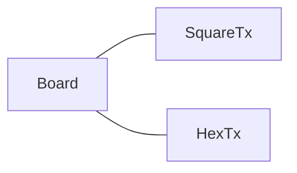
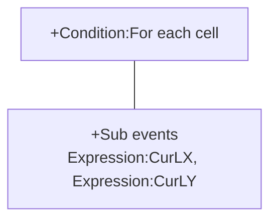
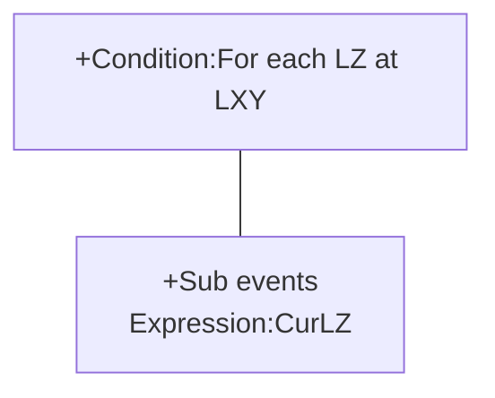
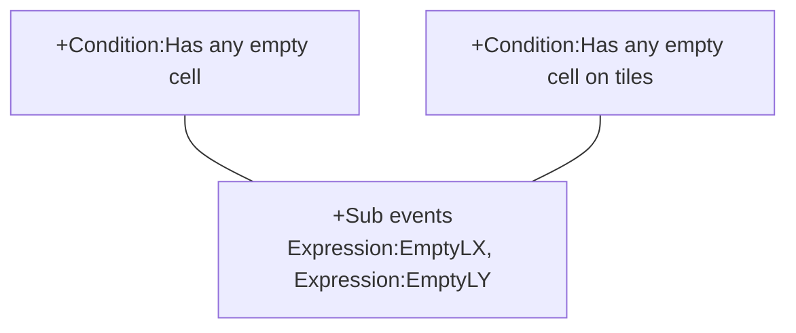
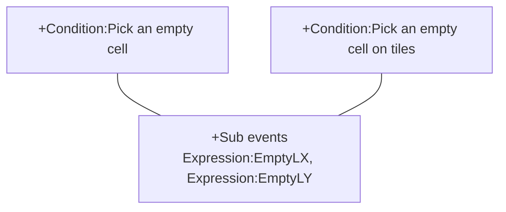
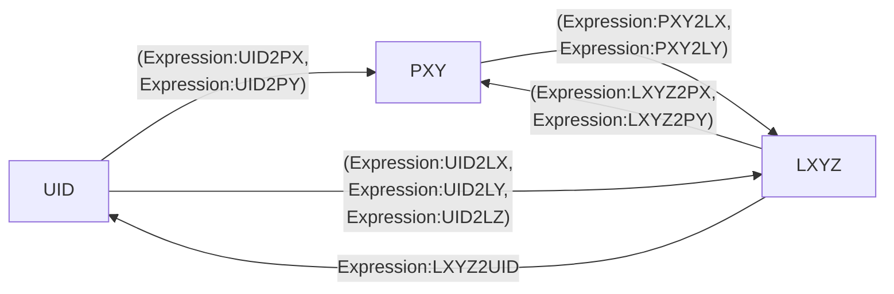

# [Index](index.html) > [Board](board.index.html) > rex_board

[TOC]

## Introduction

This plugin is a data structure of *2d array*(x,y)+*1d hash-table(z)*, to store the logical position of chess. This 2d array could be an orthogonal, isometric or hexagonal tile map combined with [rex_board_squareTx](rex_board_squaretx.html) or [rex_board_hexTx](rex_board_hextx.html) plugin.

- rex_board + [rex_board_squareTx](rex_board_squaretx.html) = orthogonal or isometric, or staggered 
- rex_board + [rex_board_hexTx](rex_board_hextx.html) = hexagonal

It is a based plugin of my board-series plugins/behaviors.

## Usage##

### Configure board

[Sample capx](https://onedrive.live.com/redir?resid=7497FD5EC94476E!521&authkey=!ABKjYmMcxdof4EA&ithint=file%2c.capx)

#### Setup layout

User should put one of board-layout plugin 

- [rex_board_squareTx](rex_board_squaretx.html) : orthogonal/isometric/staggered layout
- [rex_board_hexTx](rex_board_hextx.html) : hexagonal layout




into project. Each board object should have a board-layout object.

If the project has more then one boards, and each board has different board-layout, they need to assign board-layout object manually by `Action:Setup layout`.

#### Size

The board size could be set by `Width` and `Height` at properties table. Or use `Action:Set board width`, `Action:Set board height`.

Read size back by `Expression:BoardWidth`, `Expression:BoardHeight`.

#### Logical position

Each chess or tile has a logical position **(x,y,z)**. Each logical position only could have one instance (chess or tile).
x , y are number type,

- index x is start at 0, to `board.width`-1.
- index y is start at 0, to `board.height`-1.

z could be number or string,

- **z=0 is a tile**. It will be referenced at other plugins or behaviors.
- other z indexes are chess.

### Create chess

Use one of these actions to create and add tile (lz = 0) or chess instance on the board, 

- `Action:Create tile`
- `Action:Create chess`
- `Action:Create chess above tile`, or
- `Action:Fill tiles`, to fill all tiles on board

the created instance will be put at the right position directly.
Check the configuration `X at (0,0)`, `Y at (0,0)` in layout plugin ([rex_board_squareTx]rex_board_squaretx.html), or [rex_board_hexTx](rex_board_hextx.html)) if the created chess does not appear.
Tile (z=0) is a base logical position since any chess should stand above a tile.

### Add tiles

Use one of these actions

- `Action:Add tile`
- `Action:Add chess`, or `Action:Add chess by UID`

 to put the tile/chess on the board, i.e. set the logical position. 
These actions would not change the physical position of instance.

### Remove/Destroy chess

The chess will be remove from board when instance had been destroyed automatically, at next tick of destroying action (C2 engine will destroy instance at the tick end). So that the destroyed chess will be still on
 the board at current tick.
User should call one of these actions

- `Action:Remove chess`
- `Action:Remove chess by UID`

manually to remove chess from board for remainder actions.

Or use `Action:Destroy chess` to remove and destroy chess in one action.

### Clean board

`Action:Reset board` will clean the board to empty.

### Retrieve

#### Retrieve each cell

[Sample capx](https://onedrive.live.com/redir?resid=7497FD5EC94476E!2190&authkey=!AO0wKF2e8k_pwoQ&ithint=file%2ccapx)
Uses `Condition:For each cell` to retrieve all cells, get current logical X, logical Y index by ( `Expression:CurLX`, `Expression:CurLY` ) under this condition.



#### Retrieve each LZ at LXY

Uses `Condition:For each LZ at LXY` to retrieve all LZ at LXY, get current LZ by `Expression:CurLZ` under this condition.



#### On the board

`Condition:On the board` returns true if the chess instance is on the board.

#### Maximum or minimum of logic X, logic Y of all chess

Get maximum logic X, Y of all chess by `Expression:MaxLX`, `Expression:MaxLY`. Get minimum logic X, Y of all chess by `Expression:MinLX`, `Expression:MinLY`.

----

### Move chess

Uses one of these actions

- `Action:Move chess`
- `Action:Move chess by UID`
- `Action:Move chess to xyz`
- `Action:Move chess to xyz by UID`
- `Action:Move chess to z`

to move chess, they will only change the logical position, user need to set the physical position manually.

### Swap chess 

Uses `Action:Swap chess by UID` to swap the logical position of two chess by uid. This action will not change the physical position, user need to move them manually.

### Kicked chess

The chess will be kicked after chess created/added/moved, since each logical position only could have one chess. 
`Condition:On chess kicked` will be triggered when chess kicking, to pick kicked chess. 
Mostly, the kicking should not happened, so that this condition might be used for debugging during development stage.
To avoid kicking, user could assign z-index of each chess by its uid (for example, 

````json
"#"+chess.uid
````

), so that all z-index of chess will be different.

### Logical overlapping

 `Condition:Is overlapping` returns true if chess are overlapping with the same logical (x,y) position.
The z index of these chess will be different for logical overlapping. It will trigger `Condition:On chess kicked`, if the z-index of these chess are the same, see previous section.

----

### Empty cell

- `Condition:Is empty`

- `Condition:Is occupied`

return true if this cell is empty. Note that if a logical position is not in the board, these two conditions will return false.

### Get empty cell

[Sample capx](https://onedrive.live.com/redir?resid=7497FD5EC94476E!547&authkey=!ALfeMR4bsqOrWW8&ithint=file%2c.capx) , [Sample capx (on tiles)](https://onedrive.live.com/redir?resid=7497FD5EC94476E%212049&authkey=%21ABgmNYSj1VqJBwk&ithint=file%2ccapx)

- `Condition:Has any empty cell`, 
- `Condition:Has any empty cell on tiles`

return true if there has any empty cell on the board, user could get the logical (x,y) of an empty cell by (`Expression:EmptyLX` , `Expression:EmptyLY`).




- `Condition:Pick an empty cell`, 
- `Condition:Pick an empty cell on tiles`

are used to get an empty cell randomly, the logical (x,y) of picking result could be got by (`Expression:EmptyLX` , `Expression:EmptyLY`) too. 




If all cells are occupied, these two conditions will return false.
There has another way to pick an empty cell, see the section of "Examples**" **in [rex_chess](rex_chess.html).

----

### SOL

#### Pick all chess

These actions/conditions could pick all chess, put them into their SOL.

- `Condition:Pick all chess`, `Action:Pick all chess`

Or pick specific type of chess by these actions/conditions

- `Condition:Pick chess`, `Action:Pick chess`

#### Pick chess according to logical position

These actions/conditions could pick a chess which at specific logical (X,Y,Z) position.

- `Condition:Pick chess at Logic X,Y,Z`,  `Action:Pick chess at Logic X,Y,Z`

These actions/conditions could pick all chess which at specific logical position.

- `Condition:Pick chess at LX`,  `Action:Pick chess at LX`
- `Condition:Pick chess at LY`,  `Action:Pick chess at LY`
- `Condition:Pick chess at LZ`,  `Action:Pick chess at LZ`

These actions/conditions could pick chess at specific logical (X,Y) position.

- `Condition:Pick chess at Logic X,Y`,  `Action:Pick chess at Logic X,Y`
- `Condition:Pick chess inside a square`, `Action:Pick chess inside a square`

#### Pick chess above tiles

These actions/conditions could pick chess above based tile.

- `Condition:Pick chess above tile`,  `Action:Pick chess above tile`
- `Condition:Pick chess above tile UID`, `Action:Pick chess above tile UID`

The UID parameter in `Condition:Pick chess above tile UID`,  or `Action:Pick chess above tile UID` could be an UID number, or an UID list in json string like 

```json
"[300, 301, 302, 303]"
```

User could use [instance group plugin](rex_ginstgroup.html)'s `Expression:GroupToString` directly to assign multiple tiles.

#### Pick neighbor chess

[Sample capx](https://onedrive.live.com/redir?resid=7497FD5EC94476E!551&authkey=!AMJfIWTBD5dhOWo&ithint=file%2c.capx)
These actions/conditions could pick neighbor chess.

- `Condition:Pick neighbor chess`, `Action:Pick neighbor chess`

The direction parameter to (-1) would pick neighbors from all directions.
Or use `Expression:DIR2UID` to get the neighbor chess (uid) by origin chess uid and direction.
`Condition:Are neighbors (UID)` returns true if two chess are neighbor.
The code direction could be get in layout plugin ([rex_board_squareTx](rex_board_squaretx.html), or [rex_board_hexTx](rex_board_hextx.html)).

----

### Physical or logical position

#### Logical position and chess UID

These expressions could get logical position by chess UID, return (-1) if the chess is not on the board.

- `Expression:UID2LX` 
- `Expression:UID2LY` 
- `Expression:UID2LZ`

To get UID from logical position, use 

- `Expression:LXYZ2UID`

return (-1) if this position has no chess.

#### Z-index

`Expression:LZ2UID`could get the chess at a z-index above other chess assign by uid. i.e. the same logical (x,y) but different z-index.

`Expression:LXY2ZCn`", `Expression:UID2ZCnt`  could be used to get the number of chess at the same logical  (x,y) position (with different z-index).

#### Get physical position

These expressions could get physical position by logical position, or chess. Return (-1) for invalid value caused by out of boundary, or chess does not exist.

- `Expression:LXY2PX`
- `Expression:LXY2PY` 
- `Expression:LXYZ2PX`
- `Expression:LXYZ2PY`
- `Expression:UID2PX`
- `Expression:UID2PY`


These expressions could get the nearest physical position of valid logical position. It could help to get valid dropping point of chess.

- `Expression:PXY2NearestPX`
- `Expression:PXY2NearestPY`

`Condition:Point is in board` could be used to test a physical is in a board or not.

#### Physical position to logical position

These expressions could transfer physical position to logical position.

- `Expression:PXY2LX`
- `Expression:PXY2LY` 



----

### Wrap

[Sample capx](https://onedrive.live.com/redir?resid=7497FD5EC94476E!988&authkey=!AHykHMNgrlyZjkc&ithint=file%2ccapx)
Set property `Wrap` to `Yes`, or set by `Action:Set wrap mode` could wrap this board. The leftmost tile will become the neighbor of rightmost tile. It will effect the result of picking neighbors.

[]()

Above image is the result of picking neighbors in 8x8 hexagonal board with `Wrap` to `Yes`.

----

### String symbol chess

[Sample capx](https://onedrive.live.com/redir?resid=7497FD5EC94476E!2186&authkey=!ABdwrpLIbniQkJg&ithint=file%2ccapx)
A chess could be an instance, or replaced by a *unique string symbol* to reduce the amount of instances.
Call `Action:Add chess by UID` to add a string symbol into this board. Do NOT uses symbol string which composed by number characters ( "0" - "9" ) only, these kinds of string will be used in C2 engine for UID table of instances.
Although string symbol is not a real instance, it still could use these expressions

- Get logical position (x, y, z) by ( `Expression:UID2LX` , `Expression:UID2LY` , `Expression:UID2LZ` )
- Get string symbol at logic position by `Expression:LXYZ2UID`, or `Expression:LZ2UID`
- Get ideal physical position (x, y) by ( `Expression:UID2PX`, `Expression:UID2PY` )Get string symbol at physical position (x, y) by `Expression:PXY2UID`

----

### Infinity board

[Sample capx](https://onedrive.live.com/redir?resid=7497FD5EC94476E!2413&authkey=!ABq8xUOuGuFpcec&ithint=file%2ccapx)
Set property `Infinity` to `Yes` to become an infinity board. In this mode-

- There are not boundaries (board width or board height), chess could be place at any logic position.
- `Wrap` mode is ignored,
- Some actions or conditions are not supported like `Action:Fill tiles`.

----

### Save&Load

This plugin support official save/load system, so that it could be saved&loaded automatically.

