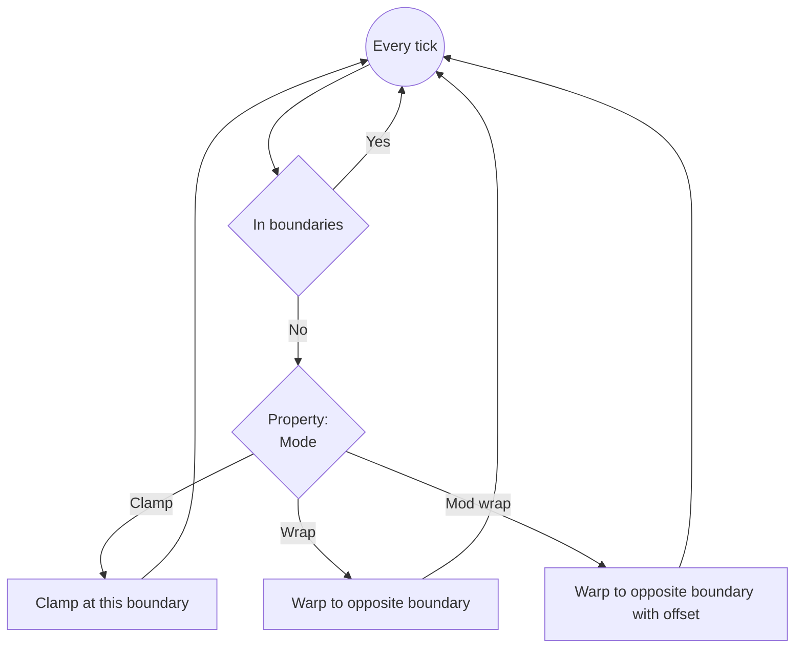
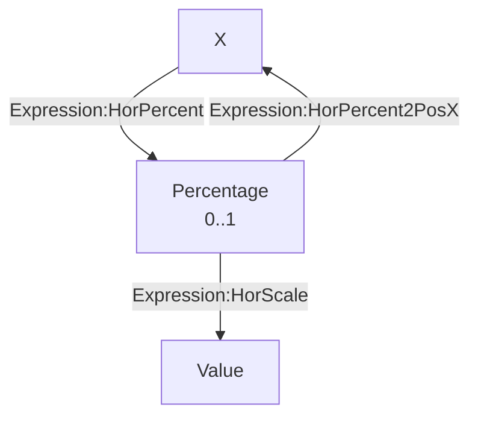
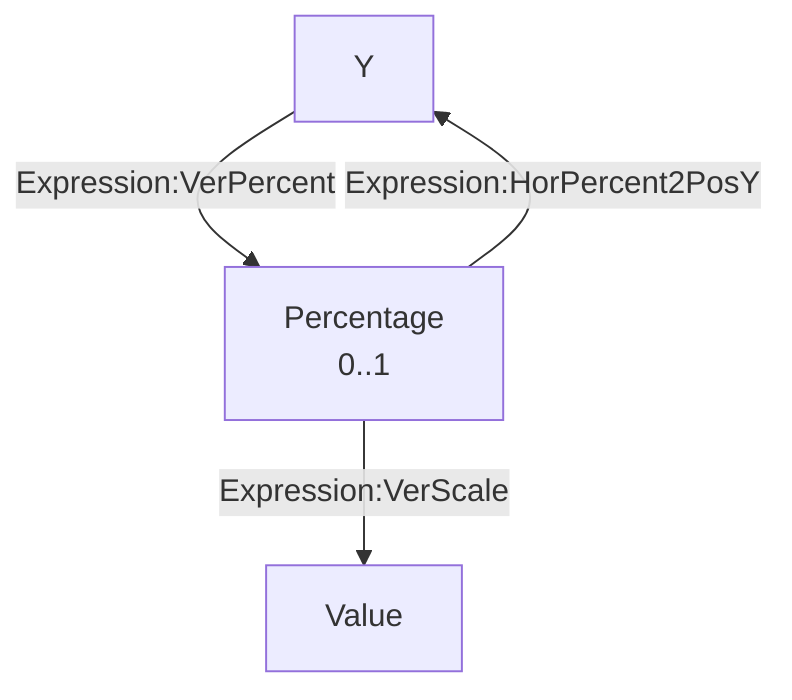

# [Categories](categories.index.html) > [Movement](movement.index.html) > rex_boundary

## Introduction

Clamp or wrap position.

## Links

- [Plugin](https://dl.dropboxusercontent.com/u/5779181/C2Repo/Zip/behaviors/rex_boundary.7z)
- [ACE table](https://rexrainbow.github.io/C2RexDoc/c2rexpluginsACE/behavior_rex_boundary.html)
- [Discussion thread](https://www.scirra.com/forum/behavior-boundary_t70160)

----

[TOC]

## Dependence

None

## Usage

[Sample capx](https://onedrive.live.com/redir?resid=7497FD5EC94476E!992&authkey=!AOEdzwJz-R_Yrzw&ithint=file%2ccapx)

### Set boundaries

- Horizontal

  - Enable
    - Set property `Horizontal` to `Yes`, or
    - `Action:Horizontal boundary enable`
    - `Expression:HorizontalEnable`
  - Boundaries
    - Property `Left`, property `Right`, or
    - `Action:Set horizontal boundary`, or
    - `Action:Set horizontal boundary to`
      - Pin boundaries on an object
    - `Expression:LeftBound`, `Expression:RightBound`

- Vertical

  - Enable
    - Set property `Vertical` to `Yes`, or
    - `Action:Vertical boundary enable`
    - `Expression:VerticalEnable`
  - Boundaries
    - Property `Top`, property `Bottom`, or
    - `Action:Set vertical boundary`, or
    - `Action:Set vertical boundary to`
      - Pin boundaries on an object
    - `Expression:TopBound`, `Expression:BottomBound`

### Mode

When position is out of boundary

- Property `Mode`
  - `Clamp` : clamp position in the boundary
    - Property `Align`
      - `Boundaries` : align boundaries box of this object to reached boundary
      - `Origin` : set position to reached boundaries
  - `Wrap`
    - Property `Align`
      - `Boundaries` : align boundaries box of this object to *opposite* boundary
        - This behavior is similar with [official wrap behavior](https://www.scirra.com/manual/105/wrap)
      - `Origin` : set position to *opposite* boundary
  - `Mode wrap`  ([sample capx](https://onedrive.live.com/redir?resid=7497FD5EC94476E!1969&authkey=!AF9P7ZEKS719guY&ithint=file%2ccapx))
    - Property `Align`
      - `Boundaries` : *not supported*
      - `Origin` : set position to *opposite* boundary with an offset to keep the moving distance
- Triggers
  - `Condition:On hit any boundary`
  - `Condition:Is hit boundary`
  - Horizontal
    - `Condition:On hit left boundary`
    - `Condition:On hit right boundary`
  - Vertical
    - `Condition:On hit top boundary`
    - `Condition:On hit bottom boundary`

----

### Position and percentage

#### Position --> percentage

- `Expression:HorPercent` : ( inst.X - left ) / ( right - left )
  - `Expression:HorScale` : map `Expression:HorPercent` to another value
- `Expression:VerPercent` : ( inst.Y - top ) / ( bottom - top )
  - `Expression:VerScale` : map `Expression:VerPercent` to another value

#### Percentage --> position

[Sample capx](https://1drv.ms/u/s!Am5HlOzVf0kHlAMXIS7Q6iq-ZPlh)

- `Expression:HorPercent2PosX` : percentage --> X  
- `Expression:HorPercent2PosY` : percentage --> Y