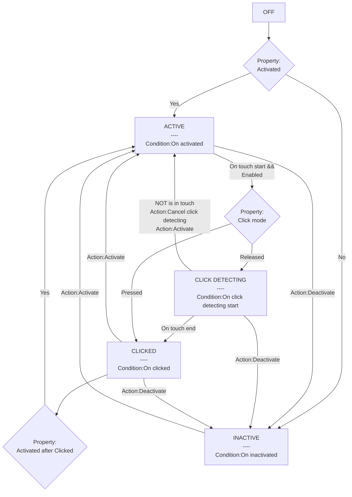

# [Categories](categories.index.html) > [Input](inputd.index.html) > rex_button

## Introduction

Get *touch end* event.

## Links

- [Plugin](https://dl.dropboxusercontent.com/u/5779181/C2Repo/Zip/behaviors/rex_button.7z)
- [ACE table](https://rexrainbow.github.io/C2RexDoc/c2rexpluginsACE/behavior_rex_button.html)
- [Discussion thread](https://www.scirra.com/forum/behaviors-rex-button_t76546)

----

[TOC]

## Dependence

- [rex_touchwrap plugin](rex_touchwrap.html)

## Usage

### Finite-state machine

- State **OFF**
  - Property `Activated`
    - `Yes` : go to state *ACTIVE*
    - `No` : go to state *INACTIVE*
- State **ACTIVE**
  - Trigger `Condition:On activated`
  - Events
    - `On touch start` and *enabled*
      - Enabled
        - The *top-most* (z-index) button sprite
        - Button sprite is *visible*, and layer is *visible*, if property `Visible checking` set to `Yes`
      - Property `Click mode` = `Pressed` : go to state *CLICKED*
      - Property `Click mode` = `Released` : go to state *CLICK DETECTING*
    - `Action:Deactivate` : go to state *INACTIVE*
      - `Action:Deactivate in layer`  : go to state *INACTIVE*, if button sprite is in layer
- State **CLICK DETECTING**
  - Trigger `Condition:On click detecting start`
  - Events
    - `On touch end` : go to state *CLICKED*
    - `Not Is in touch` ,  or `Action:Cancel click detecting`, or `Action:Activate` : go to state *ACTIVE*
      - Trigger `Condition:On click cancel`
    - `Action:Deactivate` : go to state *INACTIVE*
      - `Action:Deactivate in layer`  : go to state *INACTIVE* if button sprite is in layer
      - Trigger `Condition:On click cancel`
- State **CLICKED**
  - Trigger `Condition:On clicked`
  - Events
    - Property `Activated after Clicked` = `Yes` : go to state *ACTIVE*
    - `Action:Activate` : go to state *ACTIVE*
    - `Action:Deactivate` : go to state *INACTIVE*
      - `Action:Deactivate in layer`  : go to state *INACTIVE* if button sprite is in layer
- State **INACTIVE**
  - Trigger `Condition:On inactivated`
  - Events
    - `Action:Activate` : go to state *ACTIVE*
      - `Action:Activate in layer` : go to state *ACTIVE*, if button sprite is in layer
- `Expression:CurState` , `Expression:PreState`
  - `OFF`
  - `INACTIVE`
  - `ACTIVE`
  - `CLICK DETECTING`
  - `CLICKED`

### Rolling over

- `Condition:On rolling in` : *Not Is in touch* --> *Is in touch*
- `Condition:On rolling out` : *Is in touch* --> *Not Is in touch*

### Manual trigger

- `Action:Manual trigger`

  - `On clicked`

  - `On click cancel`

  - `On click detecting start`

  - `On activated`

  - `On inactivated`

  - `On rolling in`

  - `On rolling out`

    ​