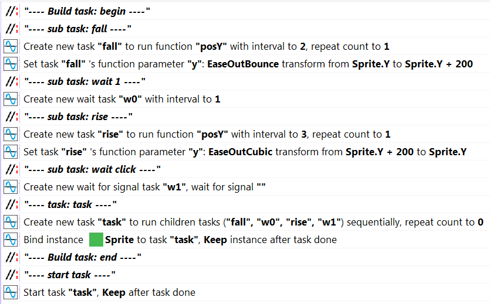

# [Categories](categories.index.html) > [System](system.index.html) > rex_comment

## Introduction

Do nothing, only show comments in actions or conditions

## Links

- [Plugin](https://dl.dropboxusercontent.com/u/5779181/C2Repo/Zip/plugins/rex_comment.7z)
- [ACE table](https://rexrainbow.github.io/C2RexDoc/c2rexpluginsACE/plugin_rex_comment.html)
- [Discussion thread](https://www.scirra.com/forum/plugin-rex-comment_t125942)

----

[TOC]

## Dependence

None

## Usage

[Sample capx](https://onedrive.live.com/redir?resid=7497FD5EC94476E!1944&authkey=!AN0CfidR-H2P41o&ithint=file%2ccapx)

- `Action:Add comment`, or `Condition:Add comment`

