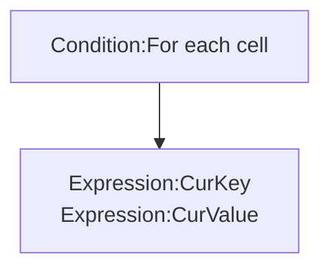

# [Categories](categories.index.html) > [Data structure](datastructure.index.html) > rex_csv2dictionary

## Introduction

Load content of official dictionary object from [csv](https://en.wikipedia.org/wiki/Comma-separated_values) string.

##Links

- [Plugin](https://dl.dropboxusercontent.com/u/5779181/C2Repo/Zip/plugins/rex_csv2dictionary.7z)
- [ACE table](https://rexrainbow.github.io/C2RexDoc/c2rexpluginsACE/plugin_rex_csv2dictionary.html)
- [Discussion thread](https://www.scirra.com/forum/plugin-csv-csv2array-csv2dictionary_t64326)


----

[TOC]

## Dependence

None

## Usage

### Load to array

[Sample capx](https://onedrive.live.com/redir?resid=7497FD5EC94476E!216&authkey=!AEhykUbiHXz44ys&ithint=file%2c.capx)

- `Action:Put csv data into dictionary`

  - Delimiter : property `Delimiter` or `Action:Set delimiter`

    - `Expression:Delimiter`

  - Format of csv :

    ```
    key0,value0
    key1,value1
    key2,value2
    ...
    ```


#### Data type

Property `Eval mode`

- `No` : string

- `Yes` :  parse value by *eval* function of javascrpt

  - number: `10`
  - string: `'hi'`
  - javascript function: `Math.random()`


### Retrieve cells



- `Condition:For each cell`
  - `Expression:CurKey`
  - `Expression:CurValue `
    - Property `Eval mode`
