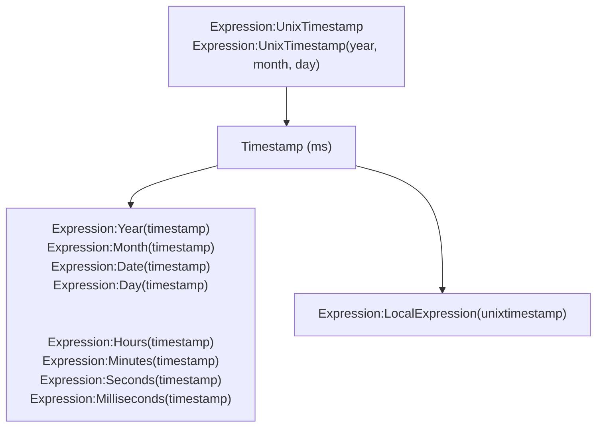
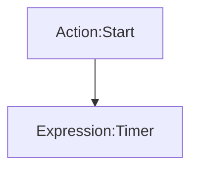

# [Categories](categories.index.html) > [Date&time](date.index.html) > rex_date

## Introduction

Get system date and time.

## Links

- [Plugin](https://dl.dropboxusercontent.com/u/5779181/C2Repo/Zip/plugins/rex_date.7z)
- [ACE table](https://rexrainbow.github.io/C2RexDoc/c2rexpluginsACE/plugin_rex_date.html)
- [Discussion thread](https://www.scirra.com/forum/plugin-system-date-and-time_t63492)

----

[TOC]

## Dependence

None

## Usage

### Get date

1. `Expression:UnixTimestamp`, to get current timestamp
   - `Expression:UnixTimestamp(year, month, day)`, to get timestamp at year/month/day
   - `Expression:UnixTimestamp(year, month, day, hours, minutes, seconds)`, to get timestamp at year/month/day/hours/minutes/seconds
2. Get date
   - `Expression:Year(timestamp)`
   - `Expression:Month(timestamp)`
   - `Expression:Date(timestamp)`
   - `Expression:Day(timestamp)`
   - `Expression:Hours(timestamp)`
   - `Expression:Minutes(timestamp)`
   - `Expression:Seconds(timestamp)`
   - `Expression:Milliseconds(timestamp)`
   - `Expression:LocalExpression(unixtimestamp)`

----

### Escaped time

1. `Action:Start`, to start a timer

2. `Expression:Timer`, to get escaped time, in seconds

   - `Action:Pause`
   - `Action:Resume`

   ​