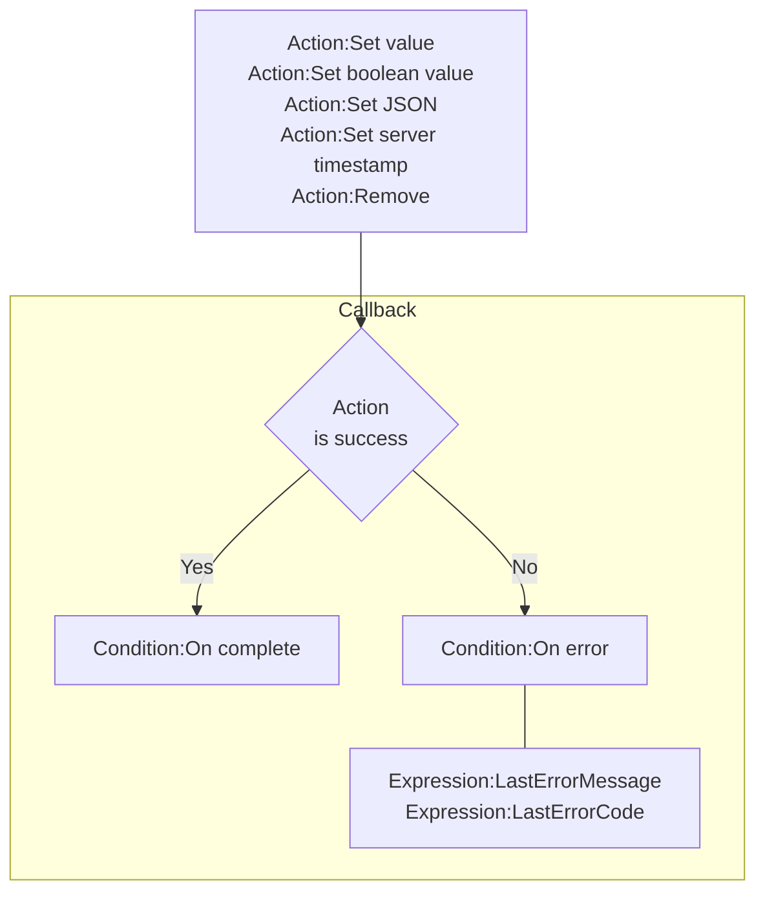
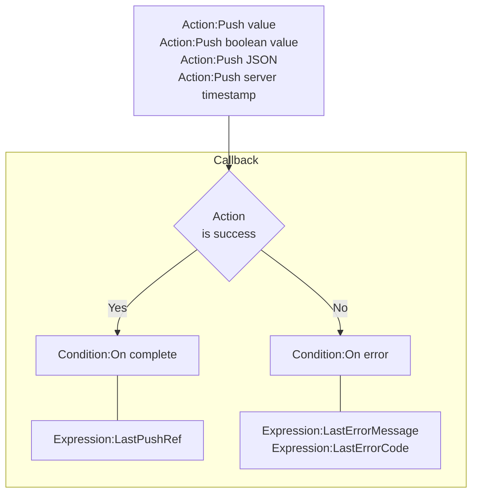
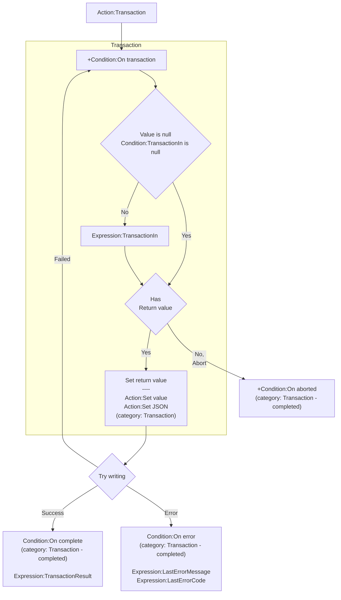
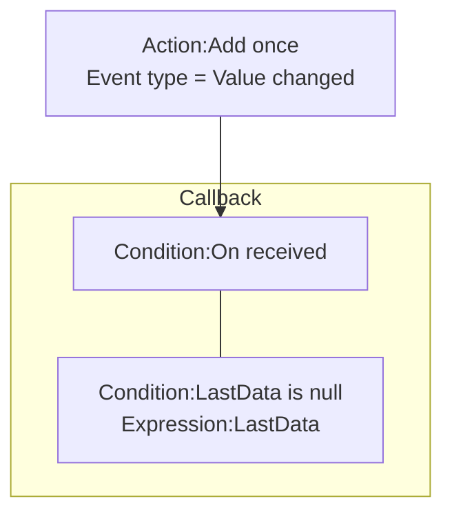
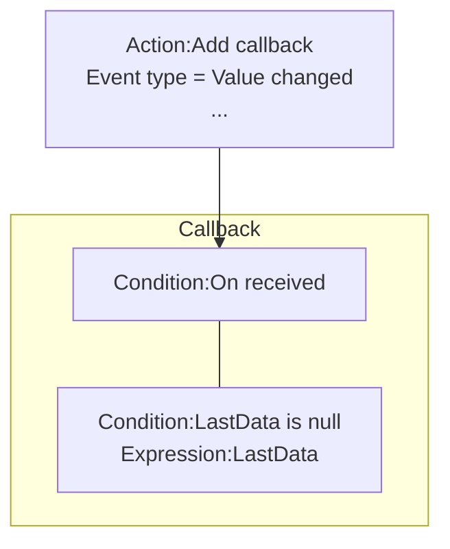
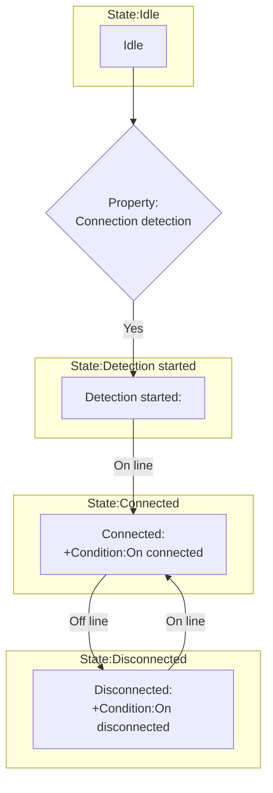

# [Categories](categories.index.html) > [Firebase](firebase.index.html) > rex_firebase

## Introduction

Access database of [firebase](https://www.firebase.com/).

## Links

- [Plugin](https://dl.dropboxusercontent.com/u/5779181/C2Repo/Zip/plugins/rex_firebase.7z)
- [ACE table](https://rexrainbow.github.io/C2RexDoc/c2rexpluginsACE/plugin_rex_firebase.html)
- [Discussion thread](https://www.scirra.com/forum/plugin-firebase_t121776)

----

[TOC]

## Dependence

- [rex_firebase_apiv3](http://c2rexplugins.weebly.com/rex_firebase_apiv3.html)

## Usage

### Write

#### Set value or remove key

 [Sample capx](https://1drv.ms/u/s!Am5HlOzVf0kHkjiX6cOko3oadNcx)

1. Writing
   - `Action:Set value`
   - `Action:Set boolean value`
   - `Action:Set JSON`
   - `Action:Set server timestamp`
   - `Action:Remove`
2. Callback
   - Success : `Condition:On complete`
   - Failed : `Condition:On error`
     - Error :  `Expression:LastErrorMessage`, `Expression:LastErrorCode`

#### Append a child  

[sample capx](https://1drv.ms/u/s!Am5HlOzVf0kHkjko-xeCSgVDPiLD)
1. Writing
    - `Action:Push value`
    - `Action:Push boolean value`
    - `Action:Push JSON`
    - `Action:Push server timestamp`
2. Callback
    - Success : `Condition:On complete`
      - `Expression:LastPushRef`
    - Failed : `Condition:On error`
      - Error :  `Expression:LastErrorMessage`, `Expression:LastErrorCode`

#### Transaction 

- Set value according to current value

Sample capx

1. `Action:Transaction`

2. `Condition:On transaction`

   1. Read value
      - `Condition:TransactionIn is null`
        - Value is null
      - Else
        - `Expression:TransactionIn`
   2. Write value
      - `Action:Set value`  (category: Transaction)
      - `Action:Set JSON`  (category: Transaction)
      - Abort if writing nothing

3. Callback

   - Writing success
     - `Condition:On complete`  (category: Transaction - completed)
       - `Expression:TransactionResult`

- Writing failed
     - Go to step 2
- Error
     - `Condition:On error`   (category: Transaction - completed)
       - `Expression:LastErrorMessage`, `Expression:LastErrorCode`
- Abort
     - `Condition:On aborted`   (category: Transaction - completed)

----

### Read

#### Read value

1. `Action:Add once`
   - Set parameter `Event type`  to `Value changed`
2. `Condition:On received`
   - `Condition:LastData is null`
     - Value is null
   - Else
     - `Expression:LastData`

#### Monitor event

----

###My connection status

[sample capx-V3](https://1drv.ms/u/s!Am5HlOzVf0kHkjda4qpESBCH5iBm)

- State: Idle
  - Set property `Connection detection` to `Yes` to enable
    - Go to *State: Detection started*

- State: Detection started
  - Connected
    - Go to *State: Connected*

- State: Connected
  - `Condition:On connected`
  - `Condition:Is connected` returns true
  - Disconnected or `Action:Go offline`
    - Go to *State: Disconnected*
- State: Disconnected
  - `Condition:On disconnected`
  - Connected or `Action:Go online`
    - Go to *State: Connected*.

---

### Clock skew

[Sample capx](https://onedrive.live.com/redir?resid=7497FD5EC94476E!2406&authkey=!AE0EdFCaU4ERFNw&ithint=file%2ccapx)

- Set property `Server time offset detection` = `Yes` to enable updating continuously
- `Expression:EstimatedTime` = `Expression:ServerTimeOffset` + current client time