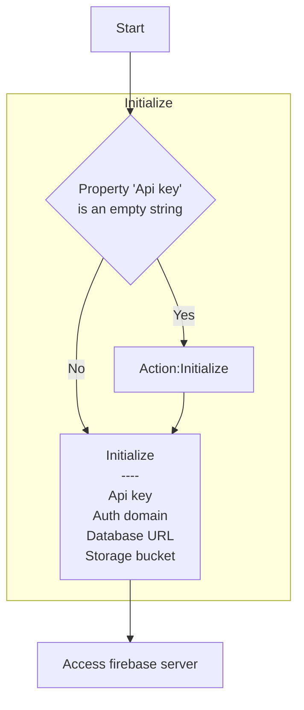

# [Categories](categories.index.html) > [Firebase](firebase.index.html) > rex_firebase_apiv3

## Introduction

3.x API of [real time database-as-a-service](https://firebase.google.com/).

## Links

- [Plugin](https://rexrainbow.github.io/C2RexDoc/repo/rex_firebase_apiV3.7z)
- [ACE table](https://rexrainbow.github.io/C2RexDoc/c2rexpluginsACE/plugin_rex_firebase_apiV3.html)
- [Discussion thread](https://www.scirra.com/forum/plugin-firebase_t121776)

----

[TOC]

## Dependence

None

## Usage



### Initialize

- If property `Api key` is not an empty string

  - Initialize with property `Api key`, `Auth domain`, `Database URL`, `Storage bucket`

- Else

  - `Action:Initialize`

Access firebase after initialize.

###Log

Set property `Log` to `Yes` to dump log messages at console.

----

### Database URL

- Fully path : for example

  ```
  https://my-3x-test.firebaseio.com/members/
  ```

- Related path : for example

  ```
  members/
  ```

----

### Database Rules

[Reference](https://firebase.google.com/docs/database/security/quickstart#numbered)

Set security rules of database to

```JSON
{
  "rules": {
    ".read": true,
    ".write": true
  }
}
```

in development stage.

