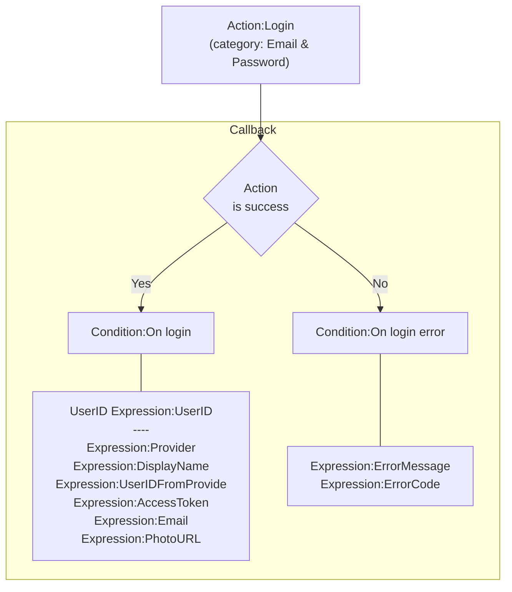
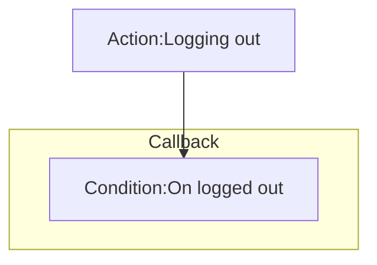
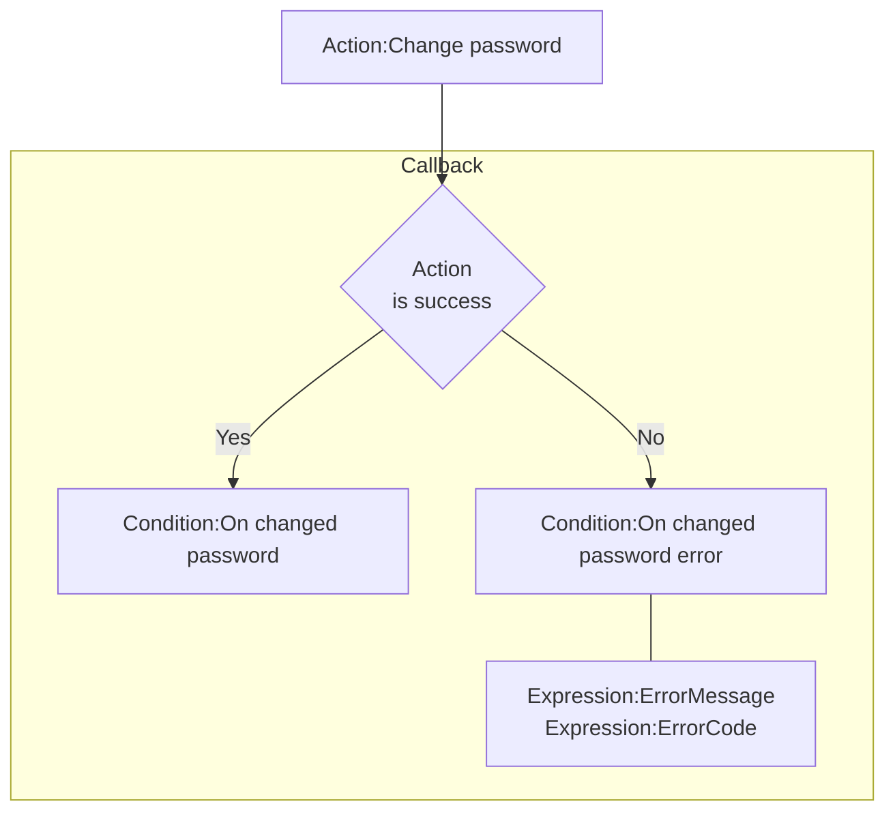
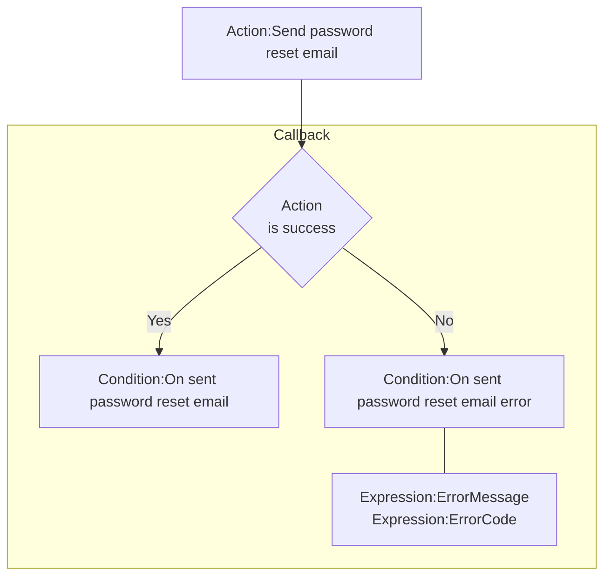
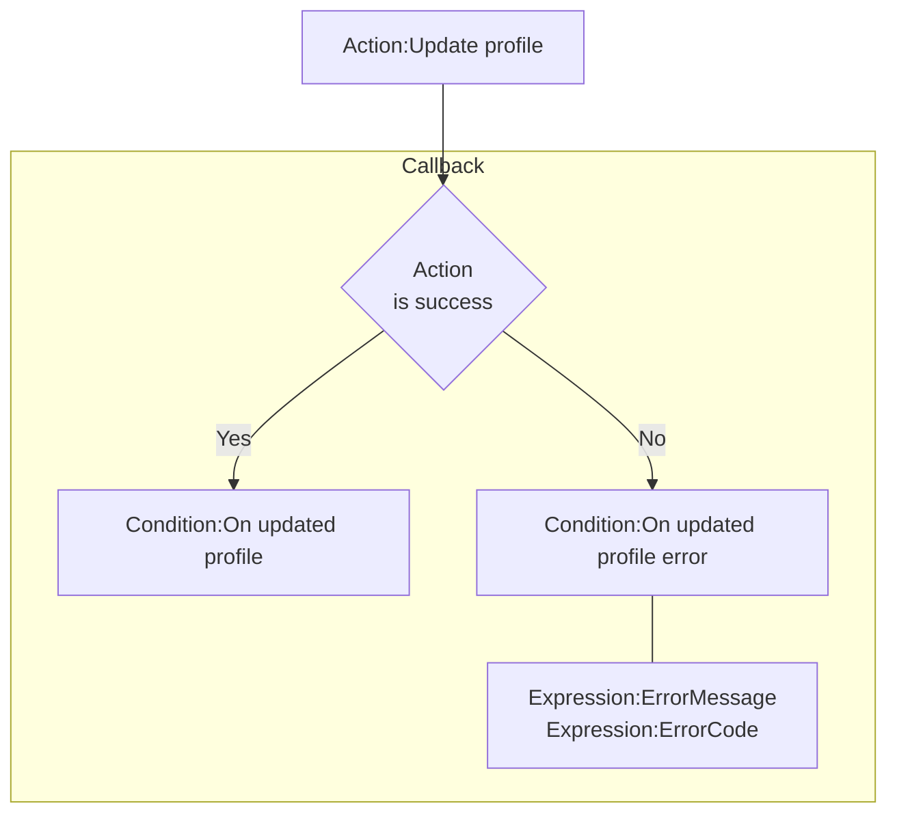
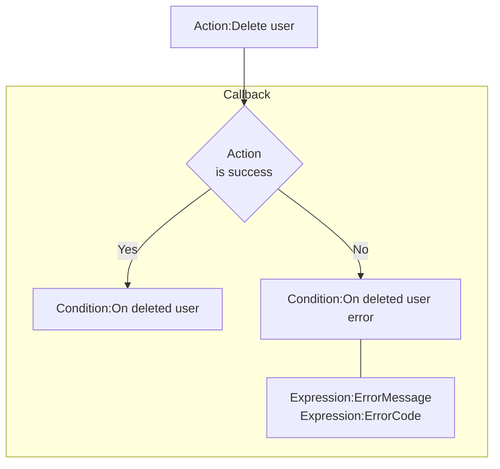
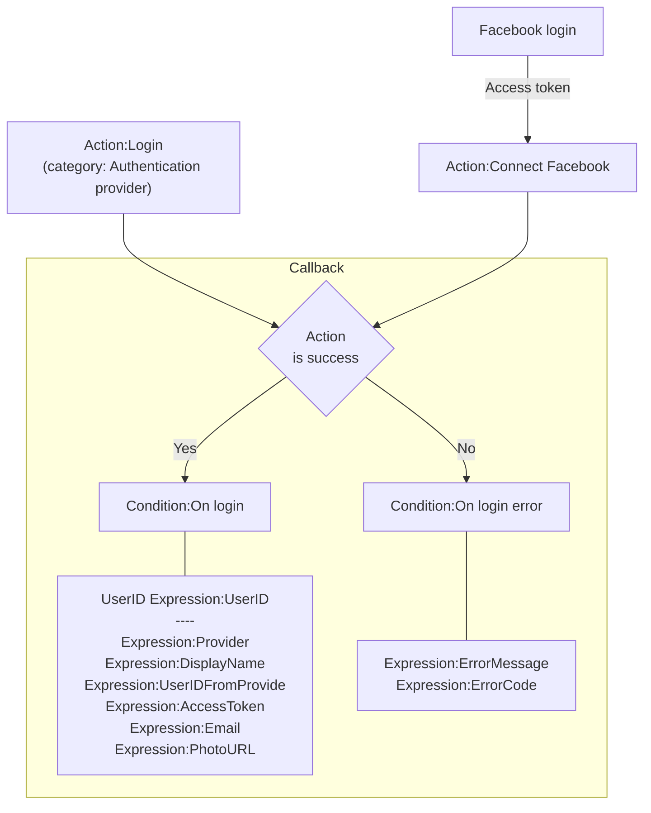
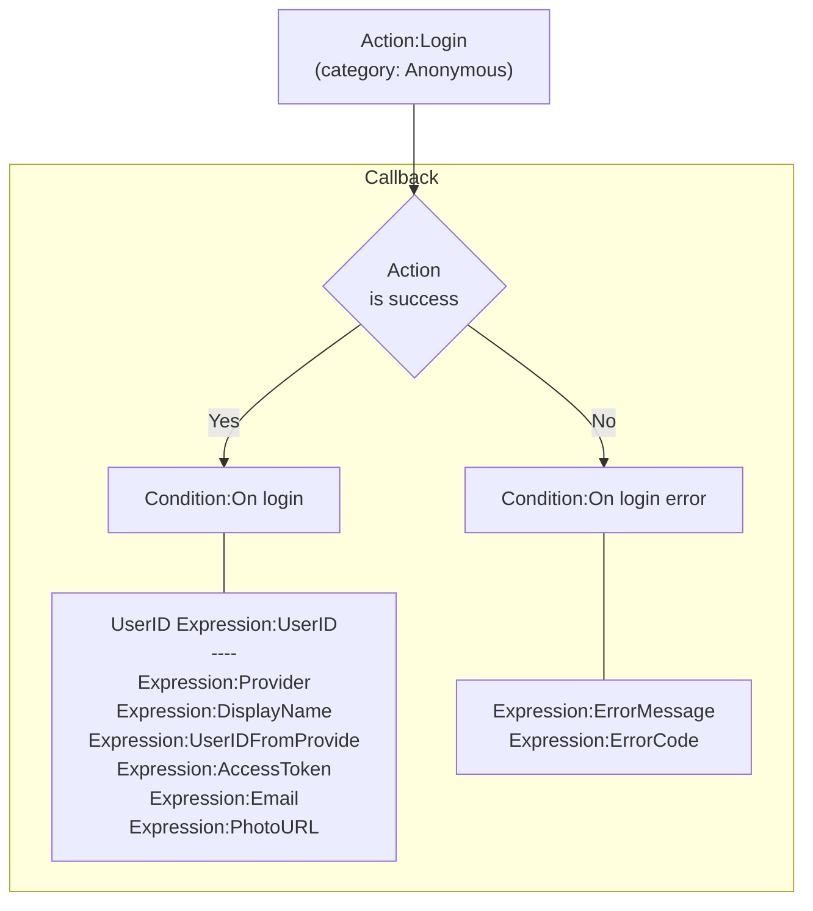
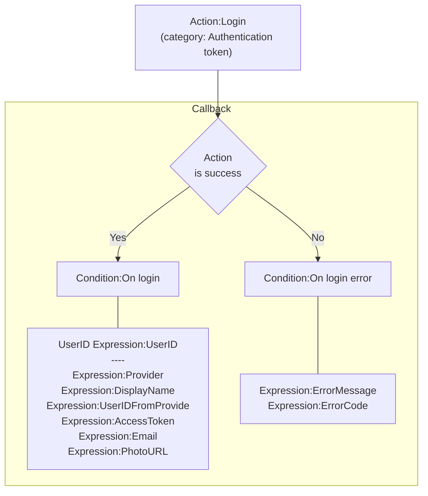

# [Categories](categories.index.html) > [Firebase](firebase.index.html) > rex_firebase_authentication

## Introduction

Authentication provided by [firebase](https://www.firebase.com/).

## Links

- [Plugin](https://rexrainbow.github.io/C2RexDoc/repo/rex_firebase_authentication.7z)
- [ACE table](https://rexrainbow.github.io/C2RexDoc/c2rexpluginsACE/plugin_rex_firebase_authentication.html)
- [Discussion thread](https://www.scirra.com/forum/plugin-firebase_t121776)

----

[TOC]

## Dependence

- [rex_firebase_apiv3](http://c2rexplugins.weebly.com/rex_firebase_apiv3.html)

## Usage

### Authenticate with Firebase using Password-Based Accounts

[Reference](https://firebase.google.com/docs/auth/web/password-auth)

[Sample capx](https://onedrive.live.com/redir?resid=7497FD5EC94476E!1459&authkey=!AKk8JfvzMRsjPFs&ithint=file%2ccapx)

#### Create account

1. `Action:Create account`
2. Callback
   - Success : `Condition:On created account`
   - Failed : `Condition:On created account error`
     - Error :  `Expression:ErrorMessage`, `Expression:ErrorCode` ([reference](https://firebase.google.com/docs/reference/js/firebase.auth.Auth#createUserWithEmailAndPassword))

#### Login

1. `Action:Login` (category: Email & Password)
2. Callback
   - Success : `Condition:On login`
     - ``Expression:UserID`, an unique user ID
     - `Expression:Provider`
     - `Expression:DisplayName`
     - `Expression:UserIDFromProvide`
     - `Expression:AccessToken`
     - `Expression:Email`
     - `Expression:PhotoURL`
   - Failed : `Condition:On login error`
     - Error :  `Expression:ErrorMessage`, `Expression:ErrorCode` ([reference](https://firebase.google.com/docs/reference/js/firebase.auth.Auth#signInWithEmailAndPassword))

`Condition:Is login`,  returns true if logging in.

#### Logging out

1. `Action:Logging out`
2. `Condition:On logged out`

#### Change password

1. `Action:Change password`
2. Callback
   - Success : `Condition:On changed password`
   - Failed : `Condition:On changed password error`
     - Error :  `Expression:ErrorMessage`, `Expression:ErrorCode`

#### Reset password

1. `Action:Send password reset email`
2. Callback
   - Success : `Condition:On sent password reset email`
   - Failed : `Condition:On sent password reset email error`
     - Error :  `Expression:ErrorMessage`, `Expression:ErrorCode` ([reference](https://firebase.google.com/docs/reference/js/firebase.auth.Auth#sendPasswordResetEmail))

#### Update profile

1. `Action:Update profile`
2. Callback
   - Success : `Condition:On updated profile`
   - Failed : `Condition:On updated profile error`
     - Error :  `Expression:ErrorMessage`, `Expression:ErrorCode`

#### Delete user

1. `Action:Delete user`
2. Callback
   - Success : `Condition:On deleted user`
   - Failed : `Condition:On deleted user error`
     - Error :  `Expression:ErrorMessage`, `Expression:ErrorCode`

----

###Authenticate Using Facebook Login

[Reference](https://firebase.google.com/docs/auth/web/facebook-login)

[Sample capx](https://1drv.ms/u/s!Am5HlOzVf0kHk1IrvSnyTMOR-OFc)

#### Login

1. `Action:Login` (category: Authentication provider)
2. Callback
   - Success : `Condition:On login`
     - `Expression:UserID`, an unique user ID
     - `Expression:Provider`
     - `Expression:DisplayName`
     - `Expression:UserIDFromProvide`
     - `Expression:AccessToken`
     - `Expression:Email`
     - `Expression:PhotoURL`
   - Failed : `Condition:On login error`
     - Error :  `Expression:ErrorMessage`, `Expression:ErrorCode` ([reference](https://firebase.google.com/docs/reference/js/firebase.auth.Auth#signInWithEmailAndPassword))

`Condition:Is login`,  returns true if logging in.

##### Login with access token

1. [Facebook login](https://www.scirra.com/manual/112/facebook)
2. `Action:Connect Facebook`
   - Assign parameter `Access token` if not using official facebook plugin.
3. Callback

#### Logging out

1. `Action:Logging out`
2. `Condition:On logged out`

----

### Authenticate Using Google Sign-In

[Reference](https://firebase.google.com/docs/auth/web/google-signin)

[Sample capx](https://1drv.ms/u/s!Am5HlOzVf0kHk2IWN7RToiZLz7L5)

See section of *Authenticate Using Facebook Login*.

----

### Authenticate Using GitHub

[Reference](https://firebase.google.com/docs/auth/web/github-auth)

See section of *Authenticate Using Facebook Login*.

------

### Authenticate Using Twitter

[Reference](https://firebase.google.com/docs/auth/web/twitter-login)

See section of *Authenticate Using Facebook Login*.

----

### Authenticate with Firebase Anonymously

[Reference](https://firebase.google.com/docs/auth/web/anonymous-auth)

#### Login

1. `Action:Login` (category: Anonymous)
2. Callback
   - Success : `Condition:On login`
     - `Expression:UserID`, an unique user ID
     - `Expression:Provider`
     - `Expression:DisplayName`
     - `Expression:UserIDFromProvide`
     - `Expression:AccessToken`
     - `Expression:Email`
     - `Expression:PhotoURL`
     - *Every anonymous login will create a new account*
   - Failed : `Condition:On login error`
     - Error :  `Expression:ErrorMessage`, `Expression:ErrorCode` ([reference](https://firebase.google.com/docs/reference/js/firebase.auth.Auth#signInWithEmailAndPassword))

`Condition:Is login`,  returns true if logging in.

`ondition:Is anonymous`,  returns true after *anonymous* login.

----

### Authentication by authentication token

[Reference](https://firebase.google.com/docs/auth/web/custom-auth)

#### Login

1. `Action:Login` (category: Authentication token)
2. Callback
   - Success : `Condition:On login`
     - `Expression:UserID`, an unique user ID
     - `Expression:Provider`
     - `Expression:DisplayName`
     - `Expression:UserIDFromProvide`
     - `Expression:AccessToken`
     - `Expression:Email`
     - `Expression:PhotoURL`
     - *Every anonymous login will create a new account*
   - Failed : `Condition:On login error`
     - Error :  `Expression:ErrorMessage`, `Expression:ErrorCode` ([reference](https://firebase.google.com/docs/reference/js/firebase.auth.Auth#signInWithEmailAndPassword))

`Condition:Is login`,  returns true if logging in.

----

### Link multiple auth providers to an account

[Reference](https://firebase.google.com/docs/auth/web/account-linking)

```mermaid
graph TB

Login["1. Login firebase"] --> LoginFB["2. Login facebook"]
LoginFB --> LinkToFB["3. Action:Link to facebook"]
LinkToFB --> ActionIsSuccess

Login --> LoginGoogle["2. Login google"]
LoginGoogle --> LinkToGoogle["3. Action:Link to google"]
LinkToGoogle --> ActionIsSuccess

Login --> LinkToEmail["2. Action:Link to email-password"]
LinkToEmail --> ActionIsSuccess

subgraph Callback
ActionIsSuccess{Action<br>is success} --> |Yes| CondOnSuccess["Condition:On link success"]
ActionIsSuccess --> |No| CondOnError["Condition:On link error"]
CondOnError --- ExpError["Expression:ErrorMessage<br>Expression:ErrorCode"]
end
```

- Link to facebook  ([sample capx](https://1drv.ms/u/s!Am5HlOzVf0kHlFbTtaV863XbVAK8))
  1. Login firebase
  2. [Login facebook](https://www.scirra.com/manual/112/facebook)
  3. `Action:Link to facebook`
     - Assign parameter `Access token` if not using official facebook plugin.
  4. Callback
     - Success : `Condition:On link`
     - Failed : `Condition:On link erro `
       - Error :  `Expression:ErrorMessage`, `Expression:ErrorCode`
- Link to google
  1. Login firebase
  2. Login google
  3. `Action:Link to google`, link to a google account by id token
  4. Callback
     - Success : `Condition:On link`
     - Failed : `Condition:On link erro `
       - Error :  `Expression:ErrorMessage`, `Expression:ErrorCode`
- Link to email-password ([sample capx](https://1drv.ms/u/s%21Am5HlOzVf0kHlFUvhsIFK5DY9GOV))
  1. Login facebook
  2. `Action:Link to email-password`
  3. Callback
     - Success : `Condition:On link`
     - Failed : `Condition:On link erro `
       - Error :  `Expression:ErrorMessage`, `Expression:ErrorCode`

----

### Login or logged out by other app

 [Reference](https://www.firebase.com/docs/web/guide/user-auth.html)

Once a user authenticates to your app, Firebase manages their session, ensuring that the user is remembered across browser or application restarts.

- `Condition:On login by other app`
- `Condition:On logged out by other app`

----

### Debug panel

UserID, display name, email, photo URL of current user will be shown at debug panel.
