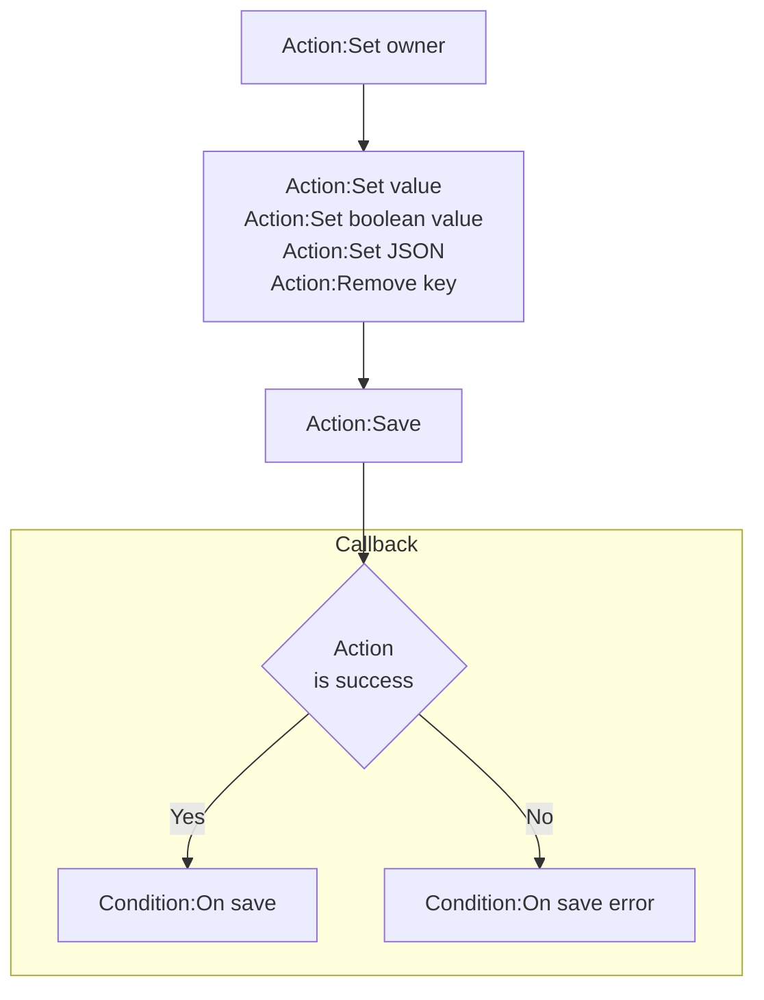
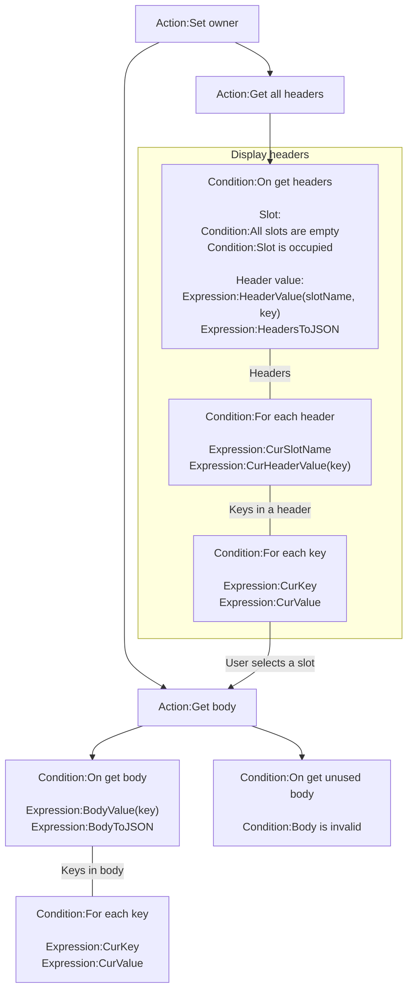
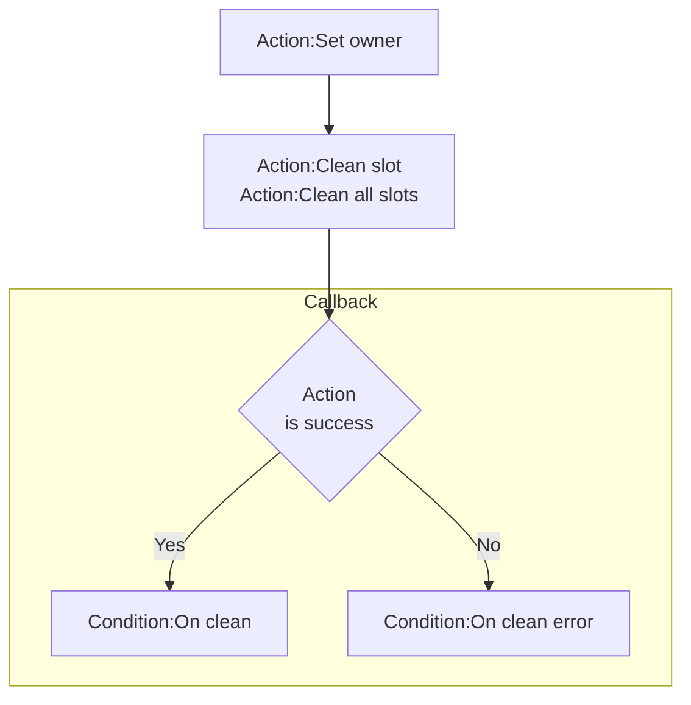

# [Categories](categories.index.html) > [Firebase](firebase.index.html) > rex_firebase_savedata

## Introduction

Private save slots.

## Links

- [Plugin](https://dl.dropboxusercontent.com/u/5779181/C2Repo/Zip/plugins/rex_firebase_savedata.7z)
- [ACE table](https://rexrainbow.github.io/C2RexDoc/c2rexpluginsACE/plugin_rex_firebase_savedata.html)
- [Discussion thread](https://www.scirra.com/forum/plugin-firebase_t121776)

----

[TOC]

## Dependence

- [rex_firebase_apiV3](rex_firebase_apiv3.html)

## Usage

### Data structure on firebase

```
<sub-domain>\
    <UserID>
        headers\
    	    <slotName>
    		    <key> - value
    
    	bodies\
    	    <slotName>
    		    <key> - value
```

- Each user has a **private** slots set
  - Each slot has
    - Header
      - Key-value pairs, to describe this slot for indexing, 
      - For instance, title, author, date of email
    - Body
      - Key-value pairs, 
      - For instance, content of email

----

### Save



[Sample capx](https://1drv.ms/u/s!Am5HlOzVf0kHkj1dKYwothGswmxD), [sample capx2](https://1drv.ms/u/s!Am5HlOzVf0kHk1uF5STtZ2Rfezaf)

1. `Action:Set owner`

   - Get UserID from [authentication](rex_firebase_authentication.html)

2. Prepare slot

   - `Action:Set value`

     - Parameter `Key` supports dot-notation. For example, set `pos.x` to `10` to update header or body with

     ```json
     {
       "pos":{
         "x": 10
       }
     }
     ```

   - `Action:Set boolean value`

   - `Action:Set JSON`

   - `Action:Remove key`

3. `Action:Save`

4. Callback

   - Success : `Condition:On save`
   - Failed : `Condition:On save error`

### Load



1. `Action:Set owner`
   - Get UserID from [authentication](rex_firebase_authentication.html)
2. Read headers, optional
   1. `Action:Get all headers`
   2. `Condition:On get headers`
      - `Expression:HeaderValue(slotName, key)`, returns a value
        - `Expression:HeaderValue(slotName, key, defaultValue)`
      - `Expression:HeadersToJSON`, returns a header in JSON string
        - `Expression:HeaderValue(slotName)`
      - `Condition:For each header`, retrieves each header
        - `Expression:CurSlotName`
        - `Expression:CurHeaderValue(key)`
          - `Expression:CurHeaderValue(key, defaultValue)`
      - `Condition:For each key`, in *Load - header* category, retrieves each key in a header
        - `Expression:CurKey`
        - `Expression:CurValue`
      - Slot
        - `Condition:All slots are empty`, returns true if no slot is used
        - `Condition:Slot is occupied`, returns true if a slot is used
3. Read a body
   1. `Action:Get body`
   2. Callback
       - `Condition:On get body`
           - `Expression:BodyValue(key)`, returns a value
               - `Expression:BodyValue(key, defaultValue)`
           - `Expression:BodyToJSON`, returns body in JSON string
               - `Expression:BodyValue`
           - `Condition:For each key`, in *Load - body* category, retrieves each key in a header
               - `Expression:CurKey`
               - `Expression:CurValue`
       - `Condition:On get unused body`, triggered when *this body has not been saved before*
           - `Condition:Body is invalid`, returns true

### Clean



1. `Action:Set owner`
   - Get UserID from [authentication](rex_firebase_authentication.html)
2. `Action:Clean slot`, or `Action:Clean all slots`
3. Callback
   - Success : `Condition:On clean`
     - Slot will become *unused*
   - Failed : `Condition:On clean error`

----

### Debug panel

Current loaded headers and loaded body will be presented on debug panel.

----

## Security

Add security rule to make private slots set.  ([Reference](https://firebase.google.com/docs/database/security/securing-data))

Assume that sub domain is `save-data` :

```json
{
    "rules": {
        "save-data": {
            "$user": {
                ".read":"auth.uid === $user",
                ".write":"auth.uid === $user"
            }
        }
    }
}
```
