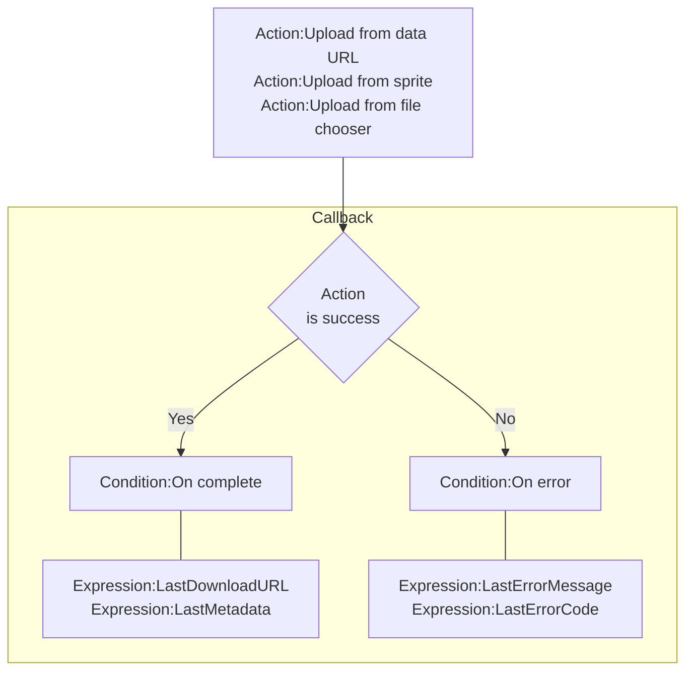
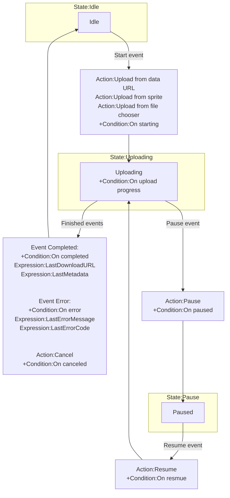
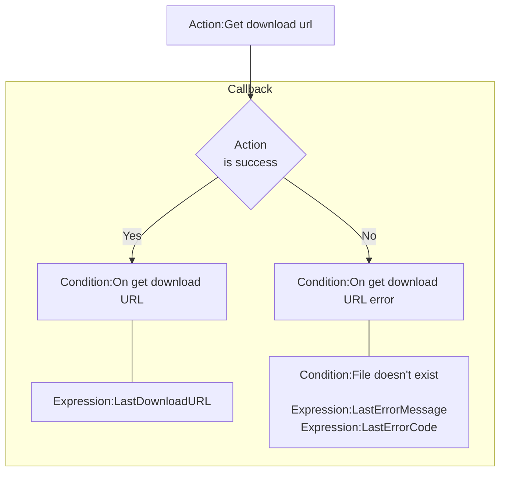
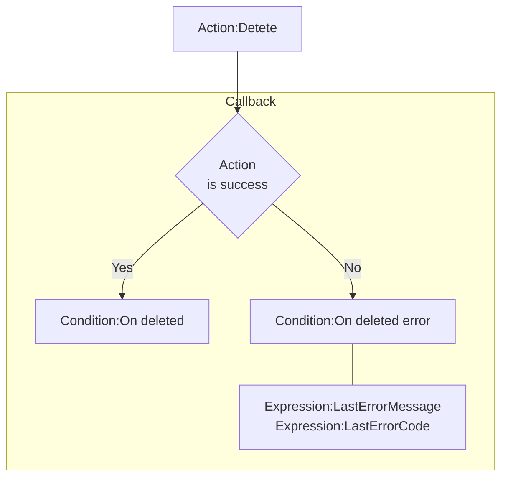
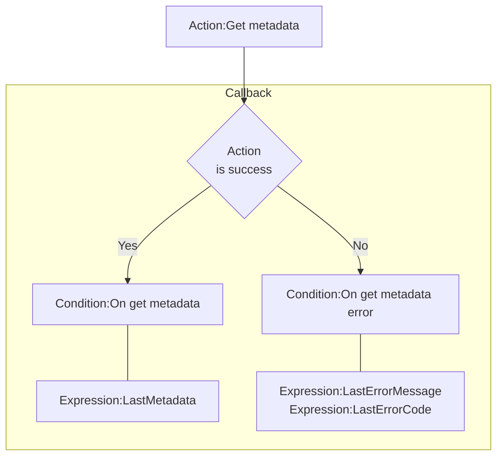
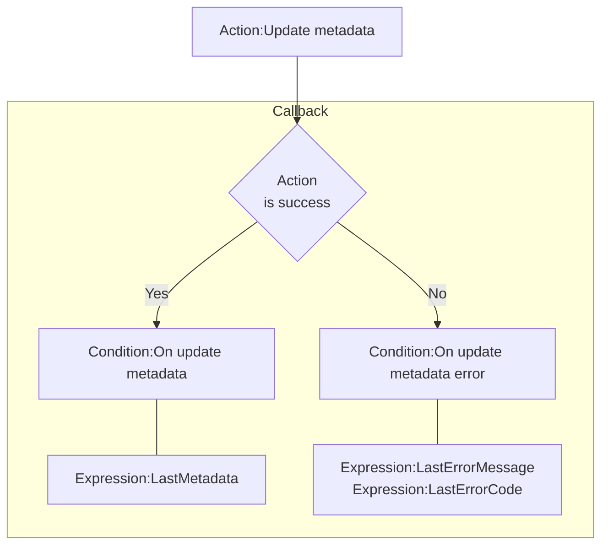

# [Categories](categories.index.html) > [Firebase](firebase.index.html) > rex_firebase_storage

## Introduction

Files storage in [firebase](https://www.firebase.com/).

## Links

- [Plugin](https://rexrainbow.github.io/C2RexDoc/repo/rex_firebase_storage.7z)
- [ACE table](https://rexrainbow.github.io/C2RexDoc/c2rexpluginsACE/plugin_rex_firebase_storage.html)
- [Discussion thread](https://www.scirra.com/forum/plugin-firebase_t121776)

----

[TOC]

## Dependence

- [rex_firebase_apiv3](http://c2rexplugins.weebly.com/rex_firebase_apiv3.html)

## Usage

### File

#### Upload

##### Brief flow



1. Uploading
   - `Action:Upload from data URL` ([sample capx](https://1drv.ms/u/s!Am5HlOzVf0kHkk87XiaGM-0IY9Tf))
   - `Action:Upload from sprite`  ([sample capx](https://1drv.ms/u/s!Am5HlOzVf0kHkk7slML48Q6BA_Vv))
   - `Action:Upload from file chooser`  ([sample capx](https://1drv.ms/u/s!Am5HlOzVf0kHkk1frphDDwMvRIBU))
2. Callback
   - Success : `Condition:On complete`
     - `Expression:LastDownloadURL`
     - `Expression:LastMetadata`, returns metadata in JSON string
       - `Expression:LastMetadata( key )`, returns a key
       - `Expression:LastMetadata( key, defaultValue )`, retruns `defaultValue` if key is not existed
   - Failed : `Condition:On error`
     - Error :  `Expression:LastErrorMessage`, `Expression:LastErrorCode` ([reference](https://firebase.google.com/docs/storage/web/handle-errors))

##### Complete flow



-  State: Idle

   -  Upload starting
      -  `Action:Upload from data URL` ([sample capx](https://1drv.ms/u/s!Am5HlOzVf0kHkk87XiaGM-0IY9Tf))
      -  `Action:Upload from sprite`  ([sample capx](https://1drv.ms/u/s!Am5HlOzVf0kHkk7slML48Q6BA_Vv))
      -  `Action:Upload from file chooser`  ([sample capx](https://1drv.ms/u/s!Am5HlOzVf0kHkk1frphDDwMvRIBU))
      -  Parameter [`Metadata`](https://firebase.google.com/docs/storage/web/file-metadata)
      -  `Condition:On starting`
         -  `Expression:Progress`, `Expression:TransferredBytes`, `Expression:TotalBytes`
      -  Go to *State: Uploading*

-  State: Uploading
   - Failed event
     - `Condition:On upload error`
       - `Expression:LastErrorMessage`, `Expression:LastErrorCode` ([reference](https://firebase.google.com/docs/storage/web/handle-errors))
       - `Expression:Progress`, `Expression:TransferredBytes`, `Expression:TotalBytes`
     - Go to *State: Idle*

   - Completed event
     - `Condition:On upload complete`
       - `Expression:LastDownloadURL`
       - `Expression:LastMetadata`, returns metadata in JSON string
         - `Expression:LastMetadata( key )`, returns a key
         - `Expression:LastMetadata( key, defaultValue )`, retruns `defaultValue` if key is not existed
       - `Expression:Progress`, `Expression:TransferredBytes`, `Expression:TotalBytes`
     - Go to *State: Idle*
   - `Action:Cancel`
     - `Condition:On canceled`
       - `Expression:Progress`, `Expression:TransferredBytes`, `Expression:TotalBytes`
     - Go to *State: Idle*
   - `Action:Pause`
     - `Condition:On paused`
       - `Expression:Progress`, `Expression:TransferredBytes`, `Expression:TotalBytes`
     - Go to *State: Paused*
   - `Condition:On upload progress`
     - `Expression:Progress`, `Expression:TransferredBytes`, `Expression:TotalBytes`
   - `Condition:Is uploading` returns true

-  State: Paused

   -  `Action:Resume`
      -  `Condition:On resmue`
         -  `Expression:Progress`, `Expression:TransferredBytes`, `Expression:TotalBytes`
      -  Go to *State: Uploading*

##### Multiple files uploding

Put or create this rex_firebase_storage object for each file uploading. 

#### Download



##### Access control allow origin

Follows [these steps](http://stackoverflow.com/questions/37760695/firebase-storage-and-access-control-allow-origin) to allow **loading images to sprite** from firebase storage.

1. [Install gsutil](https://cloud.google.com/storage/docs/gsutil_install#install)

2. Add **cors.json** file in local (*d:\cors.json*)

   ```JSON
   [
     {
       "origin": ["*"],
       "method": ["GET"],
       "maxAgeSeconds": 3600
     }
   ]
   ```

   replace * by your domain of application.


3. Type command 

   ```
   gsutil cors set d:\cors.json gs://exampleproject.appspot.com
   ```

    in command line window. Replace *exampleproject.appspot.com* by your storageBucket link.


#### Delete

[Reference](https://firebase.google.com/docs/storage/web/delete-files)



1. `Action:Detete`
2. Callback
   - Success : `Condition:On deleted`
   - Failed : `Condition:On deleted error`
     - Error :  `Expression:LastErrorMessage`, `Expression:LastErrorCode` ([reference](https://firebase.google.com/docs/storage/web/handle-errors))

----

### Metadata

[Reference](https://firebase.google.com/docs/storage/web/file-metadata)

#### Set value

[Sample capx](https://1drv.ms/u/s!Am5HlOzVf0kHlg4otTFewCb6YiHg)

set metadata before uploading file.

- `Action:Set value`
- `Action:Remove key`
- `Action:Load JSON`

Metadata will be cleaned after uploading.

##### Custom metadata

Custom metadata is an object containing string->string mappings. For example,

Set ``customMetadata.version` to `0.1.3.4` will add key `version`, value `0.1.3.4` in `customMetadata`.

#### Get



1. `Action:Get metadata`
2. Callback
   - Success : `Condition:On get metadata`
     - ``Expression:LastMetadata`, returns metadata in JSON string
       - `Expression:LastMetadata( key )`, returns a key
       - `Expression:LastMetadata( key, defaultValue )`, retruns `defaultValue` if key is not existed
   - Failed : `Condition:On get metadata error`
     - Error :  `Expression:LastErrorMessage`, `Expression:LastErrorCode` ([reference](https://firebase.google.com/docs/storage/web/handle-errors))

#### Update



1. `Action:Update metadata`
2. Callback
   - Success : `Condition:On get metadata`
     - ``Expression:LastMetadata`, returns metadata in JSON string
       - `Expression:LastMetadata( key )`, returns a key
       - `Expression:LastMetadata( key, defaultValue )`, retruns `defaultValue` if key is not existed
   - Failed : `Condition:On get metadata error`
     - Error :  `Expression:LastErrorMessage`, `Expression:LastErrorCode` ([reference](https://firebase.google.com/docs/storage/web/handle-errors))
----

### Security rules

[Reference](https://firebase.google.com/docs/storage/security/)

