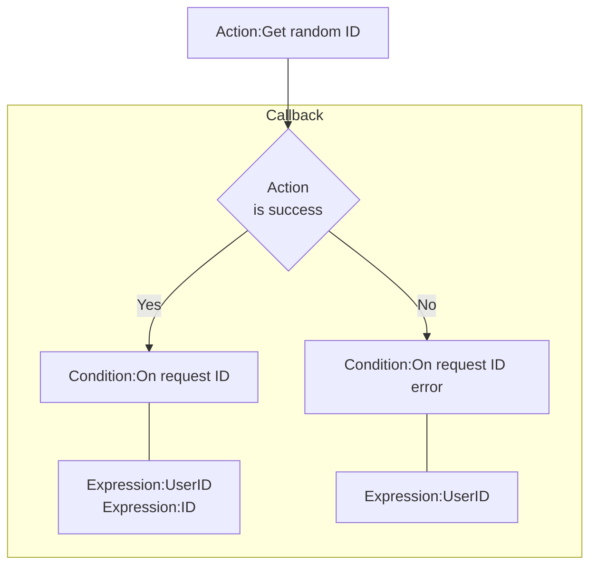
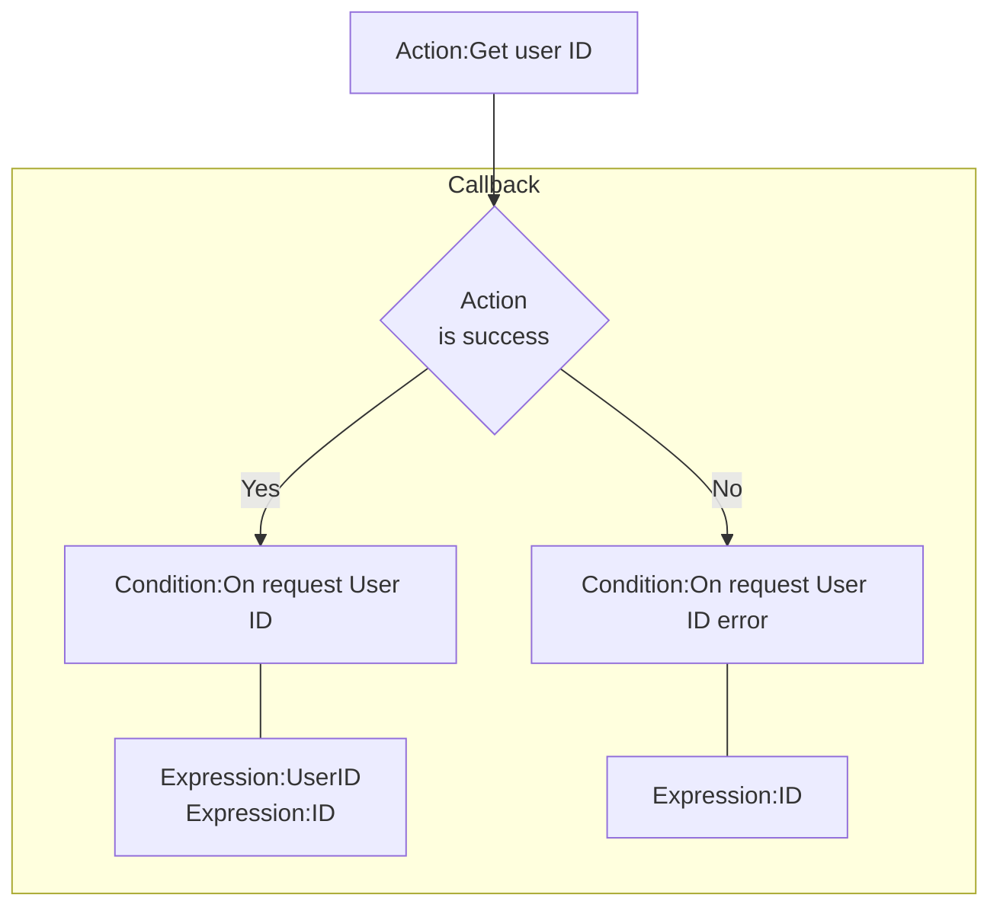
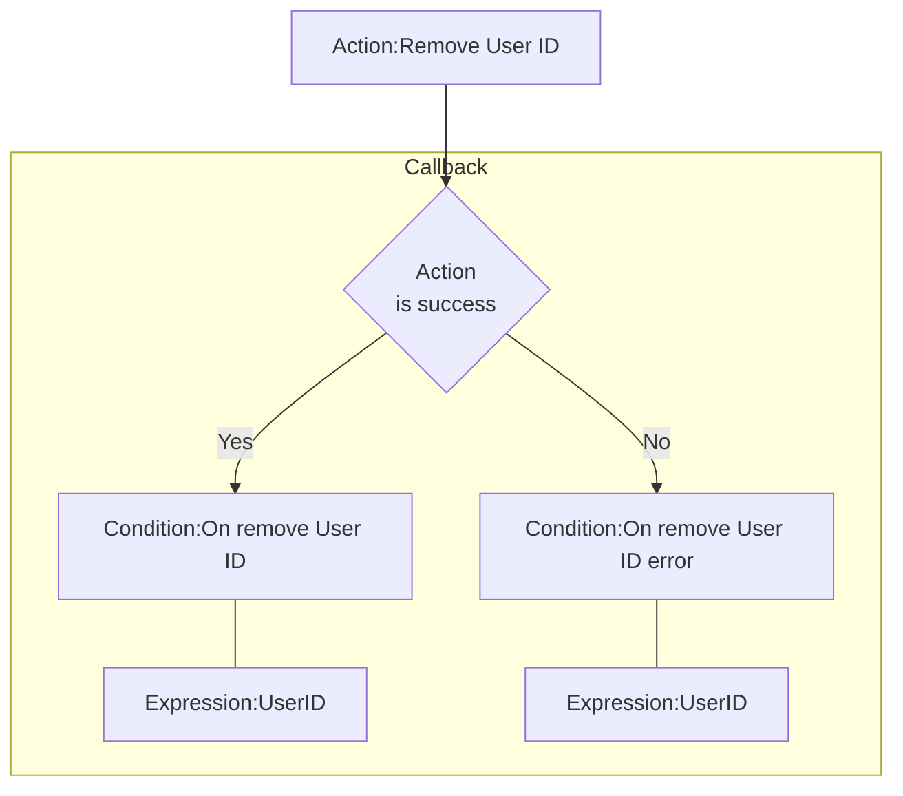
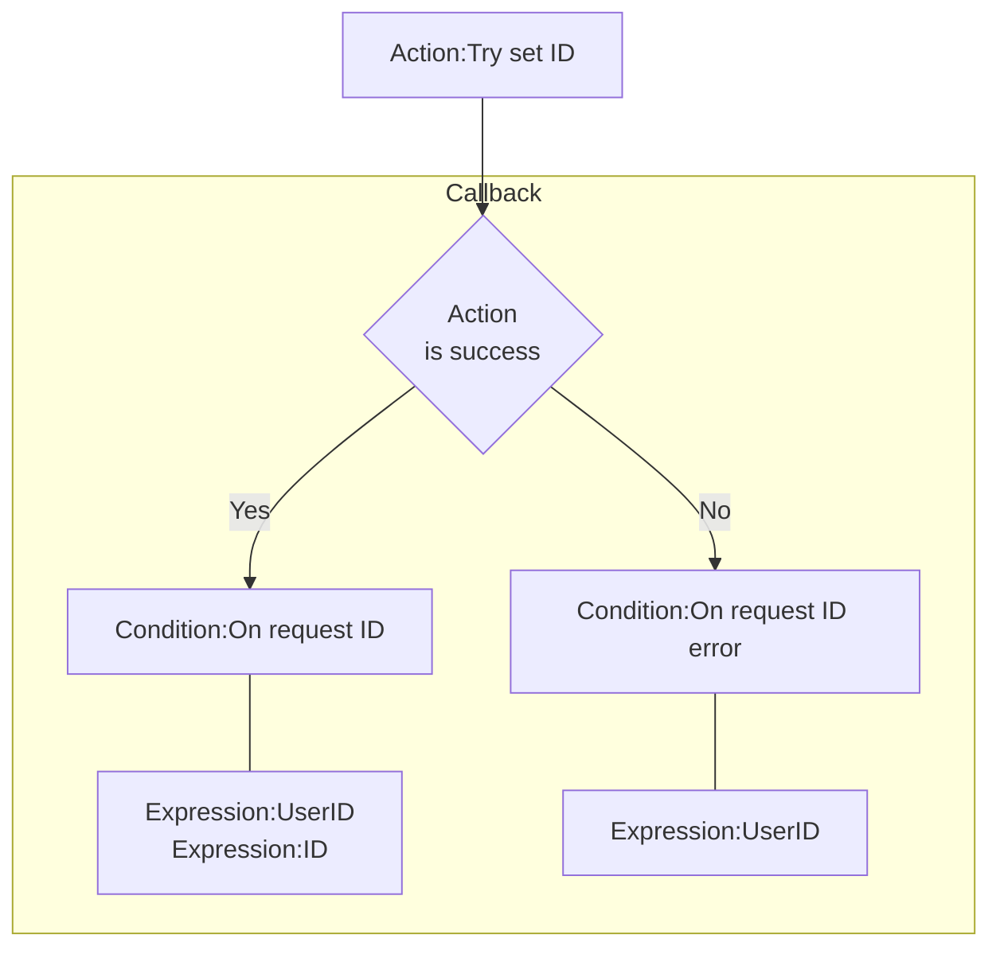

# [Categories](categories.index.html) > [Firebase](firebase.index.html) > rex_firebase_userid2id

## Introduction

Each UserID could register an alias ID.

UserID might be provided after [authentication](rex_firebase_authentication.html).

## Links

- [Plugin](https://dl.dropboxusercontent.com/u/5779181/C2Repo/Zip/plugins/rex_firebase_userid2id.7z)
- [ACE table](https://rexrainbow.github.io/C2RexDoc/c2rexpluginsACE/plugin_rex_firebase_userid2id.html)
- [Discussion thread](https://www.scirra.com/forum/plugin-firebase_t121776)

----

[TOC]

## Dependence

- [rex_firebase_apiV3](rex_firebase_apiv3.html)

## Usage

###Random number ID

#### Get ID

*UserID --> ID*



[Sample capx](https://onedrive.live.com/redir?resid=7497FD5EC94476E!2367&authkey=!AILGnt9BA_2kdjg&ithint=file%2ccapx)

1. `Action:Get random ID`
   - Get ID if UserID has registered,
   - Else, register UserID with a random ID and return this ID
2. Callback
   - Success : `Condition:On request ID`
     - `Expression:UserID`, `Expression:ID`
   - Failed : `Condition:On request ID error`

#### Get UserID

*ID --> UserID*



1. `Action:Get user ID`
2. Callback
   - Success : `Condition:On request User ID`
     - `Expression:UserID`, `Expression:ID`
   - Failed : `Condition:On request User ID error`

#### Remove UserID



1. `Action:Remove User ID`
2. Callback
   - Success : `Condition:On remove User ID`
     - `Expression:UserID`
   - Failed : `Condition:On remove User ID error`
     - `Expression:UserID`

### specific ID

#### Set ID



[Sample capx](https://onedrive.live.com/redir?resid=7497FD5EC94476E!2366&authkey=!ACQpwr4iWplacbI&ithint=file%2ccapx)

1. `Action:Try set ID`
2. Callback
   - Success : `Condition:On request ID`, if UserID has not been registered
     - `Expression:UserID`, `Expression:ID`
   - Failed : `Condition:On request ID error`

#### Get UserID

See section of `Get UserID` in `Random number ID`.

#### Remove UserID

See section of `Remove UserID` in `Random number ID`.

----

### Rules of data indexing

Add data indexing rule to improve the query performance.  ([Reference](https://firebase.google.com/docs/database/security/indexing-data))

Assume that sub domain is `UserID-ID` :

```json
{  
    "rules": {
        ".read": true,
        ".write": true,
               
        "UserID-ID": {
            ".indexOn": ".value"
        }        
    }  
}
```


