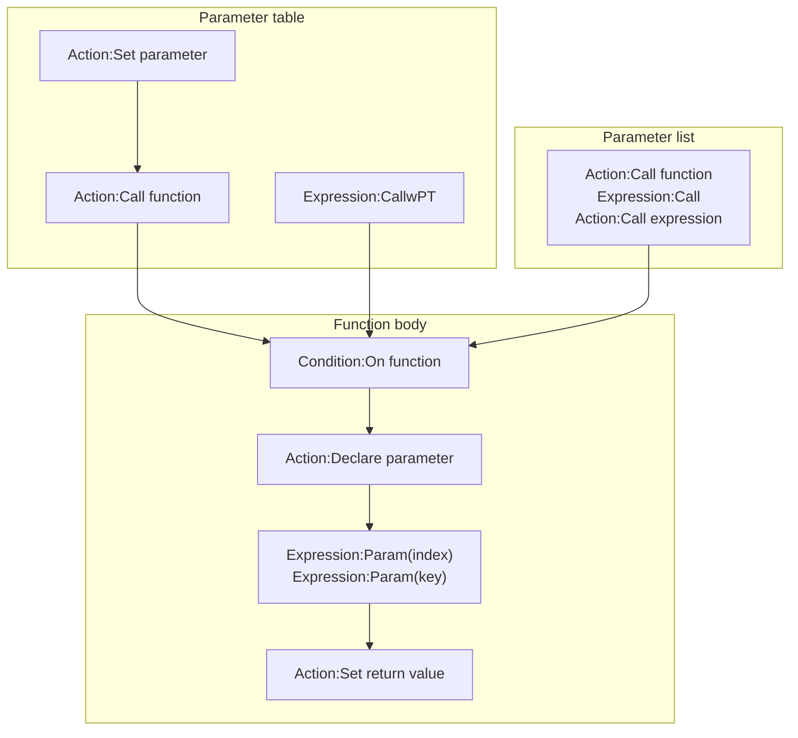

# [Categories](categories.index.html) > [Logic](logic.index.html) > rex_function2

## Introduction

- Call function with key(string) - value parameters (parameter table), or parameter list
- Input parameters with default value
- Return single value, or JSON structure

## Links

- [Plugin](https://dl.dropboxusercontent.com/u/5779181/C2Repo/Zip/plugins/rex_function2.7z)
- [ACE table](https://rexrainbow.github.io/C2RexDoc/c2rexpluginsACE/plugin_rex_function2.html)
- [Discussion thread](https://www.scirra.com/forum/plugin-rex-function2_t64334)

----

[TOC]

## Dependence

None

## Usage



[Sample capx](https://1drv.ms/u/s!Am5HlOzVf0kHg189N0WN1apSekfp)

1. Call function

   - Parameter list (similar with [official function object](https://www.scirra.com/manual/149/function))
     - Action
       - `Action:Call function` under  `Parameter list` category
       - `Action:Call expression`
     - Expression
       - `Expression:Call(functionName, value0, value1, ...)`
   - Parameter table
     - Action
       1. `Action:Set parameter`
       2. `Action:Call function` under  `Parameter table` category
     - Expression
       - `Expression:CallwPT(functionName, paramName0, value0. paramName1, value1, ...)`

2. Function body

   1. `Condition:On function`

      - Parameter `Name` is case *insensitive*

   2. `Action:Declare parameter`, at top of function body, *before any `Expression:Param`*

      - Each `Action:Declare parameter` assigns a parameter `Name` to Nth input parameter

      - Check value type of input parameter by parameter `Type check`

      - Set parameter value by parameter `Value` if this input parameter is not found in current function call

      - For example,

        ```javascript
        Call "SetPos"(100, 200)
        ```

        to trigger condition

        ```javascript
        + On "SetPos"
        - Parameter "x", default to 0      // Param("x") = Param(0) = 100  (1st parameter)
        - Parameter "y", default to 0      // Param("y") = Param(1) = 200  (2nd parameter)
        - Parameter "layer", default to 0  // Param("layer") = 0  (default value)
        ```

   3. Get value of input parameters

      - `Expression:Param( n )`, index by number, like  [official function object](https://www.scirra.com/manual/149/function)
        - `Expression:Param( 0 )`, `Expression:Param( 1 )`, ...
      - `Expression:Param( key )`, index by string
        - `Expression:Param( "x" )`, `Expression:Param( "y" )`, ...
      - `Condition:Type of parameter`  ([Sample capx](https://1drv.ms/u/s!Am5HlOzVf0kHkz1MxAYMEwKB02br))
      - `Expression:ParamCount`

   4. Return value

      - Return single value
        - `Action:Set return value` under `Return` category
        - `Expression:ReturnValue`
      - Return JSON  ([Sample capx](https://1drv.ms/u/s!Am5HlOzVf0kHk0QsiKDYrhvsIeVD))
        - `Action:Set return value` under `Return: dictionary` category
          - Parameter `Name` is a string with dot notation, like `Action:Set value` in  [JSON plugin](https://rexrainbow.github.io/C2RexDoc/plugins.md/rex_hash.html)
        - `Expression:ReturnValue`, returns all keys in JSON string
          - `Expression:ReturnValue( key )`, returns value of the key
            - Parameter `Key` is a string with dot notation, like `Expression:At( keys )` in  [JSON plugin](https://rexrainbow.github.io/C2RexDoc/plugins.md/rex_hash.html)
          - `Expression:ReturnValue( key, defaultValue )`, returns `defaultValue` if key is not existed

----

### Debug

- Set property `Debug mode` to `On`
  - Dump the trace of function call at console, including passing parameters