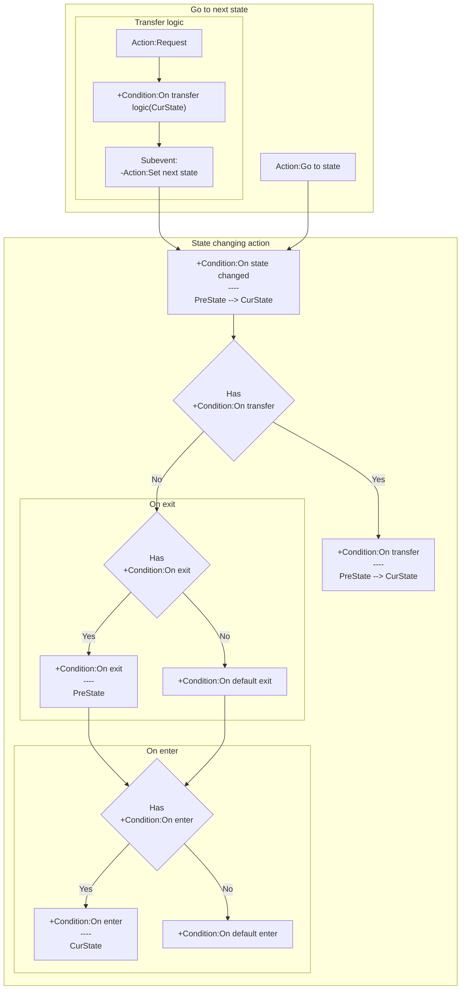

# [Categories](categories.index.html) > [Logic](logic.index.html) > rex_gfsm

## Introduction

Describe [finite state machine](http://en.wikipedia.org/wiki/Finite-state_machine).

## Links

- [Plugin](https://dl.dropboxusercontent.com/u/5779181/C2Repo/Zip/plugins/rex_gfsm.7z)
- [ACE table](https://rexrainbow.github.io/C2RexDoc/c2rexpluginsACE/plugin_rex_gfsm.html)
- [Discussion thread](https://www.scirra.com/forum/plugin-rex-gfsm-behavior-rex-fsm_t104075)

----

[TOC]

## Dependence

None

## Usage

[Sample capx](https://onedrive.live.com/redir?resid=7497FD5EC94476E!559&authkey=!AHTpy-YR7vd8hyw&ithint=file%2c.capx)

### Flow chart

### Go to next state

- `Action:Request`, get and go to next state by event. Style of *behavior tree*.
  1. `Action:Request`, go to next state which determined by
  2. `Condition:On transfer logic(Curstate)` 
     1. set next state by `Action:Set next state`
        - State will not change if `Action:Set next state` does not invoke.
- `Action:Go to state`, go to next state directly.

### State changing actions

Add actions under these conditions, which will be triggered when state is changed from `Expression:PreState` to `Expression:CurState`

1. `Condition:On state changed` 
2. If `Condition:On transfer` is in event sheet,
   - `Condition:On state changed` 
   - Else
     1. If `Condition:On exit` is in event sheet,
        - `Condition:On exit`
        - Else `Condition:On default exit`
     2. If `Condition:On enter` is in event sheet,
        - `Condition:On enter`
        - Else `Condition:On default enter`

**DO NOT** change state (`Action:Request` or `Action:Go to state`) under these conditions directly, or inserts a `System action: wait (0)` above `Action:Request` or `Action:Go to state`, which could suspend remaining actions until next tick.

### Initial state

Set initial state in property `Initial state`.

### Debug

Dump current state by `Expression:CurState` under `Condition:On state changed`, to track the state changing.