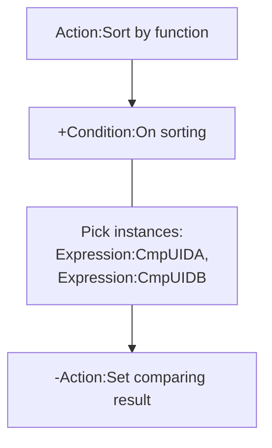
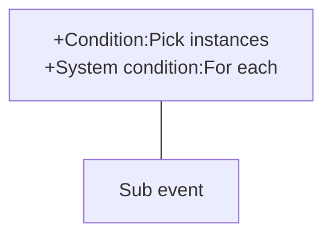
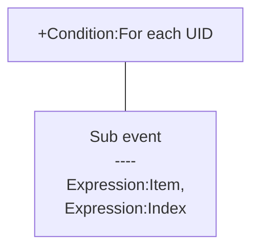

# [Categories](categories.index.html) > [Data structure](datastructure.index.html) > rex_ginstgroup

## Introduction

Stores instances reference by their UID in a *group*, each group is

- a set for set operations, or
- a list for push/pop/sorting/shuffling operations

## Links

- [Plugin](https://rexrainbow.github.io/C2RexDoc/repo/rex_ginstgroup.7z)

- [ACE table](https://rexrainbow.github.io/C2RexDoc/c2rexpluginsACE/plugin_rex_ginstgroup.html)

- [Discussion thread](https://www.scirra.com/forum/plugin-instance-group_t67642)

  ​

----

[TOC]

## Dependence

None

## Usage

[Sample capx](https://onedrive.live.com/redir?resid=7497FD5EC94476E%21520&authkey=%21APNtGd903GKvpzQ&ithint=file%2c.capx)

### Manage group

#### Add instance(s)

Add instance(s) into a group

- `Action:Add instances`, `Action:Add instances by UID`
- `Action:Clean & Add instances`, `Action:Clean & Add instance by UID`

#### Copy group

`Action:Copy`, copies content of a group to another one.

#### Remove instance(s)

Remove instance(s) from a group

- `Action:Remove instances`, `Action:Remove instances by UID`

Remove and destroy instances of a group

- `Action:Destroy instances`

#### Clean or destroy group

Clean or destroy a group

- `Action:Clean group`
- `Action:Destroy group`, `Action:Destroy all`

#### Instance is in group

`Condition:UID in group`, returns true if an UID is in group.

#### Amount of instances

`Expression:InstCnt( group )` , returns count of instances in group.

#### Dump instances

Dump instances of a group by `Expression:GroupToString( group )` , which returns a JSON string of UID list.

----

### SOL

Pick instances of a group

- `Action:Pick instances`, `Condition:Pick instances`
- `Action:Pop one instance`, `Condition:Pop one instance`

It is similar with `Object condition: Pick by unique ID`.

#### Pass SOL into function

[Sample capx](https://skydrive.live.com/redir?resid=7497FD5EC94476E!371&authkey=!AI64HTpl2mK3etY)

----

### Set operations

Merge two groups by one of these operations.

- `Action:A + B`
- `Action:A - B`
- `Action:A AND B`
- `Condition:Is a subset`
- `Condition:Empty`

----

### List/array operations

Instances in an order list.

#### Push

- `Action:Insert instances`, `Action:Insert instance by UID`
- `Action:Push instances`, `Action:Push instance by UID`

#### Pop

- `Action:Pop one instance`, `Condition:Pop one instance`, `Expression:Pop( group, index )`
- `Action:Pop random instance`, `Condition:Pop random instance`, `Expression:RandomPop`
- `Action:Slice`

#### List

- `Action:Sort by UID`
- `Action:Sort by function`
  - Trigger comparing function`Condition:On sorting`
  - Pick two comparing instances by `Expression:CmpUIDA`, `Expression:CmpUIDB`
  - Return comparing result by `Action:Set comparing result`, or `Action:Set comparing result by number`




- `Action:Shuffle`
- `Action:Reverse`

#### Retrieve

Retrieve instances

1. Pick instances of group into SOL by `Condition:Pick instances`
2. Retrieve instances in order by `System condition:For each`



Retrieve UID

1. `Condition:For each UID`
   - `Expression:Item`, UID
   - `Expression:Index`



##### Get UID by index

- `Expression:Index2UID( group, index )`, returns UID by index. Returns (-1) if index is out of list.
- `Expression:FirstUID( group )`, returns UID of first instance in group
- `Expression:LastUID( group )`, returns UID of the last instance in group
- `Expression:RandomIndex2UID( group )`, return an UID randomly in group

##### Get index of UID

- `Expression:UID2Index( group, UID)` returns the index of UID in group. Returns (-1) if UID is not in group.
- `Expression:RandomIndex( group )`, returns a random index of group.

----

### Private group

`Expression: PrivateGroup( UID, group )` returns a special group name formatted by 

```json
"@" + uid + "$" + group
```

, to bind a group with an instance. This group will be removed automatically when related instance had been destroyed.

For example, group `@10$aa`,`@10$bb`  will be destroyed automatically when instances which uid=10 had been destroyed. 

----

### Save&Load

This plugin supports official save/load system, i.e. it could be saved&loaded automatically.

Or save/load manually,

- `Expression:AllToString` , `Action:Load all` : save/load all groups
- `Expression:GroupToString`, `Action:Load group` : save/load a group