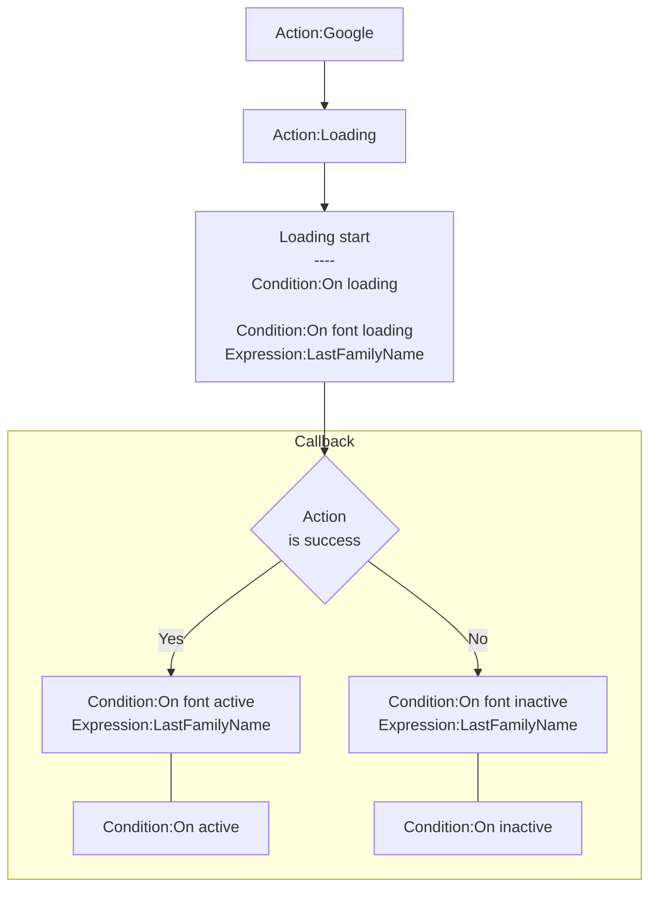
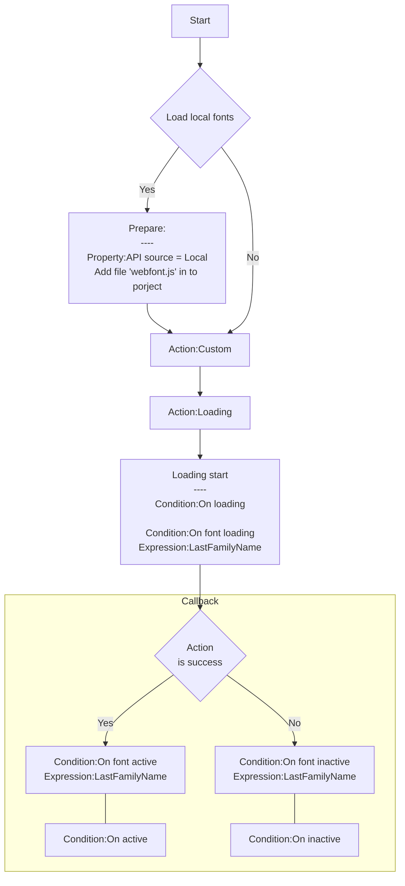

# [Categories](categories.index.html) > [Text](text.index.html) > rex_google_webfontloader

## Introduction

Loads web font. 

Reference: [webfontloader](https://github.com/typekit/webfontloader)

## Links

- [Plugin](https://dl.dropboxusercontent.com/u/5779181/C2Repo/Zip/plugins/rex_google_webfontloader.7z)
- [ACE table](https://rexrainbow.github.io/C2RexDoc/c2rexpluginsACE/plugin_rex_google_webfontloader.html)
- [Discussion thread](https://www.scirra.com/forum/plugin-web-font-loader_t179201)

----

[TOC]

## Dependence

None

## Usage

**This plugin only loads web font ONCE**

### Load google web font

[Sample capx](https://1drv.ms/u/s!Am5HlOzVf0kHk2-OuJJOO-D_VW9t)

1. `Action:Google`
   - [Google web font](https://fonts.google.com/)
2. `Action:Loading`
   - `Condition:On loading`
   - `Condition:On font loading`, when a font is loading started
     - `Expression:LastFamilyName`
3. Callback
   - Success : 
     - `Condition:On font active`, when a font is loaded
       - `Expression:LastFamilyName`
     - `Condition:On active`, when all fonts are loaded
   - Failed : 
     - `Condition:On font inactive`, when a font loaded failed
       - `Expression:LastFamilyName`
     - `Condition:On inactive`, when all fonts loaded failed

### Load custom web font

1. Prepare, if loads local fonts
   1. Set property `API source` to `Local`
   2. Add file *webfont.js* into project
      - *webfont.js* could be found in folder of this plugin
2. `Action:Custom`
   - Parameter `URL`
     - URL of CSS file
       - [Load from web](https://1drv.ms/u/s!Am5HlOzVf0kHk3AgTYTSVp2VcyF5)
       - [Load from local](https://1drv.ms/u/s!Am5HlOzVf0kHk3WTe7VSx3spfxBe)
     - URL of font file
       - [Load from web](https://1drv.ms/u/s!Am5HlOzVf0kHk3afO6p31AIXAYf_)
       - [Load from local](https://1drv.ms/u/s!Am5HlOzVf0kHk3GkDZpbGS7Clfpy)
3. `Action:Loading`
   - `Condition:On loading`
   - `Condition:On font loading`, when a font is loading started
     - `Expression:LastFamilyName`
4. Callback
   - Success : 
     - `Condition:On font active`, when a font is loaded
       - `Expression:LastFamilyName`
     - `Condition:On active`, when all fonts are loaded
   - Failed : 
     - `Condition:On font inactive`, when a font loaded failed
       - `Expression:LastFamilyName`
     - `Condition:On inactive`, when all fonts loaded failed