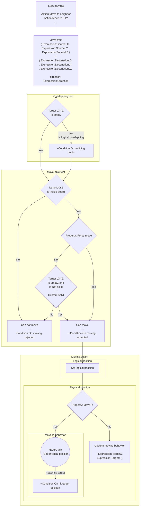
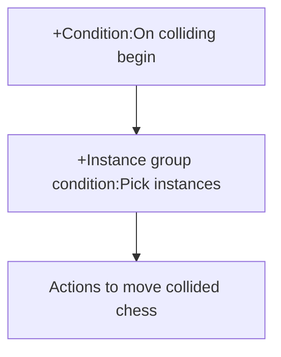
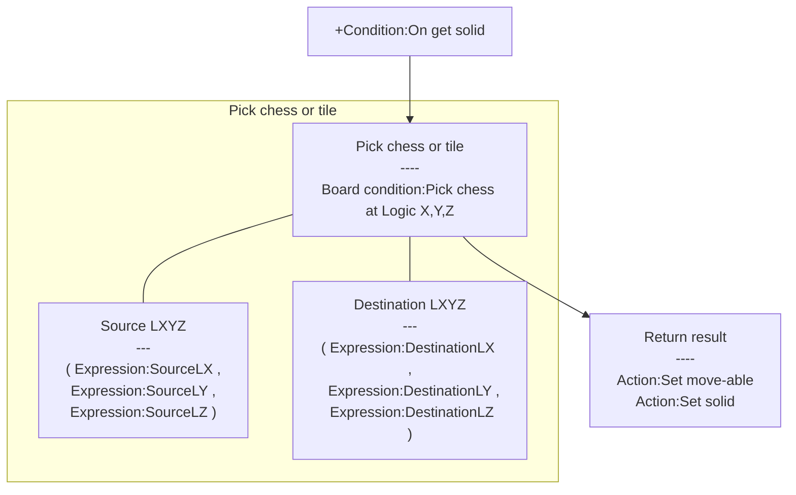

# [Categories](categories.index.html) > [Board](board.index.html) > rex_grid_move

## Introduction

Moves chess to target position, or neighbor tile.

## Links

- [Plugin](https://dl.dropboxusercontent.com/u/5779181/C2Repo/Zip/behaviors/rex_grid_move.7z)

- [ACE table](https://rexrainbow.github.io/C2RexDoc/c2rexpluginsACE/behavior_rex_grid_move.html)

- [Discussion thread](https://www.scirra.com/forum/plugin-board-layout2board-behavior-grid-move_t69647)

  ​

----

[TOC]

## Dependence

None

## Usage

### Moving start

[Sample capx](https://onedrive.live.com/redir?resid=7497FD5EC94476E%21341&authkey=%21AMZnEBTIPc2ENTI&ithint=file%2ccapx)

Call one of these action to start moving chess

- `Action:Move to neighbor` to move chess to neighbor
- `Action:Move to chess`, `Action:Move to chess by UID` to move chess to target chess/tile
- `Action:Move to LXY`, `Action:Move to offset` to move to the specific logical position. 

Chess will try to move

- from ( `Expression:SourceLX` , `Expression:SourceLY` , `Expression:SourceLZ` ) 
- to ( `Expression:DestinationLX` , `Expression:DestinationLY` , `Expression:DestinationLZ` ) 
- direction: `Expression:Direction` , if the target is a neighbor. 

### Overlapping test

Plugin first checks the target LXYZ is empty or not.

- Trigger `Condition:On colliding begin` if target LXYZ is not empty
  - Collided chess will be picked into an [instance group](rex_ginstgroup.html).
  - Design could move away these collided chess under this condition to remove colliding situation. ([Sample capx](https://onedrive.live.com/redir?resid=7497FD5EC94476E!2243&authkey=!ALhHOnx4dkTw2rg&ithint=file%2ccapx))

### Moving accepted or rejected

Next, it will test if chess could move to target LXYZ or not, when

1. target LXYZ is inside board, and
2. property `Force move` is `Yes` , otherwise (`Force move` is `No`), 
   1. Target LXYZ is empty
   2. Target LXY does not have *solid* chess
      - Chess has [official solid behavior](https://www.scirra.com/manual/104/solid), or
      - Has custom solid property set by `Condition:On get solid` ([Sample capx](https://onedrive.live.com/redir?resid=7497FD5EC94476E!523&authkey=!ADhjbRqVtUhW4V8&ithint=file%2ccapx))
        - Return solid result by `Action:Set move-able` or `Condition:On get solid`

After testing,

- `Condition:On moving accepted` will be triggered if testing passes, then moves chess.
- `Condition:On moving rejected` will be triggered if testing failed.
  - `Expression:BlockerUID` : UID of solid or occupied chess at target logical position

#### Flow chart of *Condition:On colliding begin*

#### Flow chart of *Condition:On get solid* 

### Moving

#### Move to logical position

Chess will move to target logical position immediately if moving accepted.

Z-index will be changed when logical overlapping in `Force move` mode.

#### Move to physical position 

Chess will move from current physical position to target physical position ( `Expression:TargetX` , `Expression:TargetY` ) by [rex_moveto](rex_moveto.html)-like behavior if property `MoveTo` is set to `Yes`.  `Condition:On hit target position` will be triggered when moving to target position.

Set property `MoveTo` to `No` to turn off built-in moving behavior.

##### Continue mode

Set `Continued mode` to `Yes` to move object continuously. Moving action under `Condition:On hit target position` will move forward immediately using remaining time of current tick.

### Stop

`Action:Stop` will stop physical moving, it will not change the logical position.

### Swap

`Action:Swap` could swap and move two chess at the same time. The target chess is indicated by UID.

---

### Wrap

[Sample capx](https://onedrive.live.com/redir?resid=7497FD5EC94476E!987&authkey=!ALUtYHHMGVslfZw&ithint=file%2ccapx)
Wrap mode is enabled by `Wrap` property in [rex_board object](rex_board.html), which will wrap the logical boundaries. It will also effect the physical moving when chess moves across wrapped boundaries.

For example, in 10x10 board -

- Moves from (0, 0) to (9, 0) : (0,0) and (9,0) are wrapped neighbors. 
  1. Chess moves left until out of board, 
  2. wrap to rightmost side, 
  3. moves left to (9,0).
- Moves from (1, 0) to (9, 0) :
  - chess moves right from (1,0) to (9,0) directly.

----

### AI

This behavior also provides some actions to move chess to neighbor for AI.

#### Wander

[Sample capx](https://onedrive.live.com/redir?resid=7497FD5EC94476E!522&authkey=!AOdQ6WFVmtI-smk&ithint=file%2ccapx)
`Action:Wander` could move to a neighbor tile randomly inside a boundary, 

- from (center position - range)

- to (center position + range)

The center position is

- the initial position when chess created, or
- reset by `Action:Reset center position`

The boundary is set by

- properties (`Wander range x`, `Wander range y`), or
- `Action:Set range x`, `Action:Set range y`

#### Approach/Depart

[Sample capx](https://onedrive.live.com/redir?resid=7497FD5EC94476E!2246&authkey=!ALcsanpYbg0aY2E&ithint=file%2ccapx)

`Action:Approach/Depart`, or `Action:Approach/Depart chess by UID` could move chess approach to, 

or depart from target chess.