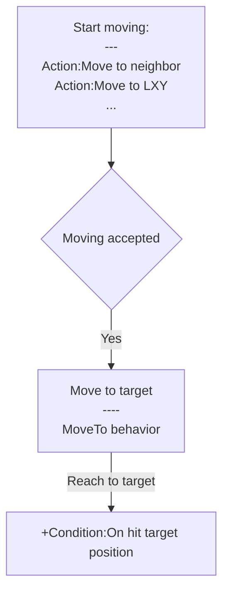

# [Index](index.html) > [Board](board.index.html) > rex_grid_move

## Introduction

Moves chess to target position, or neighbor tile.

## Links

- [Plugin](https://dl.dropboxusercontent.com/u/5779181/C2Repo/Zip/behaviors/rex_grid_move.7z)

- [ACE table](https://rexrainbow.github.io/C2RexDoc/c2rexpluginsACE/behavior_rex_grid_move.html)

- [Discussion thread](https://www.scirra.com/forum/plugin-board-layout2board-behavior-grid-move_t69647)

  ​

----

[TOC]

## Dependence

None

## Usage##

### Move chess

[Sample capx](https://onedrive.live.com/redir?resid=7497FD5EC94476E%21341&authkey=%21AMZnEBTIPc2ENTI&ithint=file%2ccapx)

Call one of these action to start moving chess

- `Action:Move to neighbor` to move chess to neighbor
- `Action:Move to chess`, `Action:Move to chess by UID` to move chess to target chess/tile
- `Action:Move to LXY`, `Action:Move to offset` to move to the specific logical position. 

