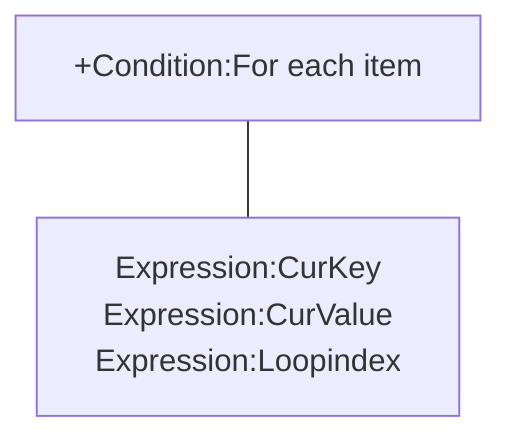

# [Categories](categories.index.html) > [Data structure](datastructure.index.html) > rex_hash

## Introduction

Manipulate [JSON](http://www.json.org/) data.

## Links

- [Plugin](https://dl.dropboxusercontent.com/u/5779181/C2Repo/Zip/plugins/rex_hash.7z)
- [ACE table](https://rexrainbow.github.io/C2RexDoc/c2rexpluginsACE/plugin_rex_hash.html)
- [Discussion thread](https://www.scirra.com/forum/plugin-hash-table_t65765)


----

[TOC]

## Dependence

None

## Usage

### Load

`Action:Load JSON`

### Content

`Expression:AsJSON`

### Dictionary

#### Write

- `Action:Set value`
- `Action:Add to`  ([Sample capx](https://onedrive.live.com/redir?resid=7497FD5EC94476E!2354&authkey=!AHVfbFqnmOdfl1o&ithint=file%2ccapx))
- `Action:Set JSON`
- `Action:Remove key`
- `Action:Clean all`
- `Action:Merge`, to merge another JSON  ([Sample capx](https://onedrive.live.com/redir?resid=7497FD5EC94476E!235&authkey=!AJ1ZUGw6di8hSS0&ithint=file%2ccapx))

Parameter `Key` is a string with dot notation. For example, content is

```json
{
  "a":10,
  "b":{
    "c":30
  },
  "d": 40
}
```

Set `root.b.c` by key `b.c`.

New object will be created if not exists.

#### Read

##### Read a value

- `Expression:At( keys )`, keys in a string with dot notation
  - `Expression:At( "" )`, returns root
- `Expression:At( keys , defaultValue )`, return `defaultValue` if keys is not existed
- `Expression:AtKeys( key0, key1, ... )`, keys in parameters

For example get value at `root.b.c` :

```json
Expression:At( "b.c" ),
Expression:AtKeys( "b", "c" )
```

- `Condition:Key exists`, returns true if key is existed
- `Expression:RandomKeyAt`, returns a random key in object

##### Retrieve keys in object



- `Condition:For each item`  [Sample capx](https://onedrive.live.com/redir?resid=7497FD5EC94476E!234&authkey=!AAYxuMIQwwy2q58&ithint=file%2ccapx)
  - `Condition:For each item`
  - `Expression:CurKey`
    - `Expression:CurValue( keys )`, child in current item
  - `Expression:Loopindex`, loop index of current for each
- `Action:Pick keys`, put all keys in object into an official array.  [Sample capx](https://onedrive.live.com/redir?resid=7497FD5EC94476E!498&authkey=!ANljbJ8AywYUxC4&ithint=file%2ccapx)
- `Expression:ItemCnt`, amount of keys in object
  - `0` : this object is a number or a string
  - `-1` : object is not existed

### Array

#### Write

- Initial an array
  - `Action:Set JSON` with parameter `JSON` to `[]`


- Push
  - `Action:Push value`
  - `Action:Push JSON`  [Sample capx](https://onedrive.live.com/redir?resid=7497FD5EC94476E!2355&authkey=!ABkoJfkcPAMBHfk&ithint=file%2ccapx)
- Insert
  - `Action:Insert value`
  - `Action:Insert JSON`
- Remove
  - `Action:Remove key`
- Array length
  - `Expression:ItemCnt`
- Order
  - `Action:Sort`  [Sample capx](https://onedrive.live.com/redir?resid=7497FD5EC94476E!2352&authkey=!AFYt6MhRyURevNY&ithint=file%2ccapx)
  - `Action:Shuffle`  [Sample capx](https://onedrive.live.com/redir?resid=7497FD5EC94476E!2349&authkey=!AAGOmvn4UItqYcw&ithint=file%2ccapx)

#### Read

##### Read a value

- `Expression:At( keys )`, keys in a string with dot notation
- `Expression:AtKeys( key0, key1, ... )`


- `Expression:Pop`, pop the last item
  - `Expression:Pop(keys, index)`, pop item at index

##### Retrieve keys in array

- `Condition:For each item`  [Sample capx](https://onedrive.live.com/redir?resid=7497FD5EC94476E!234&authkey=!AAYxuMIQwwy2q58&ithint=file%2ccapx)
  - `Condition:For each item`
  - `Expression:CurKey`
    - `Expression:CurValue( keys )`, child in current item
  - `Expression:Loopindex`, loop index of current for each
- `System condition:For`, from `0`  to `Expression:ItemCnt - 1`

------

### Save&Load

This plugin support official save/load system.