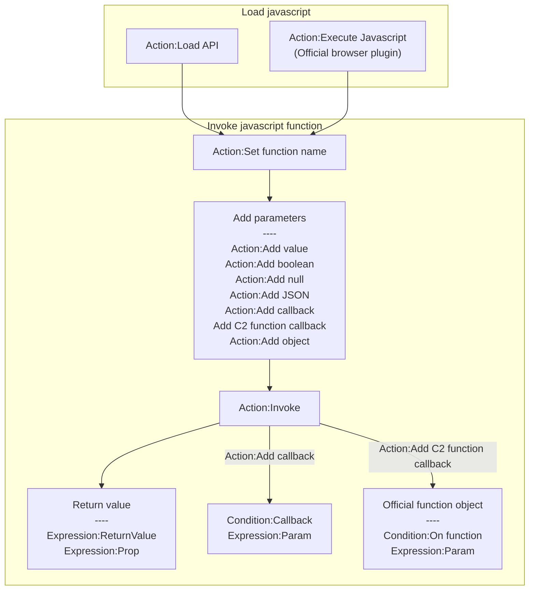
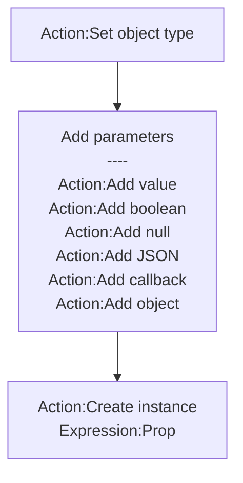

# [Categories](categories.index.html) > [Logic](logic.index.html) > rex_jsshell

## Introduction

Invoke javascript function.

## Links

- [Plugin](https://rexrainbow.github.io/C2RexDoc/repo/rex_jsshell.7z)
- [ACE table](https://rexrainbow.github.io/C2RexDoc/c2rexpluginsACE/plugin_rex_jsshell.html)
- [Discussion thread](https://www.scirra.com/forum/plugin-rex-jsshell-invoke-javascript-function_t192080)

----

[TOC]

## Dependence

None

## Usage

### Invoke function

1. Load javascript
   - `Action:Load API`  ([Sample capx](https://1drv.ms/u/s!Am5HlOzVf0kHlw7eyf712LjnrFUD))
   - `Action:Execute Javascript`  ([Sample capx](https://1drv.ms/u/s!Am5HlOzVf0kHlw3JugBBOi6bIQwm))
     - (Official browser plugin)
2. `Action:Set function name`
3. Add parameters
   - `Action:Add value`
   - `Action:Add boolean`
   - `Action:Add null`
   - `Action:Add JSON`
   - `Action:Add callback`
   - `Action:Add C2 function callback`
   - `Action:Add object`
4. `Action:Invoke`
   - Return value
     - `Expression:ReturnValue`
     - `Expression:ReturnValue(key)`, to get property of return value
     - `Expression:ReturnValue(key, defaultValue)`
     - `Expression:Prop(key)`
   - Store return object to variable  ([Sample capx](https://1drv.ms/u/s!Am5HlOzVf0kHlypUxGKJJmQVHHh7))
     - `Expression:Prop(key)`
     - `Expression:Prop(key, defaultValue)`
5. Callback
   - `Condition:Callback`, from callback parameter (`Action:Add callback`)
     - `Expression:Param(n)`, to get nth parameter of callback
     - `Expression:Param(n, key)`, to get property of nth parameter of callback
     - `Expression:Param(n, key, defaultValue)`
   - `Condition:On function` of official function object, from C2 function callback (`Action:Add C2 function callback`)  ([Sample capx](https://1drv.ms/u/s!Am5HlOzVf0kHlyyCKZIOXvR8XInG))
     - `Expression:Param(n)`, to get nth parameter of callback

### Create instance

[Sample capx](https://1drv.ms/u/s!Am5HlOzVf0kHlynuEYccVuGBndAk)

1. `Action:Set object type`
2. Add parameters
   - `Action:Add value`
   - `Action:Add boolean`
   - `Action:Add null`
   - `Action:Add JSON`
   - `Action:Add callback`
   - `Action:Add C2 function callback`
   - `Action:Add object`
3. `Action:Create instance`
   - `Expression:Prop(key)`
   - `Expression:Prop(key, defaultValue)`