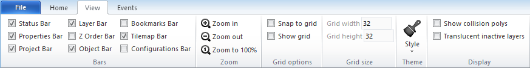

# [Categories](categories.index.html) > [Board](board.index.html) > rex_layout2board

## Introduction

Add chess/tiles on board object, these chess/tiles could be placed at layout editor.

## Links

- [Plugin](https://rexrainbow.github.io/C2RexDoc/repo/rex_layout2board.7z)
- [ACE table](https://rexrainbow.github.io/C2RexDoc/c2rexpluginsACE/plugin_rex_layout2board.html)
- [Discussion thread](https://www.scirra.com/forum/plugin-board-layout2board-behavior-grid-move_t69647)

----

[TOC]

## Dependence

- [rex_board](rex_board.html)

## Usage

### Add chess to board

1. Configure layout editor
   - Enable the `Snap to grid`
   - Set `Grid width` and `Grid height` 

   

2. Set layout ([squareTx](rex_board_squaretx.html), or [hexTx](rex_board_hextx.html)) object

   - Property `Width`, `Height`

3. `Action:Put chess on board`

   - Add tile (parameter `Logic Z`=0)  first
   - Pop alerts if add chess at a non-empty cell

#### Grid width and height

- Orthogonal board  ([sample capx](https://onedrive.live.com/redir?resid=7497FD5EC94476E!530&authkey=!AEJSUQs9iZGH6IM&ithint=file%2c.capx))

  - `Grid width` = property `Width` of [squareTx](rex_board_squaretx.html)
  - `Grid height` = property `Height` of [squareTx](rex_board_squaretx.html)

  

- Isometric board  ([sample capx](https://onedrive.live.com/redir?resid=7497FD5EC94476E!531&authkey=!APQPd2bpdiHNvr4&ithint=file%2c.capx))

  - `Grid width` = 0.5 * property `Width` of [squareTx](rex_board_squaretx.html)
  - `Grid height` = 0.5 * property `Height` of [squareTx](rex_board_squaretx.html)

  

- Hexagonal board  ([sample capx](https://onedrive.live.com/redir?resid=7497FD5EC94476E!529&authkey=!AC_x8uQU8YUrykQ&ithint=file%2c.capx))

  - [HexTx](rex_board_hextx.html) : Property `Axis` 

    - `Left-Right`

      - `Grid width` = 0.5 * property `Width` of  [hexTx](rex_board_hextx.html)
      - `Grid height` = property `Height` of [hexTx](rex_board_hextx.html)

      

    - `Top-Down`
      - `Grid width` = property `Width` of  [hexTx](rex_board_hextx.html)
      - `Grid height` = 0.5 * property `Height` of [hexTx](rex_board_hextx.html)