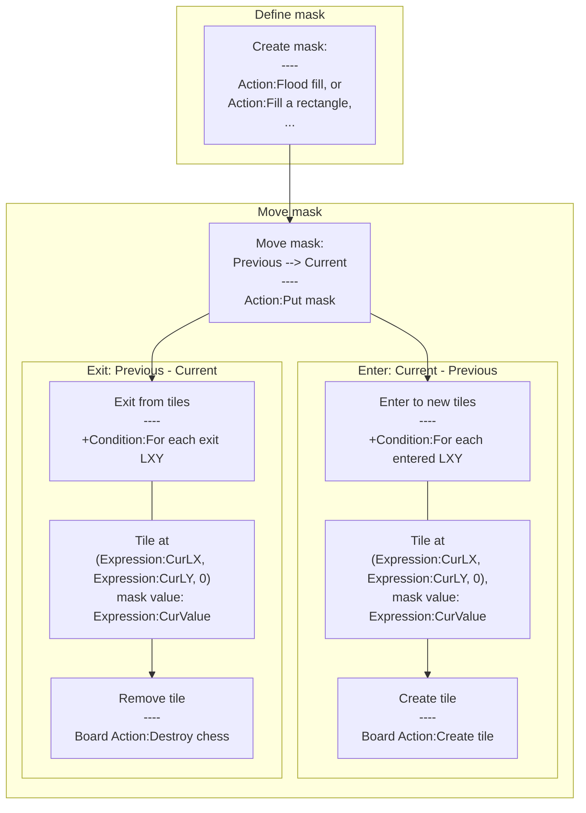

# [Categories](categories.index.html) > [Board](board.index.html) > rex_logicmask

## Introduction

Display a logical area on a very large board.

## Links

- [Plugin](https://dl.dropboxusercontent.com/u/5779181/C2Repo/Zip/plugins/rex_logicmask.7z)
- [ACE table](https://rexrainbow.github.io/C2RexDoc/c2rexpluginsACE/plugin_rex_logicmask.html)
- [Discussion thread](https://www.scirra.com/forum/plugin-rex-logicmask_t118875)


----

[TOC]

## Dependence

Optional:

- [rex_board_squareTx](http://c2rexplugins.weebly.com/rex_board_squaretx.html)
- [rex_board_hexTx](http://c2rexplugins.weebly.com/rex_board_hextx.html)

## Usage

### Concept



Defines a mask area then moves it, to get new covered (entered) tiles and uncovered (exited) tiles.

### Define mask

- `Action:Fill a rectangle`
- `Action:Fill a point`
- `Action:Flood fill `, 
  - requires [rex_board_squareTx](rex_board_squaretx.html) , or [rex_board_hexTx](rex_board_hextx.html)
- `Action:Clean a point`, `Action:Clean`

### Move mask

Call `Action:Put mask` to move this mask, to get new covered (entered) tiles and uncovered (exited) tiles.

- `Entered area  = Current_logic_coverage  -  Previous_logic_coverage`, i.e. area which did not in previous coverage, but in current coverage
  - `Condition:For each entered LXY`, to get each entered tile
    - Create  tile at (`Expression:CurLX`, `Expression:CurLY`, 0) by  `Board Action:Create tile`.
    - Mask value `Expression:CurValue`, optional.
- `Exited area  = Previous_logic_coverage  -   Current_logic_coverage`,  i.e. area which in previous coverage, but not in current coverage
  - `Condition:For each exit LXY`, to get each exited tile
    - Destroy tile at (`Expression:CurLX`, `Expression:CurLY`, 0) by  `Board Action:Destroy chess`.
    - Mask value `Expression:CurValue`, optional.
- Current coverage
  - `Condition:For each masked LXY`, to get current masked tile
    - Tile at (Expression:CurLX, Expression:CurLY, 0)
    - Mask value `Expression:CurValue`, optional.
  - (`Expression:OX` , `Expression:OY`) , logical position of current mask
  - `Condition:In mask area`, returns true if a position is inside current mask.

----

### Example

#### Define mask

Fills mask by a rectangle at 

- Left-top (X , Y) to (-1, -1) and 
- Width to 3, 
- Height to 3. 

The mask will become

```
(-1, -1)    (0, -1)    (1, -1)
(-1,  0)    (0,  0)    (1,  0)
(-1,  1)    (0,  1)    (1,  1)
```

#### Move mask

Then put this mask to logic position (50, 50) , 

- The coverage area will become

```
(49, 49)    (50, 49)    (51, 49)
(49, 50)    (50, 50)    (51, 50)
(49, 51)    (50, 51)    (51, 51)
```

- All these coverage logic position are entered area.

Put this mask to logic position (51, 50) , 

- The coverage area will become

```
(50, 49)    (51, 49)    (52, 49)
(50, 50)    (51, 50)    (52, 50)
(50, 51)    (51, 51)    (52, 51)
```

- The entered area

```
(52, 49) , (52, 50) , (52, 51)
```

- The exited area

```
(49, 49) , (49, 50) , (49, 51)
```

----

### More samples

[Using logic mask with rex_board](https://onedrive.live.com/redir?resid=7497FD5EC94476E!1014&authkey=!AAgE7vo2EOVc9Ww&ithint=file%2ccapx)
[Move on a very large board](https://onedrive.live.com/redir?resid=7497FD5EC94476E!1024&authkey=!AF1lJt1z-lGtoXs&ithint=file%2ccapx)