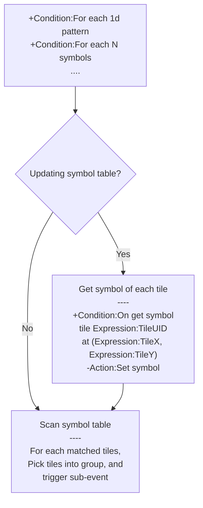

# [Categories](categories.index.html) > [Board](board.index.html) > rex_matcher

## Introduction

Pick tiles which match the pattern on board object.

## Links

- [Plugin](https://dl.dropboxusercontent.com/u/5779181/C2Repo/Zip/plugins/rex_matcher.7z)

- [ACE table](https://rexrainbow.github.io/C2RexDoc/c2rexpluginsACE/plugin_rex_matcher.html)

- [Discussion thread](https://www.scirra.com/forum/plugin-matcher_t74348)

  ​

----

[TOC]

## Dependence

- [rex_board](http://c2rexplugins.weebly.com/rex_board.html)
- [rex_ginstgroup plugin](http://c2rexplugins.weebly.com/rex_ginstgroup.html)


## Usage

### Prepare

This plugin picks matched tiles into a group. therefor [rex_board](http://c2rexplugins.weebly.com/rex_board.html) and [rex_ginstgroup](http://c2rexplugins.weebly.com/rex_ginstgroup.html) objects should be put into project first.

### Concept

#### Symbol

Each tile has a symbol indicated by a word, like  `1`, or null, stored in the symbol table.

##### Reserve symbol

`,` is a reserved symbol of delimiter.

#### Pattern

##### 1-d pattern

A pattern is a sequence of symbols, it could be one-dimension, like `111`. Or separated by `,` like `1,1,1`.

##### 2-d pattern

The pattern also could be two-dimensions represented by csv format, for example

```
1,1,1
,1,
```

This pattern is composed of four "1" symbols within "T" shaped.

### Get matched tiles




[Sample capx](https://onedrive.live.com/redir?resid=7497FD5EC94476E!533&authkey=!ADYTyOWuJ5udAek&ithint=file%2c.capx)

Steps of picking matched tiles

1. the matching procedure starts by these conditions
   - 1d pattern
     - `Condition:For each 1d pattern`, `Condition:For each N symbols`
     - `Condition:Any 1d pattern`, `Condition:Any N symbols` : to pick first matched tiles
   - 2d pattern
     - `Condition:For each 2D pattern`, `Condition:For each 2D template pattern`
     - `Condition:Any 2D pattern`, `Condition:Any 2D template pattern` : to pick first matched tiles
2. updating symbol table for each tile if property `Update symbols` is set to `Auto`
   - `Condition:On get symbol`,
   - to get symbol on a tile `Expression:TileUID`at (`Expression:TileX`, `Expression:TileY`, 0)
   - return symbol by `Action:Set symbol`.
3. picking each matched tiles into instance group, and trigger sub event.
   - manipulate these tiles by conditions or actions of [rex_ginstgroup](rex_ginstgroup.html).

`Condition:No pattern` returns true if no matched found in last picking condition.

### Update symbol table

Symbol table will be updated when 

- executing picking conditions (`Condition:For each 1d pattern`, `Condition:For each N symbols`, ... etc) if `Update symbols` is set to `Auto`
  - only updates once in a tick
- `Action:Update all`

These actions only updates symbol of a tile

- `Action:Update cell by LXY`
- `Action:Update cell by chess`
- `Action:Update cell by chess uid`

### Axis of square board

There are three axis for 1d pattern of [square board](squaretx.html), enable them in properties table or actions

- property `Horizontal`, `Action:Compare at horizontal axis`
- property `Vertical`, `Action:Compare at vertical axis`
- property `Isometric`, `Action:Compare at isometric axis`