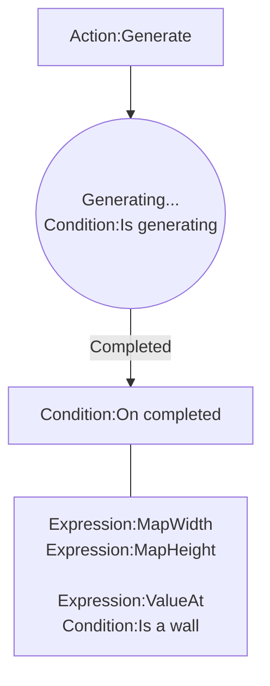

# [Categories](categories.index.html) > [Board](board.index.html) > rex_maze_gen

## Introduction

Generate random maze asynchronously. 

Reference: [rot.js](http://ondras.github.io/rot.js/hp/)

## Links

- [Plugin](https://dl.dropboxusercontent.com/u/5779181/C2Repo/Zip/plugins/rex_maze_gen.7z)
- [ACE table](https://rexrainbow.github.io/C2RexDoc/c2rexpluginsACE/plugin_rex_maze_gen.html)
- [Discussion thread](https://www.scirra.com/forum/plugin-rex-maze-gen_t167845)

----

[TOC]

## Dependence

None

## Usage

### Generate maze

[Sample capx](https://onedrive.live.com/redir?resid=7497FD5EC94476E%212162&authkey=%21AAoxHY5DTYpo1SU&ithint=file%2ccapx)

1. `Action:Generate`
2. Generating in webworker
   - `Action:Cancel`
3. Trigger `Condition:On completed` when completed
   - Map size
     - `Expression:MapWidth`, `Expression:MapHeight`
   - Cell symbol
     - `Expression:ValueAt`
       - `0` : empty space,
       - `1` : wall
       - `-1` : not in map
     - `Condition:Is a wall`, returns true if a tile is a wall (or an empty space)
   - A possible solution to create map
     - Create tiles in multi-ticks : [rex_eventbalancer plugin](rex_eventbalancer.html) + [rex_loopiterator plugin](rex_loopiterator.html)
     - Position of each tile in orthogonal or isometric map :  [rex_board_squareTx plugin](rex_board_squaretx.html)

- `Action:Release`, to release current maze in memory

------

### Save & load

It supports official saving & loading feature.