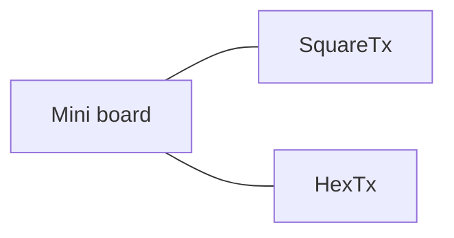
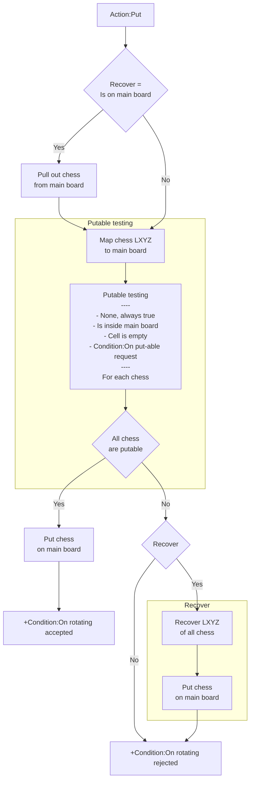
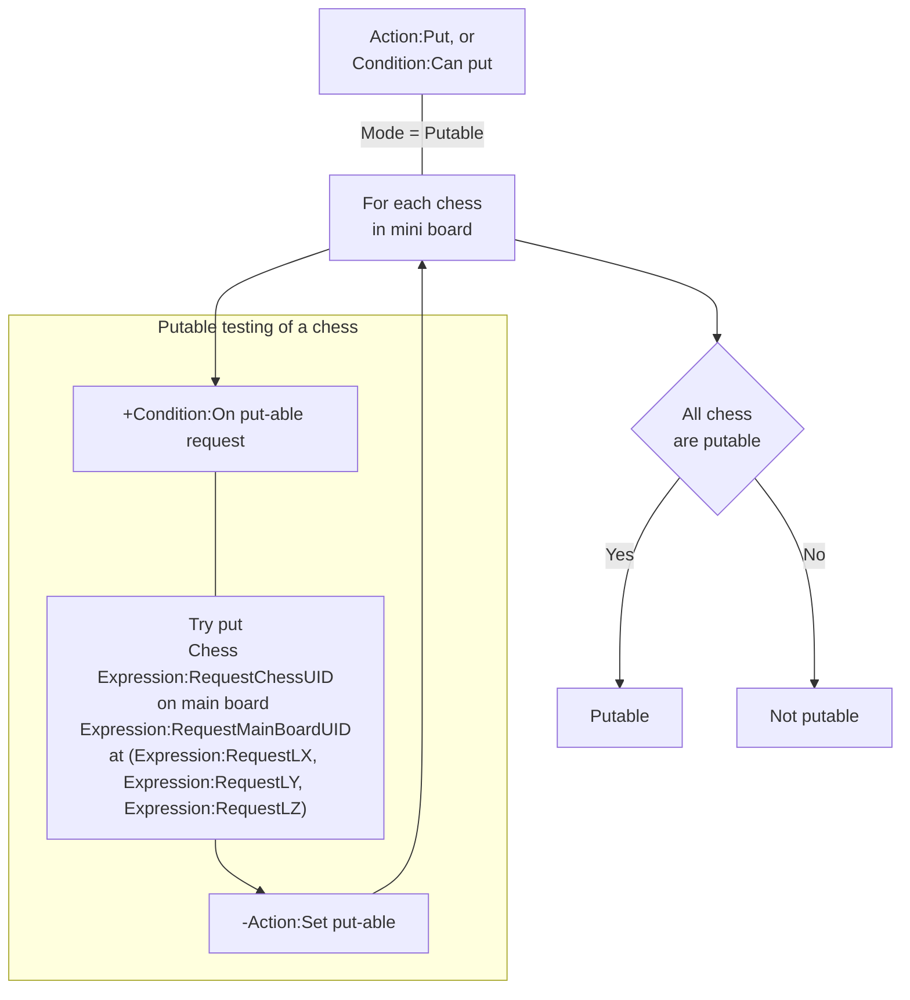

# [Categories](categories.index.html) > [Board](board.index.html) > rex_miniboard

## Introduction

A board-container to group chess and move them together.

## Links

- [Plugin](https://rexrainbow.github.io/C2RexDoc/repo/rex_miniboard.7z)
- [ACE table](https://rexrainbow.github.io/C2RexDoc/c2rexpluginsACE/plugin_rex_miniboard.html)
- [Discussion thread](https://www.scirra.com/forum/plugin-mini-board_t116865)


----

[TOC]

## Dependence

- [rex_board_squareTx](rex_board_squaretx.html), or
- [rex_board_hexTx](rex_board_hextx.html)

## Usage

### Setup layout

Puts one of board-layout plugin 

- [rex_board_squareTx](rex_board_squaretx.html) : orthogonal/isometric/staggered layout
- [rex_board_hexTx](rex_board_hextx.html) : hexagonal layout



into project. Each board object should have a board-layout object.

Mini board and [rex_board](rex_board.html) could share the same board-layout.

Assign board-layout object manually by `Action:Setup layout` if the project has more than one board, and each board has different board-layout.

----

### Chess group

[Sample capx](https://onedrive.live.com/redir?resid=7497FD5EC94476E!979&authkey=!AJ8gjEx8Pof8qJs&ithint=file%2ccapx)

#### Add chess

A mini board object is a chess group.

-  `Action:Create chess`, or  `Action:Add chess`, to add chess into this mini board.

   -  A chess instance only could be added into a mini board.
   -  Logical position ( X, Y ) of chess is the related logical position when this mini board puts on main board ([rex_board](rex_board.html)).
   -  Logic position Z of chess will not change after putting on main board.

   ```
   Put mini board at (5,8) on main board,
   Chess at (-1,-2,1) on mini board will be placed at (4,6,1) on main board
   ```

-  `Condition:On chess kicked` will be triggered when adding a chess to an occupied cell.

#### Destroy

All chess in this mini board will be destroyed when the mini board is destroyed.

#### Release chess

`Action:Release all chess`, to release the reference of chess in this mini board. These chess will still exist.

----

### Put on the main board



[Sample capx](https://onedrive.live.com/redir?resid=7497FD5EC94476E!978&authkey=!AOKCL_TloCfo8s0&ithint=file%2ccapx)

1. `Action:Put`, or `Action:Put back`
2. If this min board is on main board already
   1. Save position of chess, Set *Recover = true*
   2. Pull out from this main board
3. Run put-able testing of all chess
   - **Put-able**, all test results are true
     1. Put chess to main board
     2. Trigger `Condition:On putting accepted`
   - **Not Put-able**, any test result are false
     1. If *Recover = true*
        1. Recover position of chess
        2. Put chess to main board
     2. Trigger `Condition:On putting rejected`
   - `Condition:Is putting accepted` returns true if putable.

####Put-able testing



`Action:Put`, `Action:Put back`or `Condition:Can put` will run one of put-able testing for each chess on min board.

- `None` : always returns true.

- `Inside `: cell is inside main board.

- `Empty` : cell is empty.

- `Putable` : get put-able result by event `Condition:On put-able request`

  - Triggers `Condition:On put-able request` for each chess
    - Try put chess `Expression:RequestChessUID` 
    - on main board `Expression:RequestMainBoardUID`
    - at (`Expression:RequestLX`, `Expression:RequestLY`, `Expression:RequestLZ`)
  - `Action:Set put-able`, or `Action:Set put-able by number` to return put-able result of this chess
    - Return Not put-able by default (i.e. no `Action:Set put-able` called)


Put-able of mini board

- **Put-able**, if all put-able testing are true, 
- **Not put-able**, if any put-able testing is false.

### Pull out from main board

`Action:Pull out` to put out this mini board from main board, i.e. remove the logical position of chess in this mini board.
Do nothing if this mini board is not on any main board.

### On main board

- `Condition:On the board` returns true if this mini board is at a main board.
- (`Expression:LX`, `Expression:LY`) : logical position of this mini board on main board

----

### Pin chess

Set property `Pin mode` to `Yes` to pin chess to mini board.

----

### Logical and physical position

- Logical position of chess in the mini board, (`Expression:UID2LX`, `Expression:UID2LY`, `Expression:UID2LZ`)
- Physical position of chess by (`Expression:UID2PX`, `Expression:UID2PY`)

----

### Layer

`Action:Move all to layer`, to move this miniboard and all chess to another layer.

----

### SOL

- Pick chess which are in mini board
  - `Condition:Pick chess`
  - `Action:Pick chess`
  - `Condition:Pick all chess`
  - `Action:Pick all chess`
- Pick mini board by chess
  - `Condition:Pick mini board`

----

### Color

Property `Color` is only used to identify the different mini board in layout editor.

