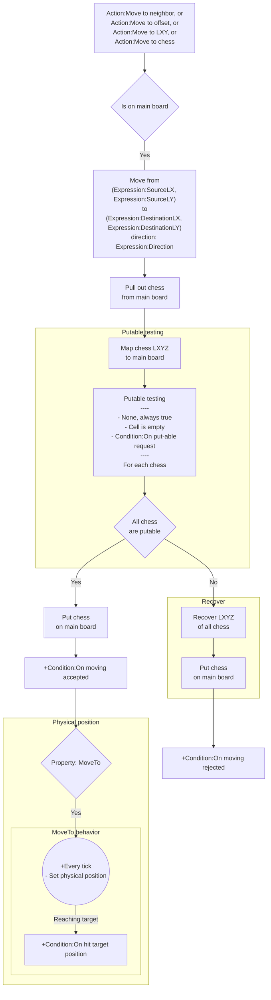

# [Categories](categories.index.html) > [Board](board.index.html) > rex_miniboard_move

## Introduction

A behavior of [mini board](rex_miniboard.html), which move chess on main board logically and physically.

## Links

- [Plugin](https://dl.dropboxusercontent.com/u/5779181/C2Repo/Zip/behaviors/rex_miniboard_rotate.7z)
- [ACE table](https://rexrainbow.github.io/C2RexDoc/c2rexpluginsACE/behavior_rex_miniboard_rotate.html)
- [Discussion thread](https://www.scirra.com/forum/plugin-mini-board_t116865)

----

[TOC]

## Dependence

- [rex_miniboard](rex_miniboard.html)

## Usage

### Move to

[Sample capx](https://onedrive.live.com/redir?resid=7497FD5EC94476E!998&authkey=!AErrbfT9kwIDR90&ithint=file%2ccapx)

1. Start moving
   - `Action:Move to neighbor`, or
   - `Action:Move to offset`, or 
   - `Action:Move to LXY`, or 
   - `Action:Move to chess`
2. If mini board is on main board
   1. Save position of chess
   2. Pull out from this main board
   3. Move LXYZ of mini board
      - from (`Expression:SourceLX`, `Expression:SourceLY`) 
      - to (`Expression:DestinationLX`, `Expression:DestinationLY`) 
      - direction: `Expression:Direction` , if the target is a neighbor. 
   4. Run **put-able testing** of all chess
      - **Put-able**, all test results are true
        1. Put chess to main board
        2. Trigger `Condition:On moving accepted`
      - **Not Put-able**, any test result are false
        1. Recover position of chess
        2. Put chess to main board
        3. Trigger `Condition:On moving rejected`
   5. If put-able and property `MoveTo` is `Yes`
      1. [Grid move](rex_grid_move.html) mini board to target physical position (`Expression:TargetX`, `Expression:TargetY`)
      2. Trigger `Condition:On hit target position` when reach target position

### Can move

- `Condition:Can move to neighbor `, returns true if mini board can move to neighbor.
- `Condition:Can move to`, returns true if mini board can move to specific LXY.

----

### More sample capx

[Tetris](https://onedrive.live.com/redir?resid=7497FD5EC94476E!1001&authkey=!AHIF5LinGc3mLCw&ithint=file%2ccapx)