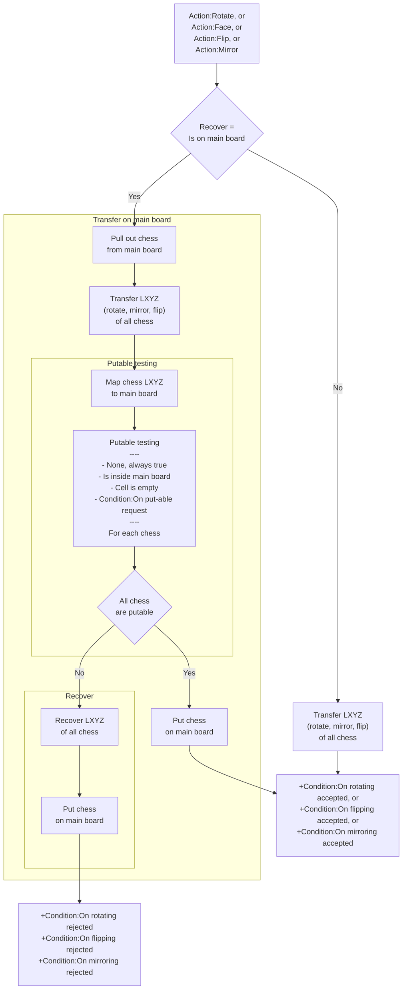

# [Categories](categories.index.html) > [Board](board.index.html) > rex_miniboard_rotate

## Introduction

A behavior of [mini board](rex_miniboard.html), which spin chess on mini board logically and physically.

## Links

- [Plugin](https://dl.dropboxusercontent.com/u/5779181/C2Repo/Zip/behaviors/rex_miniboard_rotate.7z)
- [ACE table](https://rexrainbow.github.io/C2RexDoc/c2rexpluginsACE/behavior_rex_miniboard_rotate.html)
- [Discussion thread](https://www.scirra.com/forum/plugin-mini-board_t116865)

----

[TOC]

## Dependence

- [rex_miniboard](rex_miniboard.html)

## Usage

### Transfer

[Sample capx](https://onedrive.live.com/redir?resid=7497FD5EC94476E!981&authkey=!ADyYTTeRfTxWu1Y&ithint=file%2ccapx)

1. `Action:Rotate`,  `Action:Face`, `Action:Mirror`,  or `Action:Flip`
   - `Action:Rotate`, to rotate the chess in the mini board.
   - `Action:Face`, to make the mini board face to specific direction.
   - `Action:Flip`, to toggle the sign of logic Y for each chess.
   - `Action:Mirror`, to toggle the sign of logic X for each chess.
2. If this min board is on main board already
   - On main board
     1. Save position of chess, Set *Recover = true*
     2. Pull out from this main board
     3. Transfer logical position of all chess
     4. Run **put-able testing** of all chess
        - **Put-able**, all test results are true
          1. Put chess to main board
          2. Trigger `Condition:On putting accepted`
        - **Not Put-able**, any test result are false
          1. If *Recover = true*
             1. Recover position of chess
             2. Put chess to main board
          2. Trigger `Condition:On putting rejected`
   - Not on any main board
     1. Rotate logical position of all chess
     2. Trigger `Condition:On putting accepted`

Set property  `RotateTo` to `Yes` to change physical position of chess to its logical position.

### Can transfer

- `Condition:Can rotate `, returns true if mini board can rotate.
- `Condition:Can face`, returns true if mini board can face to specific direction.
- `Condition:Can flip`, returns true if mini board can flip.
- `Condition:Can mirror`, returns true if mini board can mirror.

They won't change the logical and physical position.

### Initial direction

Set property `Direction` to assign initial direction of this mini board for `Action:Rotate`.