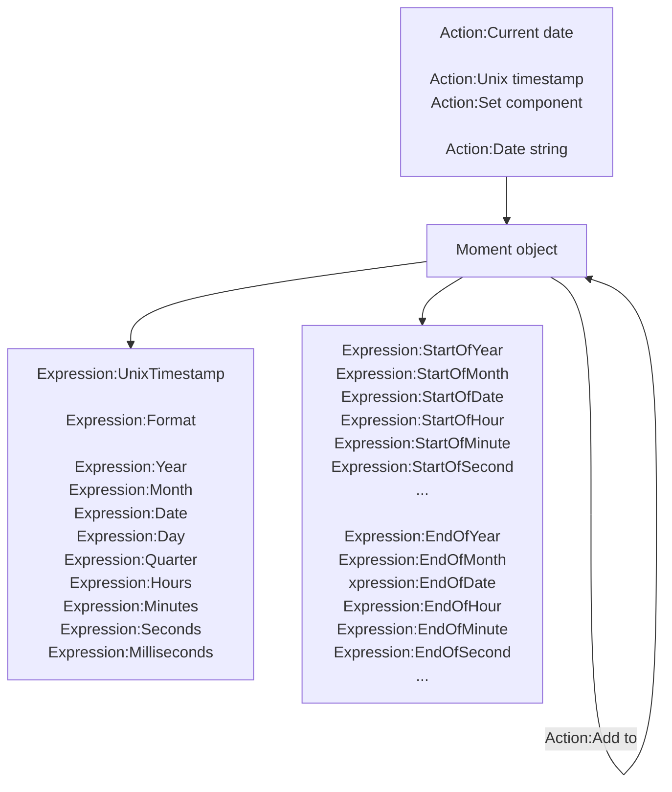

# [Categories](categories.index.html) > [Date&time](date.index.html) > rex_momentjs

## Introduction

Parse, validate, manipulate, and display dates. 

Reference : [moment.js](http://momentjs.com/)

## Links

- [Plugin](https://dl.dropboxusercontent.com/u/5779181/C2Repo/Zip/plugins/rex_momentjs.7z)
- [ACE table](https://rexrainbow.github.io/C2RexDoc/c2rexpluginsACE/plugin_rex_momentjs.html)
- [Discussion thread](https://www.scirra.com/forum/plugin-system-date-and-time_t63492)

----

[TOC]

## Dependence

None

## Usage

### Set date

- `Action:Current date`  ([sample capx](https://onedrive.live.com/redir?resid=7497FD5EC94476E!2335&authkey=!AJdDmvxiWnag0vs&ithint=file%2ccapx))
- `Action:Unix timestamp`  ([sample capx](https://onedrive.live.com/redir?resid=7497FD5EC94476E!2336&authkey=!AIZMGSOPwrfMEbk&ithint=file%2ccapx))
- `Action:Date string`
  - Parameter `Format`
    - `""` : [ISO 8601](http://en.wikipedia.org/wiki/ISO_8601). see next section
    - Custom format, see next section
- `Action:Set component`
- `Action:Clone`

#### Format of date string

##### ISO 8601 format

- Date part
  - `2013-02-08`, a calendar date part
  - `2013-W06-5`, a week date part
  - `2013-039`, an ordinal date part
  - `20130208`, basic (short) full date
  - `2013W065`, basic (short) week, weekday
  - `2013W06`, basic (short) week only
  - `2013050`, basic (short) ordinal date
- Time part, separated from the date part by a space ` ` or a uppercase `T`
  - `2013-02-08T09`, an hour time part separated by a `T`
  - `2013-02-08 09`, an hour time part separated by a space ` `
  - `2013-02-08 09:30`, an hour and minute time part
  - `2013-02-08 09:30:26`, an hour, minute, and second time part
  - `2013-02-08 09:30:26.123`, an hour, minute, second, and millisecond time part
  - `2013-02-08 24:00:00.000`, hour 24, minute, second, millisecond equal 0 means next day at midnight
  - `20130208T080910,123`, short date and time up to ms, separated by comma `,`
  - `20130208T080910.123`, short date and time up to ms
  - `20130208T080910`, short date and time up to seconds
  - `20130208T0809`, short date and time up to minutes
  - `20130208T08`, short date and time, hours only
- Any of the date parts can have a time part
  - `2013-02-08 09`, a calendar date part and hour time part
  - `2013-W06-5 09`, a week date part and hour time part
  - `2013-039 09`, an ordinal date part and hour time part
- If a time part is included, an offset from UTC can also be included as `+-HH:mm`, `+-HHmm`, `+-HH` or `Z`
  - `2013-02-08 09+07:00`, `+-HH:mm`
  - `2013-02-08 09-0100`, `+-HHmm`
  - `2013-02-08 09Z`, `Z`
  - `2013-02-08 09:30:26.123+07:00`, `+-HH:mm`
  - `2013-02-08 09:30:26.123+07`, `+-HH`

##### Custom format

Format is composed by these components, and ignores non-alphanumeric characters.

- Year, month, and day tokens
  - `YYYY` : 4 or 2 digit year (2014)
  - `YY` : 2 digit year (14)
  - `Y` : Year with any number of digits and sign (-25)
  - `Q` :Quarter of year. Sets month to first month in quarter. (1..4)
  - `M` `MM` : Month number (1..12)
  - `MMM` `MMMM` : Month name in locale (Jan..December)
  - `D` `DD` : Day of month (1..31)
  - `Do` : Day of month with ordinal (1st..31st)
  - `DDD` `DDDD` : Day of year (1..365)
  - `X` : Unix timestamp (1410715640.579)
  - `x` : Unix ms timestamp (1410715640579)
- Week year, week, and weekday tokens
  - `gggg` : Locale 4 digit week year (2014)
  - `gg` : Locale 2 digit week year (14)
  - `w` `ww` : Locale week of year (1..53)
  - `e` : Locale day of week (0..6)
  - `ddd` `dddd` : Day name in locale (Mon...Sunday)
  - `GGGG` : ISO 4 digit week year (2014)
  - `GG` : ISO 2 digit week year (14)
  - `W` `WW` : ISO week of year (1..53)
  - `E` : ISO day of week (1..7)
- Hour, minute, second, millisecond, and offset tokens
  - `H` `HH` : 24 hour time (0..23)
  - `h` `hh` : 12 hour time used with a A. (1..12)
  - `a` `A` : Post or ante meridiem (Note the one character a p are also considered valid) (am pm)
  - `m` `mm` : Minutes (0..59)
  - `s` `ss` : Seconds (0..59)
  - `S` `SS` `SSS` : Fractional seconds (0..999)
  - `Z` `ZZ` : Offset from UTC as +-HH:mm, +-HHmm, or Z (+12:00)

##### Format is valid

- `Condition:Is valid`

### Get date

- `Expression:Year`
- `Expression:Month` ( 0..11 )
- `Expression:Date`
- `Expression:Day`
- `Expression:Quarter`
- `Expression:Hours`
- `Expression:Minutes`
- `Expression:Seconds`
- `Expression:Milliseconds`
- `Expression:UnixTimestamp`

#### Display date

[Sample capx](https://onedrive.live.com/redir?resid=7497FD5EC94476E%212338&authkey=%21AFV7O7E8gBDyBXA&ithint=file%2ccapx)

- `Expression:Format`, ISO 8601 format

  - `Expression:Format(format)`

    - Year
      - `YY` : 70 71 ... 29 30
      - `YYYY` : 1970 1971 ... 2029 2030
      - `Y` : 1970 1971 ... 9999 +10000 +10001
    - Month
      - `M` : 1 2 ... 11 12
      - `Mo` : 1st 2nd ... 11th 12th
      - `MM` : 01 02 ... 11 12
      - `MMM` : Jan Feb ... Nov Dec
      - `MMMM` : January February ... November December
    - Day
      - Day of Month
        - `D` : 1 2 ... 30 31
        - `Do` : 1st 2nd ... 30th 31st
        - `DD` : 01 02 ... 30 31
      - Day of Year
        - `DDD` : 1 2 ... 364 365
        - `DDDo` : 1st 2nd ... 364th 365th
        - `DDDD` : 001 002 ... 364 365
      - Day of Week
        - `d` : 0 1 ... 5 6
        - `do` : 0th 1st ... 5th 6th
        - `dd` : Su Mo ... Fr Sa
        - `ddd` : Sun Mon ... Fri Sat
        - `dddd` : Sunday Monday ... Friday Saturday
      - Day of Week (Locale)
        - `e` : 0 1 ... 5 6
      - Day of Week (ISO)
        - `E` : 1 2 ... 6 7
    - AM/PM
      - `A` : AM PM
      - `a` : am pm
    - Hour
      - `H` : 0 1 ... 22 23
      - `HH` : 00 01 ... 22 23
      - `h` : 1 2 ... 11 12
      - `hh` : 01 02 ... 11 12
      - `k` : 1 2 ... 23 24
      - `kk` : 01 02 ... 23 24
    - Minute
      - `m` : 0 1 ... 58 59
      - `mm` : 00 01 ... 58 59
    - Second
      - `s` : 0 1 ... 58 59
      - `ss` : 00 01 ... 58 59
    - Fractional Second
      - `S` : 0 1 ... 8 9
      - `SS` : 00 01 ... 98 99
      - `SSS` : 000 001 ... 998 999
      - `SSSS` ... `SSSSSSSSS` : 000[0..] 001[0..] ... 998[0..] 999[0..]
    - Unix Timestamp
      - `X` : 1360013296, in seconds
      - `x` : 1360013296123, in millisecond

    - Quarter
      - `Q` : 1 2 3 4
      - `Qo` : 1st 2nd 3rd 4th
    - Week
      - Week of Year
        - `w` : 1 2 ... 52 53
        - `wo` : 1st 2nd ... 52nd 53rd
        - `ww` : 01 02 ... 52 53
      - Week of Year (ISO)
        - `W` : 1 2 ... 52 53
        - `Wo` : 1st 2nd ... 52nd 53rd
        - `WW` : 01 02 ... 52 53
    - Week Year
      - `gg` : 70 71 ... 29 30
      - `gggg` : 1970 1971 ... 2029 2030
    - Week Year (ISO)
      - `GG` : 70 71 ... 29 30
      - `GGGG` : 1970 1971 ... 2029 2030

  - Localized formats

    - `LT` : 8:30 PM
    - `LTS` : 8:30:25 PM
    - `L`  : 09/04/1986
    - `l` : 9/4/1986
    - `LL` : September 4 1986 
    - `ll` : Sep 4 1986
    - `LLL` : September 4 1986 8:30 PM
    -  `lll` : Sep 4 1986 8:30 PM
    - `LLLL` : Thursday, September 4 1986 8:30 PM
    -  `llll` : Thu, Sep 4 1986 8:30 PM

  - `[...]` : escaping characters. For example, `[today] dddd`

  - `Action:Set locale`, to set display language  ([Sample capx](https://onedrive.live.com/redir?resid=7497FD5EC94476E!2345&authkey=!AN2yY6NoEk94NjE&ithint=file%2ccapx))

### Manipulation

#### Add

[Sample capx](https://onedrive.live.com/redir?resid=7497FD5EC94476E!2337&authkey=!AMec3g-i9C2k2Kg&ithint=file%2ccapx)

- `Action:Add to`, to add years, quarters, months, weeks, days, hours, minutes, seconds, milliseconds to current date value

#### Elapsed time

[Sample capx](https://1drv.ms/u/s!Am5HlOzVf0kHlhaOIdGBOOZFuT6_)

- `Expression:ElapsedYears( prevDate )`, (curDate - prevDate) in years
- `Expression:ElapsedMonths( prevDate )`, (curDate - prevDate) in months
- `Expression:ElapsedDays( prevDate )`, (curDate - prevDate) in days
- `Expression:ElapsedHours( prevDate )`, (curDate - prevDate) in hours
- `Expression:ElapsedMinutes( prevDate )`, (curDate - prevDate) in minutes
- `Expression:ElapsedSeconds( prevDate )`, (curDate - prevDate) in seconds
- `Expression:ElapsedMilliseconds( prevDate )`, (curDate - prevDate) in milliseconds

Parameter `prevDate`

- number : unix timestamp
- string : date string

Add `1` at 2nd parameter to return float number. For example `Expression:ElapsedYears( prevDate , 1 )`

#### Start or end of date time

[Sample capx](https://1drv.ms/u/s!Am5HlOzVf0kHlEVfHFwI4r8Eyad5)

- Start date time
  - `Expression:StartOfYear`
  - `Expression:StartOfMonth`
  - `Expression:StartOfQuarter`
  - `Expression:StartOfWeek`
  - `Expression:StartOfISOWeek`
  - `Expression:StartOfDate`
  - `Expression:StartOfHour`
  - `Expression:StartOfMinute`
  - `Expression:StartOfSecond`
- End date time
  - `Expression:EndOfYear`
  - `Expression:EndOfMonth`
  - `Expression:EndOfQuarter`
  - `Expression:EndOfWeek`
  - `Expression:EndOfISOWeek`
  - `Expression:EndOfDate`
  - `Expression:EndOfHour`
  - `Expression:EndOfMinute`
  - `Expression:EndOfSecond`

Each expression returns unix timestamp or date string

- `Expression:StartOfYear`, returns unix timestamp
- `Expression:StartOfYear( "iso" )`, returns ISO date string
- `Expression:StartOfYear( format )`, returns formatted date string

### Time zone

[rex_momenttimezonejs](rex_momenttimezonejs.html)

