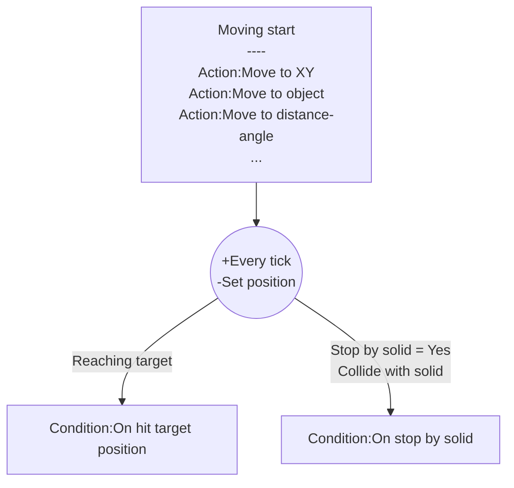

# [Categories](categories.index.html) > [Movement](movement.index.html) > rex_moveto

## Introduction

Move object to specific position.

## Links

- [Plugin](https://dl.dropboxusercontent.com/u/5779181/C2Repo/Zip/behaviors/rex_moveto.7z)

- [ACE table](https://rexrainbow.github.io/C2RexDoc/c2rexpluginsACE/behavior_rex_moveto.html)

- [Discussion thread](https://www.scirra.com/forum/behavior-moveto_t63156)​

----

[TOC]

## Dependence

None

## Usage

### Move start
[Sample capx](https://onedrive.live.com/redir?resid=7497FD5EC94476E!564&authkey=!AHMARIkJXF4kG9I&ithint=file%2c.capx)

- `Action:Move to XY`
- `Action:Move to delta XY`
- `Action:Move to object` 
- `Action:Move to distance-angle`

Target position is (`Expression:TargetX` , `Expression:TargetY`).

### Reach target

- `Condition:On hit target position`

### Stop

- `Action:Stop`

### Pause

- `Action:Set enabled` and set parameter  `State` to `Disabled`

### Resume

- `Action:Set enabled` and set parameter  `State` to `Enabled `

#### Stopped by solid object

[Sample capx](https://onedrive.live.com/redir?resid=7497FD5EC94476E!2168&authkey=!APcdQBwmSmXPACg&ithint=file%2ccapx)

Stop moving  when colliding any solid object

- Set property `Stop by solid`  to `Yes`, or  `Action:Stop by solid`
- Trigger `Condition:On stopped by solid` when stopped by solid object

### Continue mode

- Set property `Continued mode` to `Yes` 
  - Moving action under `Condition:On hit target position` will move forward immediately using remaining delta time

### Moving angle

- `Expression:MovingAngle` :  angle from previous position to current position.
- `Expression:MovingAngleStart` : angle from moving-start position to target position.

----

### Waypoints

Add [command queue behavior](rex_bcmdqueue.html) to pend target positions to make a series of waypoints.

