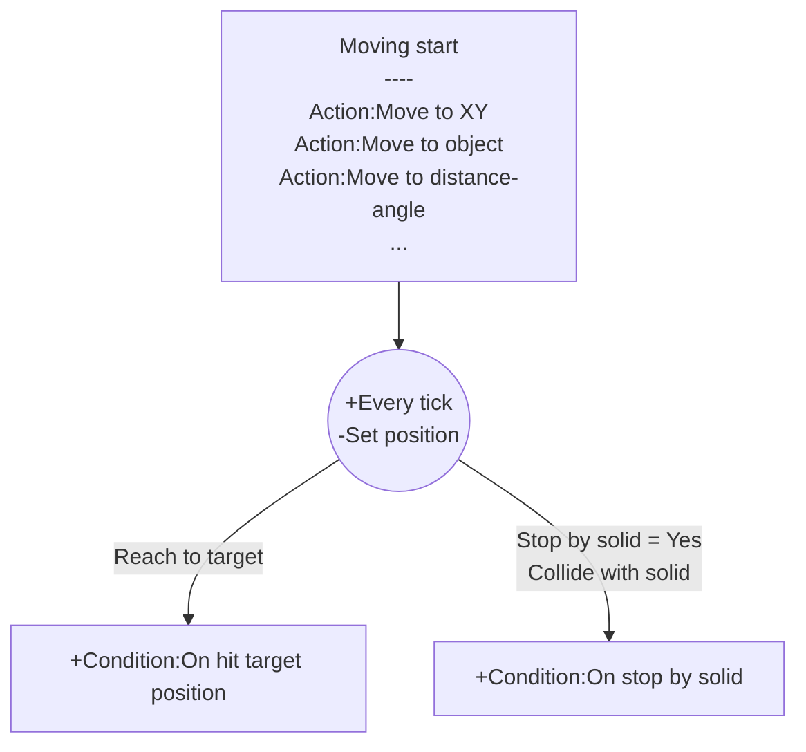

# [Index](index.html) > [Board](board.index.html) > rex_moveto

## Introduction

Move object to specific position.

## Links

- [Plugin](https://dl.dropboxusercontent.com/u/5779181/C2Repo/Zip/behaviors/rex_moveto.7z)

- [ACE table](https://rexrainbow.github.io/C2RexDoc/c2rexpluginsACE/behavior_rex_moveto.html)

- [Discussion thread](https://www.scirra.com/forum/behavior-moveto_t63156)

  ​

----

[TOC]

## Dependence

None

## Usage##

### Moving start
[Sample capx](https://onedrive.live.com/redir?resid=7497FD5EC94476E!564&authkey=!AHMARIkJXF4kG9I&ithint=file%2c.capx)

Call one of these actions to move instance to specific position. 

- `Action:Move to XY`
- `Action:Move to delta XY`
- `Action:Move to object` 
- `Action:Move to distance-angle`

Target position is (`Expression:TargetX` , `Expression:TargetY`).

`Condition:On hit target position` will be triggered when it moves to target position.

### Pause or resume

Call `Action:Set enabled` and set `State` parameter to `Disabled` to pause current moving. Set the `State` to `Enabled` to resume moving.

### Stopped by solid object

[Sample capx](https://onedrive.live.com/redir?resid=7497FD5EC94476E!2168&authkey=!APcdQBwmSmXPACg&ithint=file%2ccapx)
Set property `Stop by solid`  to `Yes`, or set by `Action:Stop by solid` to stop moving  when colliding any solid object, and `Condition:On stopped by solid` will be triggered.

### Continue mode

Set `Continued mode` to `Yes` to move object continuously.
Moving action under `Condition:On hit target position` with `Continued mode` to `Yes`, will move forward immediately using remaining delta time.

### Moving angle

There are 2 kinds of moving angle available.

- `Expression:MovingAngle` :  angle from previous position to current position.
- `Expression:MovingAngleStart` : angle from moving-start position to target position.

----

### Waypoints

Add [command queue behavior](rex_bcmdqueue.html) to pend target positions to make a series of waypoints.

