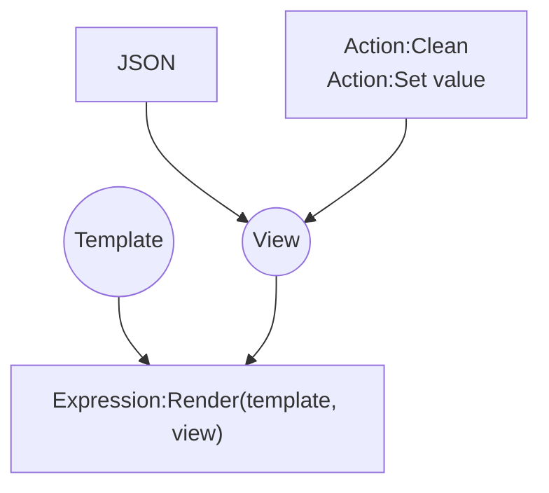

# [Categories](categories.index.html) > [String](string.index.html) > rex_mustache

## Introduction

Logic-less templates to render text content.

Reference - [mustache](https://github.com/janl/mustache.js)](https://github.com/npm/ini)

## Links

- [Plugin](https://dl.dropboxusercontent.com/u/5779181/C2Repo/Zip/plugins/rex_mustache.7z)
- [ACE table](https://rexrainbow.github.io/C2RexDoc/c2rexpluginsACE/plugin_rex_mustache.html)
- [Discussion thread](https://www.scirra.com/forum/plugin-rex-mustache_t171137)


----

[TOC]

## Dependence

None

## Usage

### Render template



[Sample capx](https://onedrive.live.com/redir?resid=7497FD5EC94476E!2283&authkey=!AHCtiTRmnCQkT7I&ithint=file%2ccapx)

- `Expression:Render`

  - Parameter `Template` : a template string for rendering

    For example

    ```
    Hello, {{name}}
    ```

  - Parameter `View` :

    - JSON string : variables in JSON string

      For example

      ```json
      {"name":"Construct2"}
      ```
      The render result is

      ```
      Hello, Construct2
      ```

    - Ignored : variables in built-in dictionary  ([sample capx](https://onedrive.live.com/redir?resid=7497FD5EC94476E!2282&authkey=!ALbaPAEpV6rEt4Y&ithint=file%2ccapx))

      - Set value
        - `Action:Set value`
        - `Action:Clean`
      - Get value
        - `Expression:Value(name)`, to read value back
          - `Expression:Value(name, defaultValue)`, returns `defaultValue` if variable is not existed
      - Save & load
        - `Expression:VariablesAsJSON`
        - `Action:Load from JSON`

### Delimiter

- Properties `Left delimiter`, `Right delimiter`
- `Action:Set delimiters`