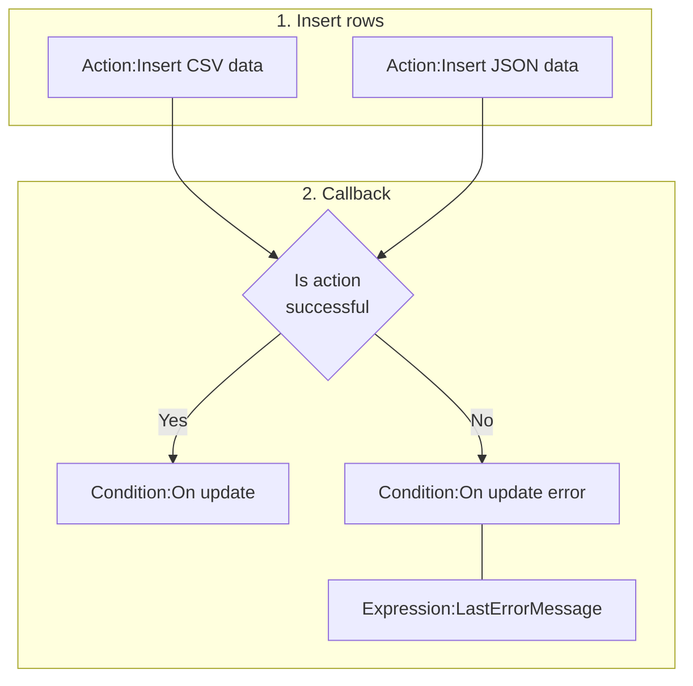
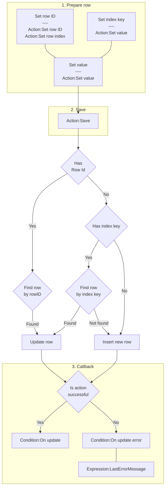
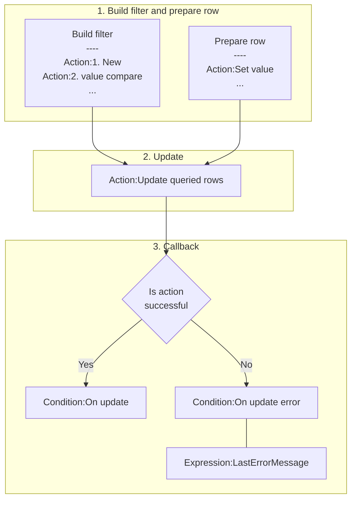
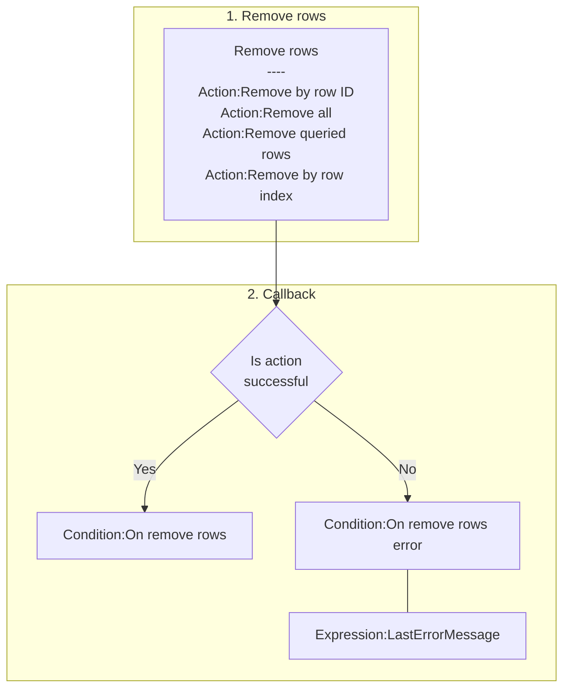

# [Categories](categories.index.html) > [Data structure](datastructure.index.html) > rex_nedb

## Introduction

Asynchronous [database](https://github.com/louischatriot/nedb).

## Links

- [Plugin](https://dl.dropboxusercontent.com/u/5779181/C2Repo/Zip/plugins/rex_nedb.7z)
- [ACE table](https://rexrainbow.github.io/C2RexDoc/c2rexpluginsACE/plugin_rex_nedb.html)
- [Discussion thread](https://www.scirra.com/forum/plugin-rex-taffydb-local-database_t149092)


----

[TOC]

## Dependence

None

## Usage

### Storage type

- Persistence : store database in disk
  - Set property `Storage` to `Disk`. and
  - Set `Database name` to a *non-empty string*
    - Reset to *In memory* mode if `Database name` is `""`, an empty string.
- In memory : store database in memory
  - Set property `Storage` to `In memory`.

### Write




#### Insert rows by CSV

[Sample capx](https://1drv.ms/u/s!Am5HlOzVf0kHlDSf42epT4MmgZjW)

1. `Action:Insert CSV data`
   - First row : name of keys
   - Other rows : data


2. Callback
   - Trigger `Condition:On update`, or
   - Trigger `Condition:On update error`
     - ``Expression:LastErrorMessage`

##### Data type

Property `Eval mode`

- `No` : string

  - `Action:Define type` : define a column to be number type ([Sample capx](https://1drv.ms/u/s!Am5HlOzVf0kHlDWiI-Y4uCsZx5IE))

- `Yes` :  parse value by *eval* function of javascrpt

  - number: `10`
  - string: `'hi'`
  - javascript function: `Math.random()`

  For example, 

  ```json
  Name,HP,MP
  'aaa',100,20
  'bbb',80,30
  ```

  will insert 2 rows.

  *Error message* will display on console when eval failed.

#### Insert rows by JSON

[Sample capx](https://1drv.ms/u/s!Am5HlOzVf0kHlDaioebAKjo83QLo)

1. `Action:Insert JSON data`
2. Callback
   - Trigger `Condition:On update`, or
   - Trigger `Condition:On update error`
     - `Expression:LastErrorMessage`

#### Save row




[Sample capx](https://1drv.ms/u/s!Am5HlOzVf0kHlDHLscmpHe_YtLox)

1. prepare row

   - Save data at a specific row, i.e. pick row then update it

     - `Action:Set row ID`, or `Action:Set row index`

     - `Action:Set value` , to set value of index key

       - Index keys : a set of keys which the values are unique.

         - Property `Index keys`, or `Action:Set index keys`. 
         - Multiple keys are separated by `,`, for example

         ```json
         UID,VarName
         ```

   - Other keys
     - `Action:Set value`
       - options: `if greater` , `if less`
     - `Action:Set boolean value`
     - `Action:Add to`

2. `Action:Save`

   - `Expression:LastSavedRowID`
   - Pick row by rowID
     - Update row if found
   - Else
     - Pick row by index keys
       - Update row, if found, or
       - Insert new row

3. Callback

   - Trigger `Condition:On update`, or
   - Trigger `Condition:On update error`
     - `Expression:LastErrorMessage`

#### Update rows



[Sample capx](https://1drv.ms/u/s!Am5HlOzVf0kHlDPJ_rq_3eKOY6QS)

1. Build filter and prepare row
   - Build filter
     1. `Action:1. New`
     2. `Action:2. value compare`
     3. ...
   - Prepare row
     1. Action:Set value
     2. ...
2. `Action:Update queried rows`
3. Callback
   - Trigger `Condition:On update`, or
   - Trigger `Condition:On update error`
     - `Expression:LastErrorMessage`

#### Remove



1. remove rows
   - `Action:Remove by row ID`
   - `Action:Remove all`
   - `Action:Remove queried rows`
   - `Action:Remove by row index`
2. Callback
   - Trigger `Condition:On remove rows`, or
   - Trigger `Condition:On remove rows error`
     - `Expression:LastErrorMessage`

----

### Read

#### Read all rows

- `Expression:AllRowsAsJSON`, all rows in JSON string
- `Expression:AllRowsCount`

#### Querying

````mermaid
graph TB

subgraph 1,2,3 Build filter
NewFilter["New filter<br>----<br>Action:1. New"] --> Compare["Value comparison<br>----<br>Action:2. value compare<br>Action:2. boolean value compare<br>Action:2. regex matched"]
CurrentFilter["Current filter"] --> Compare
Compare --> Order["Sort<br>----<br>Action:3. order"]
end

Order --> Load["Action:Load queried rows"]

subgraph 4. Load
Load
end

Load --> IsActionSuccessful

subgraph 5. Callback
IsActionSuccessful{Is action<br>successful} --> |Yes| CondOnUpdate["Condition:On load rows"]
IsActionSuccessful --> |No| CondOnUpdateError["Condition:On load rows error"]
CondOnUpdateError --- ExpErrMsg["Expression:LastErrorMessage"]


CondOnUpdate --- QueriedRows["Queried rows<br>----<br>Expression:QueriedRowsAsJSON"]
QueriedRows --> ExpIndexedQueriedRow["Expression:Index2QueriedRowContent(index)<br>Expression:QueriedRowsCount"]
QueriedRows --> CondForEachQueriedRow["Condition:For each row"]
CondForEachQueriedRow --- ExpCurQueriedRow["Expression:CurRowContent<br>Expression:CurRowIndex"]
end
````


[Sample capx](https://1drv.ms/u/s!Am5HlOzVf0kHlDeCzuUeHooae0sl)

1. Create a new filter, or start from *current filter* ([sample capx](https://1drv.ms/u/s!Am5HlOzVf0kHlDjTKK8TqvjlPqqs)), if it does not create a new filter.
   - `Action:1. New`
2. Add conditions, or get *all row*, if no conditions assigned.
   - `Action:2. value compare`
   - `Action:2. boolean value compare`
   - `Action:2. regex matched`
3. sort
   - `Action:3. order`, or `Condition:3. order`
4. Load
   - `Action:Load queried rows`
5. Callback
   - Trigger `Condition:On load rows`, or
   - Trigger `Condition:On load rows error`
     - ``Expression:LastErrorMessage`

##### Read all queried rows

- `Expression:QueriedRowsAsJSON`, all queried rows in JSON string
- `Expression:QueriedRowsCount `
- `Expression:QueriedSum( key )`
- `Expression:QueriedMin( key )`
- `Expression:QueriedMax( key )`

##### Retrieve queried rows

[Sample capx](https://1drv.ms/u/s!Am5HlOzVf0kHlDeCzuUeHooae0sl)

`Condition:For each row`

- `Expression:CurRowContent`
  - `Expression:CurRowContent`, returns key-value pairs of current row in JSON string
  - `Expression:CurRowContent( key )`, returns the value of a specific key, or 0 if the key does not exist
  - `Expression:CurRowContent( key, defaultValue )`, returns the value of a specific key, or `defaultValue` if the key does not exist.
- `Expression:CurRowIndex`

Get queried row by index from 0 to `Expression:QueriedRowsCount`-1 ([sample capx](https://1drv.ms/u/s!Am5HlOzVf0kHlDll2sZIrOKGHI2G))

- `Expression:Index2QueriedRowContent( index )`, returns key-value pairs of the specific row in JSON string
- `Expression:Index2QueriedRowContent( index, key )`, returns the value of a specific key, or 0 if the key does not exist
  - `Expression:Index2QueriedRowID( index )`, returns rowID of the specific row
- `Expression:Index2QueriedRowContent( index, key, defaultValue )`, returns the value of a specific key, or `defaultValue` if the key does not exist.

----

### Database reference

[Sample capx](https://1drv.ms/u/s!Am5HlOzVf0kHlDtJKd5Pox20qaG0)

Property `Database name`

- Empty string `""` : private database, destroyed when instance had been destroyed
- Not empty string : a global database indexed by this `Database name` property
  - Separate writing and reading into different database instance

----

### Save & load

It supports official saving & loading feature when using `Disk` storage mode, queried rows will also be saved.

----

### Debug panel

All rows will be shown at debug panel in JSON format.