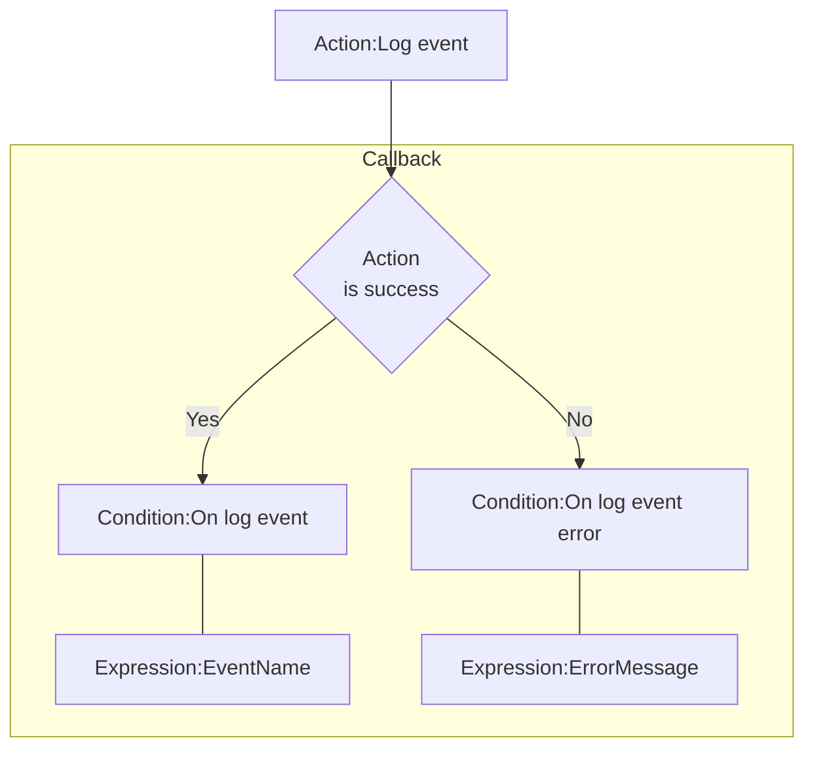

# [Categories](categories.index.html) > [Newgrounds.io](ngio.index.html) > rex_ngio_event

## Introduction

Handles logging of custom events.

## Links

- [Plugin](https://rexrainbow.github.io/C2RexDoc/repo/rex_ngio_event.7z)
- [ACE table](https://rexrainbow.github.io/C2RexDoc/c2rexpluginsACE/plugin_rex_ngio_event.html)
- [Discussion thread](https://www.scirra.com/forum/plugin-new-grounds-api-v3_t179642)

----

[TOC]

## Dependence

- [rex_ngio_authentication](rex_ngio_authentication.html)

## Usage

[Sample capx](https://1drv.ms/u/s!Am5HlOzVf0kHlABTRPbO91YO5YsO)

### Prepare

Put [rex_ngio_authentication](rex_ngio_authentication.html) into project, and set property `App id` and `AES key`.

### Manage events

Manage events in dashboard, `API Tools`, `Referrals and Event`.

### Log event

1. `Action:Log event`
2. Callback
   - Success : `Condition:On log event`
     - `Expression:EventName`
   - Error : `Condition:On log event error`
     - `Expression:ErrorMessage`

### Statistics of events

Statistics of events will be shown in dashboard `Project Dashboard` -> `Statistics for xxx`.