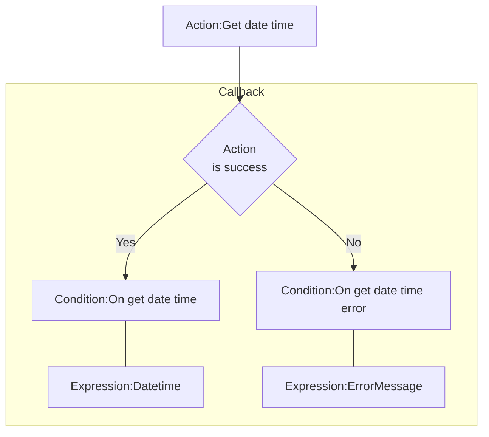
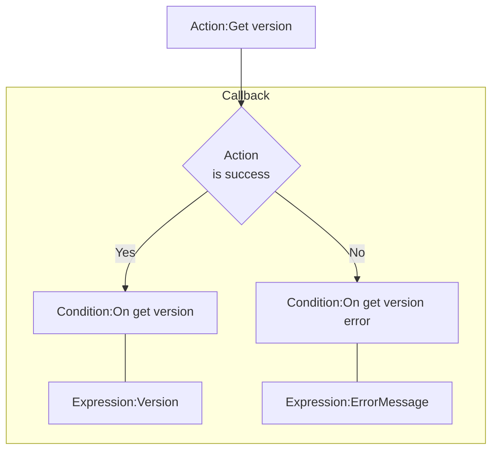
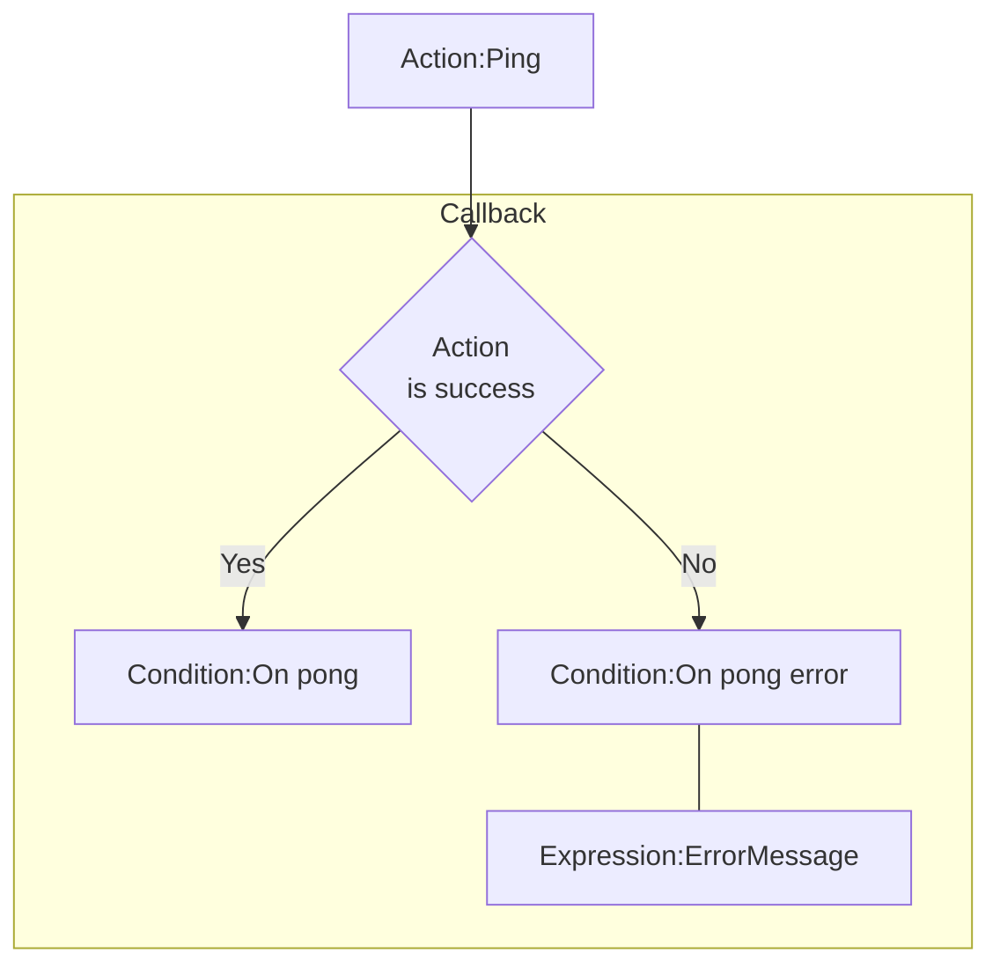

# [Categories](categories.index.html) > [Newgrounds.io](ngio.index.html) > rex_ngio_gateway

## Introduction

Provides information about the gateway server.

## Links

- [Plugin](https://rexrainbow.github.io/C2RexDoc/repo/rex_ngio_gateway.7z)
- [ACE table](https://rexrainbow.github.io/C2RexDoc/c2rexpluginsACE/plugin_rex_ngio_gateway.html)
- [Discussion thread](https://www.scirra.com/forum/plugin-new-grounds-api-v3_t179642)

----

[TOC]

## Dependence

- [rex_ngio_authentication](rex_ngio_gateway.html)

## Usage

[Sample capx](https://1drv.ms/u/s!Am5HlOzVf0kHk387Kmd8fNoQzeWU)

### Prepare

Put [rex_ngio_authentication](http://c2rexplugins.weebly.com/rex_ngio_gateway.html) into project, and set property `App id` and `AES key`.

### Get date-time

1. `Action:Get date time`
2. Callback
   - Success : `Condition:On get date time`
     - `Expression:Datetime`

   - Error : `Condition:On login error`

     - `Expression:ErrorMessage`

----

### Get version

1. `Action:Get version`
2. Callback
   - Success : `Condition:On get version`
     - `Expression:Version`

   - Error : `Condition:On get version error`

     - `Expression:ErrorMessage`

----

### Ping

1. `Action:Ping`
2. Callback
   - Success : `Condition:On pong`

   - Error : `Condition:On pong error`

     - `Expression:ErrorMessage`