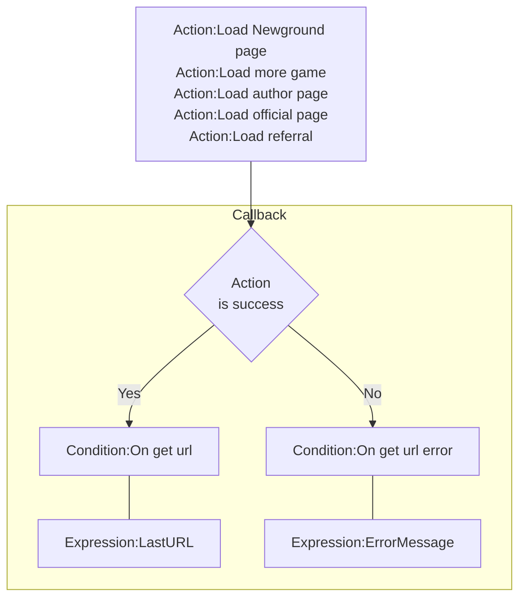

# [Categories](categories.index.html) > [Newgrounds.io](ngio.index.html) > rex_ngio_loader

## Introduction

Handles loading various URLs and tracking referral stats.

## Links

- [Plugin](https://rexrainbow.github.io/C2RexDoc/repo/rex_ngio_loader.7z)
- [ACE table](https://rexrainbow.github.io/C2RexDoc/c2rexpluginsACE/plugin_rex_ngio_loader.html)
- [Discussion thread](https://www.scirra.com/forum/plugin-new-grounds-api-v3_t179642)

----

[TOC]

## Dependence

- [rex_ngio_authentication](rex_ngio_gateway.html)

## Usage

[Sample capx](https://1drv.ms/u/s!Am5HlOzVf0kHlBSkuEwDTZvGIzrb)

### Prepare

Put [rex_ngio_authentication](http://c2rexplugins.weebly.com/rex_ngio_gateway.html) into project, and set property `App id` and `AES key`.

### Host

Set the domain URL of this app in property `Host`.

### Open or get url of page

1. open page or get url of page
   - `Action:Load Newground page`
   - `Action:Load more game`
   - `Action:Load author page`
   - `Action:Load official page`
   - `Action:Load referral`
2. Parameter `Operation`
   - `Open` : open a page in a new tab if success
   - `Get url` :
     - Success : `Condition:On get url`
       - `Expression:LastURL`
     - Error : `Condition:On get url error`
       - `Expression:ErrorMessage`

----

### Referral

Manage `Referral` in dashboard `API Tools`, `Referrals and Events`.

