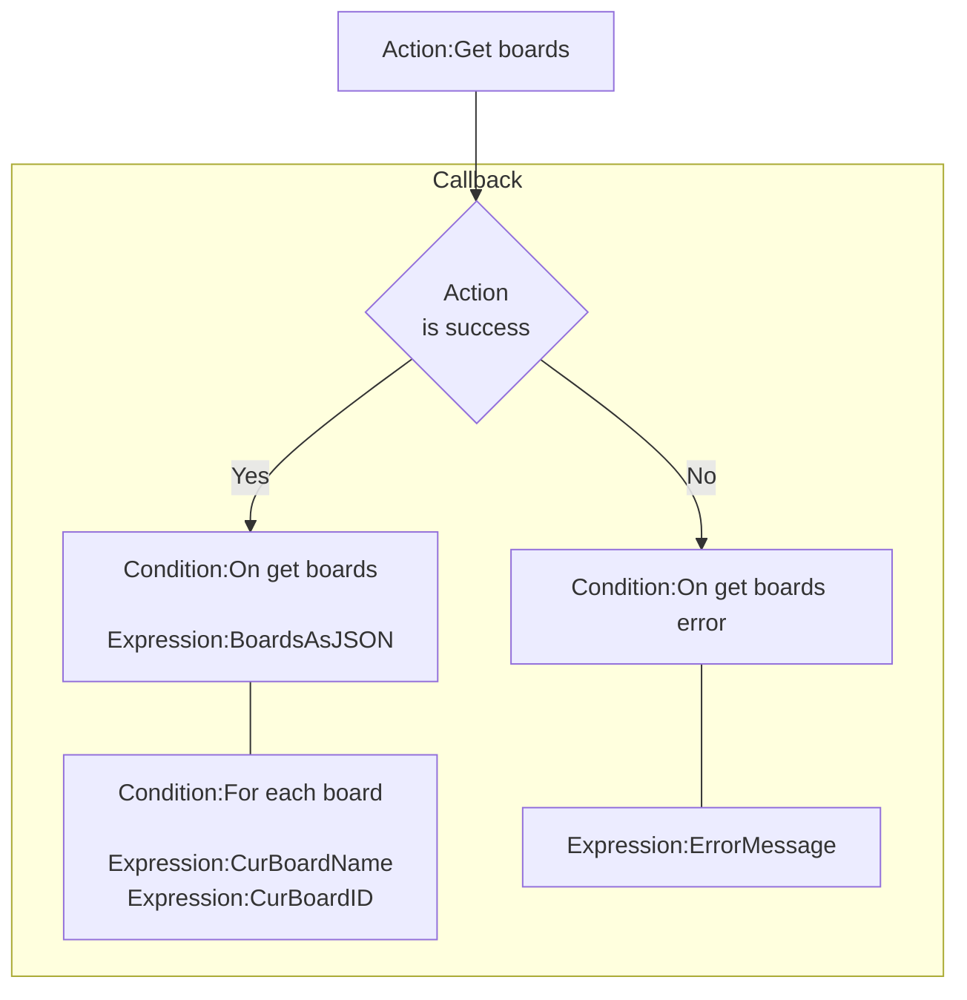
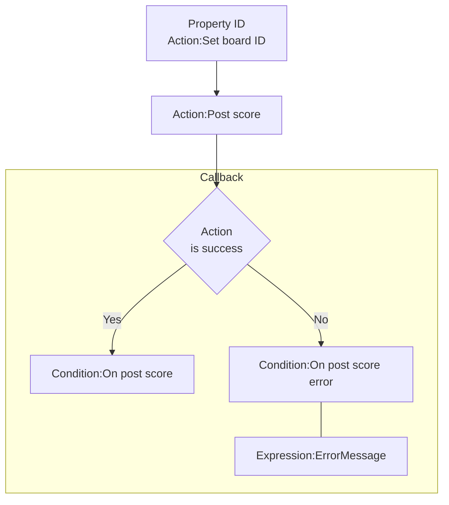
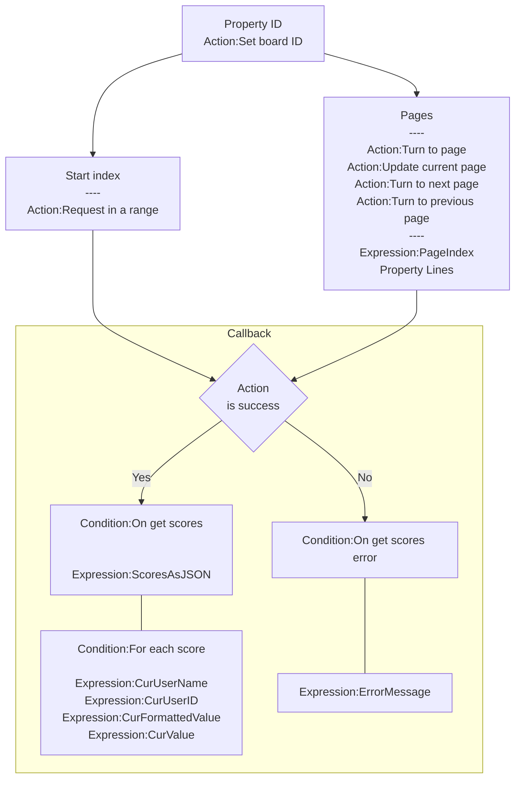

# [Categories](categories.index.html) > [Newgrounds.io](ngio.index.html) > rex_ngio_scoreboard

## Introduction

Handles loading and posting of high scores and scoreboards.

## Links

- [Plugin](https://dl.dropboxusercontent.com/u/5779181/C2Repo/Zip/plugins/rex_ngio_scoreboard.7z)
- [ACE table](https://rexrainbow.github.io/C2RexDoc/c2rexpluginsACE/plugin_rex_ngio_scoreboard.html)
- [Discussion thread](https://www.scirra.com/forum/plugin-new-grounds-api-v3_t179642)

----

[TOC]

## Dependence

- [rex_ngio_authentication](rex_ngio_gateway.html)

## Usage

### Prepare

Put [rex_ngio_authentication](http://c2rexplugins.weebly.com/rex_ngio_gateway.html) into project, and set property `App id` and `AES key`.

### Manage boards

Mange boards in dashboard, `API Tools`, `Scoreboards`.

### Get boards

[Sample capx](https://1drv.ms/u/s!Am5HlOzVf0kHlAwblUQYzZ6HV7h_)

1. `Action:Get boards`
2. Callback
   - Success : `Condition:On get boards`
     - `Expression:BoardsAsJSON`
     - `Expression:BoardsCount`
     - `Condition:For each board`
       - `Expression:CurBoardName`
       - `Expression:CurBoardID`
       - `Expression:LoopIndex`, index in this for each loop
     - Get board by index
       - `Expression:Index2BoardName( index )`
       - `Expression:Index2BoardID( index )`
   - Error : `Condition:On get boards error`
     - `Expression:ErrorMessage`

----

### Post score

1. Set board ID
   - Property `ID`, or
   - `Action:Set board ID`
   - `Expression:BoardID`
2. `Action:Post score`
   - *Tag* for querying scores (optional)
     - Property `Tag`
     - `Action:Set tag`
     - `Expression:Tag`
3. Callback
   - Success : `Condition:On post score`
   - Error : `Condition:On post score error`
     - `Expression:ErrorMessage`

### Get score

1. Set board ID
   - Property `ID`, or
   - `Action:Set board ID`
   - `Expression:BoardID`
2. Request scores
   - By start index
     - `Action:Request in a range`
   - Page by page
     - Action:Turn to page
     - Action:Update current page
     - Action:Turn to next page
     - Action:Turn to previous page
     - Page properties:
       - `Expression:PageIndex`, current page index
       - Property `Lines` : lines of each page
   - *Period*, time-frame (optional)
     - Property `Period`
     - `Action:Set period`
     - `Action:Set period by code`
       - `D` : current day
       - `W` : current week
       - `M` : current month
       - `Y` : current year
       - `A` : all-time
     - `Expression:Period`
   - *Tag* for querying scores (optional)
     - Property `Tag`
     - `Action:Set tag`
     - `Expression:Tag`
3. Callback
   - Success : `Condition:On get scores`
     - `Expression:ScoresAsJSON`
     - `Expression:ScoresCount`
     - `Condition:For each score`
       - `Expression:CurUserName`
       - `Expression:CurUserID`
       - `Expression:CurFormattedValue`
       - `xpression:CurValue`
       - `Expression:LoopIndex`, index in this for each loop
     - Get board by index
       - `Expression:Index2UserName( index )`
       - `Expression:Index2UserID( index )`
       - `Expression:Index2FormattedValue( index )`
       - `Expression:Index2Value( index )`
   - Error : `Condition:On get scores error`
     - `Expression:ErrorMessage`