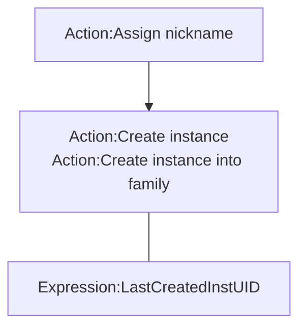

# [Categories](categories.index.html) > [System](system.index.html) > rex_nickname

## Introduction

Create instance by string.

## Links

- [Plugin](https://dl.dropboxusercontent.com/u/5779181/C2Repo/Zip/plugins/rex_nickname.7z)
- [ACE table](https://rexrainbow.github.io/C2RexDoc/c2rexpluginsACE/plugin_rex_nickname.html)
- [Discussion thread](https://www.scirra.com/forum/plugin-nickname-behavior-nickname_t74522)

----

[TOC]

## Dependence

None

## Usage

### Create instance

1. `Action:Assign nickname`, to add an alias name of an object type
2. Create instance
   - `Action:Create instance`  ([Sample capx](https://onedrive.live.com/redir?resid=7497FD5EC94476E!255&authkey=!AE2etKVNGxixVwM&ithint=file%2c.capx))
     - Configure instance under its `condition:on created`  ([Sample capx](https://onedrive.live.com/redir?resid=7497FD5EC94476E%21183&authkey=%21AD9oI60FDR0pSXk&ithint=file%2c.capx))
     - Set properties (x, y, angle, opacity,...) of instance by [rex_uid2prop](rex_uid2prop.html) with `Expression:LastCreatedInstUID`  ([Sample capx](https://onedrive.live.com/redir?resid=7497FD5EC94476E!1948&authkey=!AJBjcYFseVb0u90&ithint=file%2ccapx))
   - `Action:Create instance into family`  ([Sample capx](https://onedrive.live.com/redir?resid=7497FD5EC94476E!404&authkey=!ANVWEL6QrNY1KUk&ithint=file%2c.capx))
     - Configure instance by SOL of family object

### Pick instance by nickname

- Matching name string exactly  ([Sample capx](https://onedrive.live.com/redir?resid=7497FD5EC94476E!257&authkey=!ACzbVtkHwjsP7_U&ithint=file%2c.capx))
  - `Condition:Pick instances`,
  -  `Action:Pick all instances`
- Matching sub-string  ([Sample capx](https://onedrive.live.com/redir?resid=7497FD5EC94476E%21470&authkey=%21AF-n_bkjnteyT50&ithint=file%2c.capx))
  - `Condition:Pick  matched instances`, 
  - `Action:Pick matched instances`

### Debug panel

All alias names and its mapped object type name will be shown on debug panel.