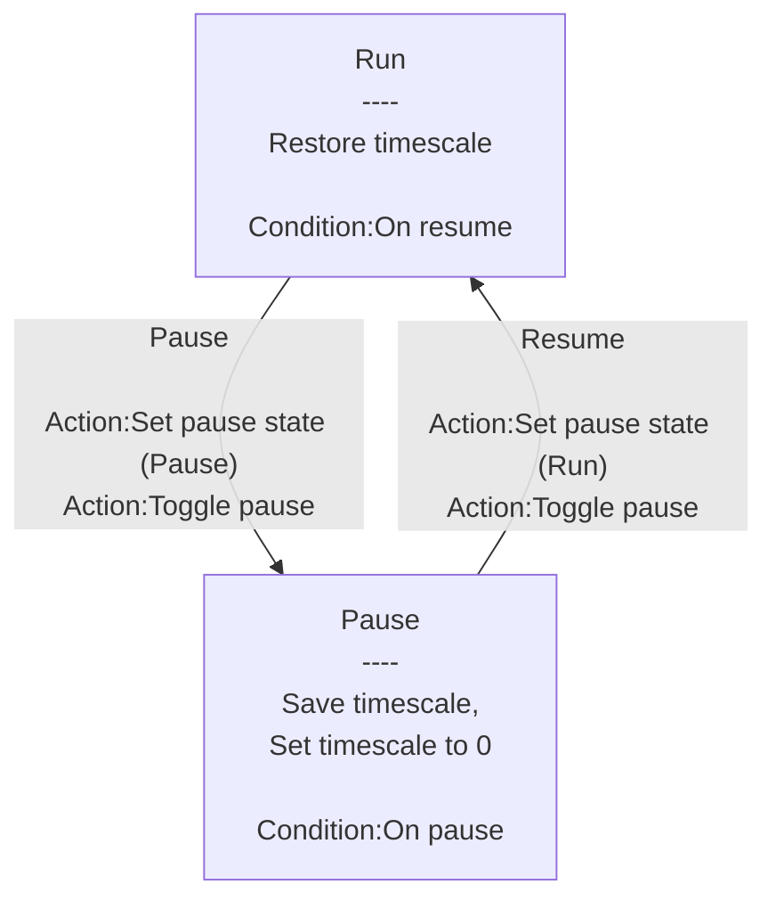

# [Categories](categories.index.html) > [System](system.index.html) > rex_pause

## Introduction

Pause/resume system by setting [timescale](https://www.scirra.com/tutorials/67/delta-time-and-framerate-independence#h2a5).

## Links

- [Plugin](https://dl.dropboxusercontent.com/u/5779181/C2Repo/Zip/plugins/rex_pause.7z)
- [ACE table](https://rexrainbow.github.io/C2RexDoc/c2rexpluginsACE/plugin_rex_pause.html)
- [Discussion thread](https://www.scirra.com/forum/plugin-pause-behavior-pause_t64888)

----

[TOC]

## Dependence

None

## Usage

[Sample capx](https://onedrive.live.com/redir?resid=7497FD5EC94476E!536&authkey=!AHOh24sxVxcT6VQ&ithint=file%2c.capx)

- State : Run
  - Event : go to state Pause
    - `Action:Toggle pause`, or 
    - `Action:Set pause state` with parameter `State` to `Pause`
  - State Transition : Run to Pause
    1. Store current timescale
       - `Expression:PreTimescale`
    2. Set timescale to `0`
    3. Trigger `Condition:On pause`
- State : Pause
  - Event : go to state Run
    - `Action:Toggle pause`, or 
    - `Action:Set pause state` with parameter `State` to `Run`
  - State Transition : Pause to Run
    1. Restore timescale to `Expression:PreTimescale`
    2. Trigger `Condition:On resume`