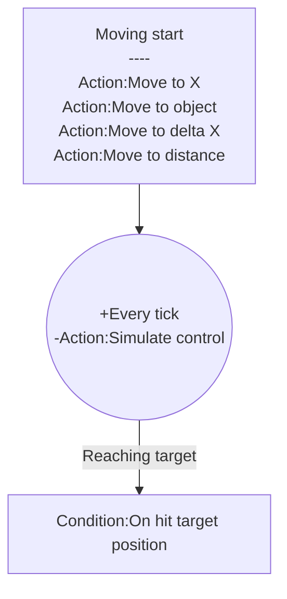

# [Categories](categories.index.html) > [Movement](movement.index.html) > rex_platform_moveto

## Introduction

Move platformer to specific position.

## Links

- [Plugin](https://dl.dropboxusercontent.com/u/5779181/C2Repo/Zip/behaviors/rex_platform_moveto.7z)
- [ACE table](https://rexrainbow.github.io/C2RexDoc/c2rexpluginsACE/behavior_rex_platform_moveto.html)
- Discussion thread

----

[TOC]

## Dependence

- [Official platform behavior](https://www.scirra.com/manual/100/platform)

## Usage

### Prepare

Put this behavior under [official platform behavior](https://www.scirra.com/manual/100/platform).

### Move to target

[Sample capx](https://onedrive.live.com/redir?resid=7497FD5EC94476E!524&authkey=!ABf0f6H3yHRilhE&ithint=file%2c.capx)

Call One of these action to move platformer to target position by `Action:Simulate control` of [official platform behavior](https://www.scirra.com/manual/100/platform).

- `Action:Move to X`
- `Action:Move to object`
- `Action:Move to delta X`
- `Action:Move to distance`

Target position is (`Expression:TargetX` , `Expression:TargetY`).

### Reach target

- `Condition:On hit target position`

### Stop

- `Action:Stop`