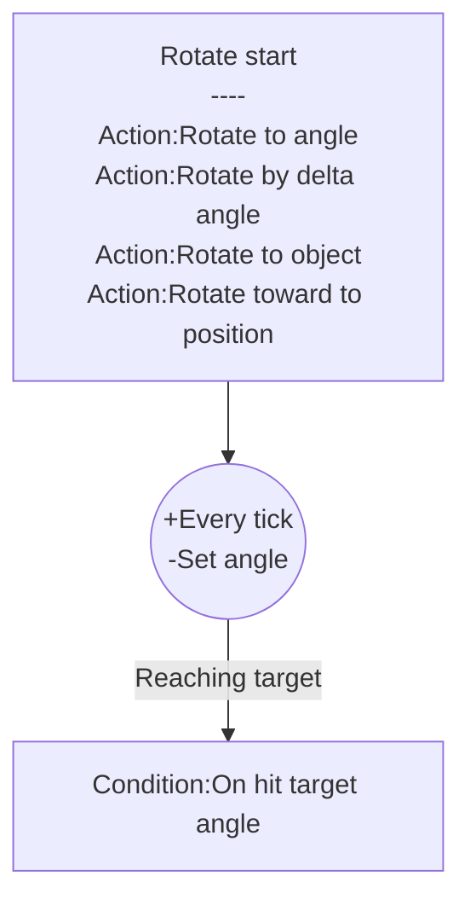

# [Categories](categories.index.html) > [Movement](movement.index.html) > rex_rotateto

## Introduction

Spin object to specific angle.

## Links

- [Plugin](https://rexrainbow.github.io/C2RexDoc/repo/rex_rotateto.7z)
- [ACE table](https://rexrainbow.github.io/C2RexDoc/c2rexpluginsACE/behavior_rex_rotateto.html)
- Discussion thread

----

[TOC]

## Dependence

None

## Usage

### Rotate start
[Sample capx](https://onedrive.live.com/redir?resid=7497FD5EC94476E!566&authkey=!AIIAkEarfLhAi-g&ithint=file%2c.capx)

- `Action:Rotate to angle`
- `Action:Rotate by delta angle`
- `Action:Rotate to object` 
- `Action:Rotate toward to position`

Target angle is `Expression:TargetAngle`

### Reach target

- `Condition:On hit target angle`

### Stop

- `Action:Stop`

### Pause

- `Action:Set enabled` and set parameter  `State` to `Disabled`

### Resume

- `Action:Set enabled` and set parameter  `State` to `Enabled `