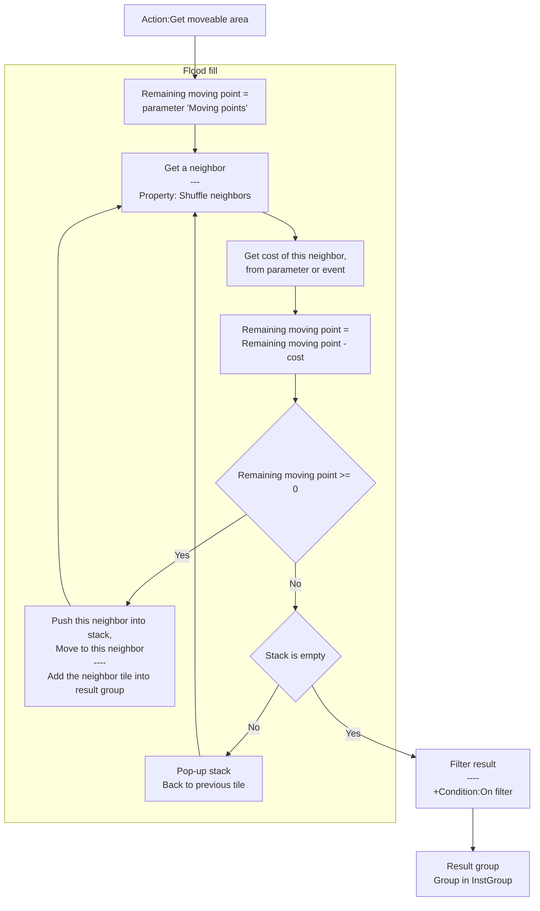
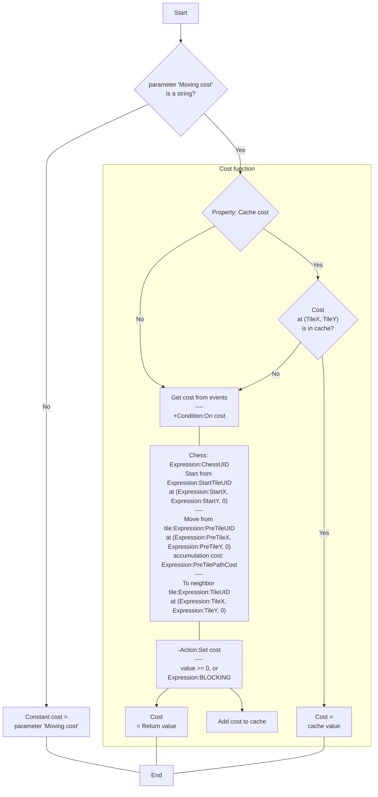
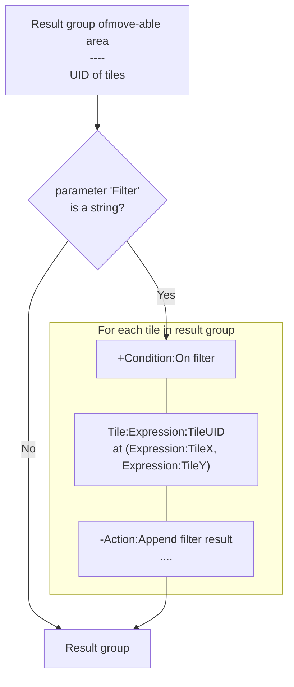
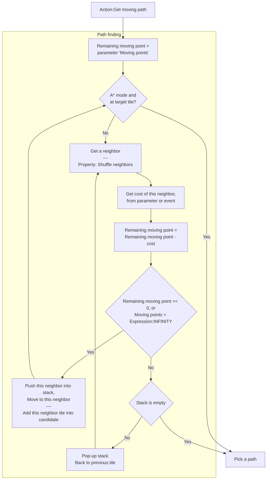
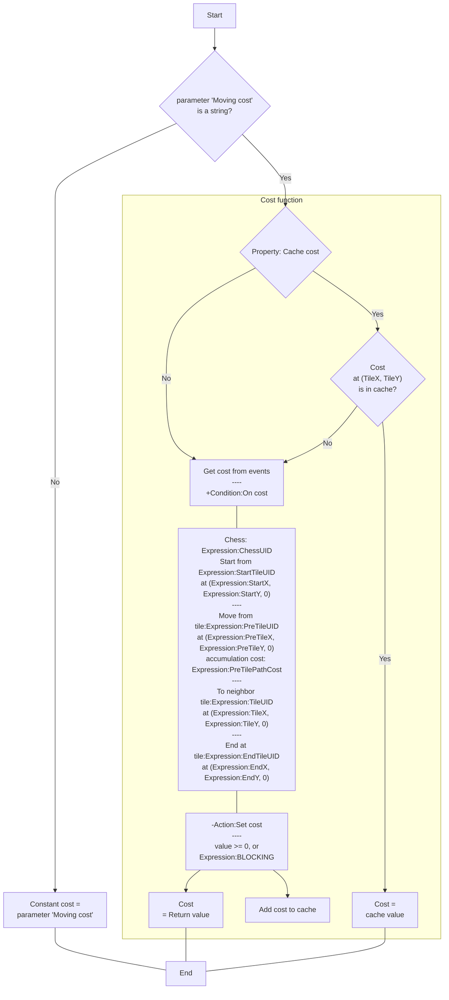
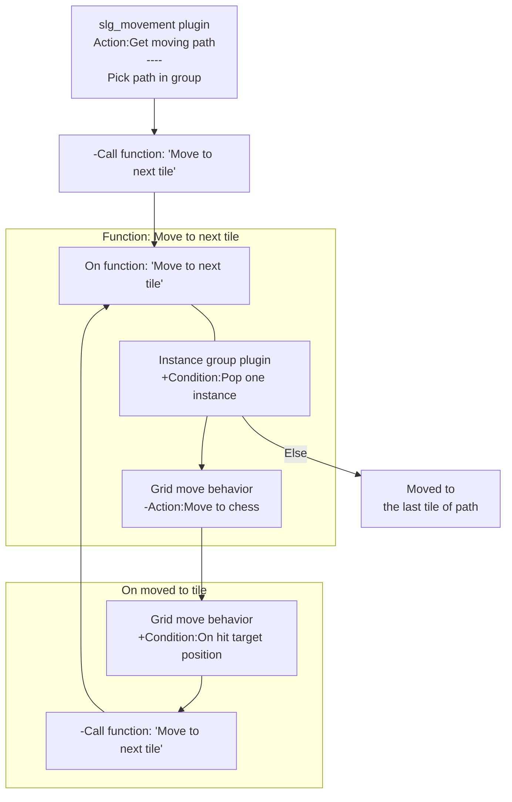

# [Categories](categories.index.html) > [Board](board.index.html) > rex_slg_movement

## Introduction

Get move-able area, or moving path between two chess/tiles on an orthogonal or isometric, or hexagonal board.

## Links

- [Plugin](https://dl.dropboxusercontent.com/u/5779181/C2Repo/Zip/plugins/rex_slg_movement.7z)

- [ACE table](https://rexrainbow.github.io/C2RexDoc/c2rexpluginsACE/plugin_rex_slg_movement.html)

- [Discussion thread](https://www.scirra.com/forum/plugin-slg-movement_t75938)

  ​

----

[TOC]

## Dependence

- [rex_board](rex_board.html)
- [rex_ginstgroup plugin](rex_ginstgroup.html)

## Usage

### Prepare

This plugin picks tiles of move-able area or moving path into a group. therefor [rex_board](http://c2rexplugins.weebly.com/rex_board.html) and [rex_ginstgroup](http://c2rexplugins.weebly.com/rex_ginstgroup.html) objects should be put into project first.

### Get moveable area

#### Main flow

#### Flow chart of getting cost

#### Flow chart of filter function

Get move-able area

- `Action:Get moveable area`
- `Action:Get moveable area by UID`

There are 5 parameters in action

- **Chess** : chess to move.
- **Moving points** : initial moving point. Chess could *move* to tiles (i.e move-able tiles) when the remaining moving point is large or equal to 0.
- **Moving cost** : each tile will consume some cost. This parameter could be a number or a string
  - Number : constant moving cost of each tile
  - String : get cost from cost function. Flow chart of cost function is show above.
    - Cost function is started at `Condition:On cost`, to get cost of this moving
      - Chess `Expression:ChessUID`
      - start from tile `Expression:StartTileUID` at LXYZ (`Expression:StartX`, `Expression:StartY`)
      - move from tile `Expression:PreTileUID` at LXYZ (`Expression:PreTileX`, `Expression:PreTileY`, 0) , with `accumulation cost: Expression:PreTilePathCost`
      - to neighbor tile `Expression:TileUID` at LXYZ (`Expression:TileX`, `Expression:TileY`, 0)
    - Return cost by `Action:Set cost`
      - value >= 0, or
      - `Expression:BLOCKING`
- **Filter** : The result of moving area are UID of tiles by default. Or use a filter function if this parameter is not equal to "", to reset or add picked instances. Flow chart of filter function is shown above.
  - Filter function is started at `Condition:On filter`
    - Filter each tile `Expression:TileUID` at LXYZ : (`Expression:TileX`, `Expression:TileY`, 0)
  - Add an instance by uid into result group by `Action:Append filter result`
- **Group** : put move-able tiles into result group , which is a group in [instance group object](rex_ginstgroup.html)

#### Shuffle neighbors

[Sample capx](https://onedrive.live.com/redir?resid=7497FD5EC94476E!976&authkey=!AJRxJLiWfO0sHQw&ithint=file%2ccapx)
If property `Shuffle neighbors` is set to `Yes`, the order of visited neighbors will be random, i.e. the order of visited nodes is not the same for each request.

Here is the order of tiles in result group with parameters

- parameter `Moving points` = 3
- parameter `Cost` = 1
- property `Shuffle neighbors` = `No`

#### Cache cost

If property `Cache cost` is set to `Yes`, `Condition:On cost` will only be triggered once for each tile in a request.

### Get moving path

#### Main flow

#### Flow chart of getting cost

Get shortest moving path between source chess to destination chess/tile

- `Action:Get moving path`
- `Action:Get moving path by UID`

There are 5 parameters in action

- **Chess** : source chess.
- **Tile/Chess** : destination chess/tile.
- **Moving points** : initial moving point. Chess could *move* to tiles (i.e move-able tiles) when the remaining moving point is large or equal to 0.
- **Moving cost** : each tile will consume some cost. This parameter is very similar with parameter *Moving cost* in `Action:Get moveable area`.
  - Number : constant moving cost of each tile
  - String : get cost from cost function. Flow chart of cost function is show above.
    - Cost function is started at `Condition:On cost`, to get cost of this moving
      - Chess `Expression:ChessUID`
      - start from tile `Expression:StartTileUID` at LXYZ (`Expression:StartX`, `Expression:StartY`)
      - move from tile `Expression:PreTileUID` at LXYZ (`Expression:PreTileX`, `Expression:PreTileY`, 0) , with `accumulation cost: Expression:PreTilePathCost`
      - to neighbor tile `Expression:TileUID` at LXYZ (`Expression:TileX`, `Expression:TileY`, 0)
      - end at tile `Expression:EndTileUID`  at LXYZ (`Expression:EndX`, `Expression:EndY`, 0)
    - Return cost by `Action:Set cost`
      - value >= 0, or
      - `Expression:BLOCKING`
- **Group** : pick a path presented by *a sequence of tiles* into result group , which is a group in [instance group object](rex_ginstgroup.html).

#### Path mode

Configure property `Path mode` to get a *shorter* path or *shortest* path.

##### Get shortest path

Set property `Path mode` to 

- `Random` : picking the shortest path randomly
- `Diagonal` : picking the shortest path which has the maximum changing of moving direction
- `Straight` : picking the shortest path which has the minimum changing of moving direction
- `Line` : picking the shortest path which has the minimum changing of moving angle

##### Get shorter path

Set property `Path mode` to `A*-`,

-  `A* -line`, `A* -random` : using A* algorithm to find path, this will have the best performance. It is recommended that using these modes only when parameter `moving point` is set to `Expression:INFINITY`.

##### Exact or nearest

Set parameter `Exact`  to `nearest` to get moving path from start tile to nearest target tile. Get the nearest target tile UID by `Expression:NearestTileUID`.
The result of instance group is empty if `Exact` is set to `""` and no path found from start tile to target tile.

#### Move chess alone path

Using [rex_grid_move behavior](rex_grid_move.html) to move chess alone path after 	`Action:Get moving path`.

1. Pick path into group by `Action:Get moving path`
2. Call C2 function *Move to next tile*

Add events of C2 function *Move to next tile* :

1. Pick next tile by `Condition:Pop one instance` of [Instance group plugin](rex_ginstgroup.html)
2. Move to tile by `Action:Move to chess` of [grid move behavior](rex_grid_move.html)
3. chess has moved to the last tile of the path If picking nothing (`system condition:Else`)

Add events to move to next tile when reached to target tile by `Condition:On hit target position` of [grid move behavior](rex_grid_move.html)

1. Call C2 function *Move to next tile*

Sets property`Force move` to`Yes` in [grid move behavior](rex_grid_move.html), since the move-able (solid) had been determined 
by this `Action:Get moving path`.

Uses `Expression: PrivateGroup` ([Instance group plugin](rex_ginstgroup.html)) to pick path into private group of chess instance when picking path of multiple chess.

### Use case of filter function and cost function

[Sample capx](https://onedrive.live.com/redir?resid=7497FD5EC94476E!271&authkey=!AO2IO1PCb1t_9P4&ithint=file%2c.capx)
This sample capx shows how to implement the filter function and cost function to get move-able area, moving path, and the enemies in a range.

#### No overlapped with other chess

Filter tiles which the cell of chess is empty, to exclude the tiles which has been occupied by other chess.

1. If (`Expression:TileX`, `Expression:TileY`, 0) is empty (`Condition:Is empty` of [board object](rex_board.html)) under `Condition:On filter`
   1. Append tile UID `Expression:TileUID` by `Action:Append filter result`

#### Pick enemies

Append enemy instances which stand on tiles, to pick pick enemies in a range.

1. Pick enemy chess by `Condition:Pick chess above tile` ([board object](rex_board.html)) under `Condition:On filter`
   1. Append chess UID by `Action:Append filter result`

#### No moving across enemies

Return `Expression:BLOCKING` if the enemy instance stands on tile under in cost function

1. Pick enemy chess by (`Expression:TileX`, `Expression:TileY`, 1) ([board object](rex_board.html)) under `Condition:On cost`
   1. Return `Expression:BLOCKING` if true

#### More samples

- [Sternhalma](https://onedrive.live.com/redir?resid=7497FD5EC94476E!1434&authkey=!AP_SV4mFTcXvszs&ithint=file%2ccapx)
  - Note that `Cache cost` is set to `No`

----

### Wrap

[Sample capx](https://onedrive.live.com/redir?resid=7497FD5EC94476E!990&authkey=!AAXv6WoYTYBmMHQ&ithint=file%2ccapx)
Set property `Wrap` to `Yes` in [board object](rex_board.html) to wrap the logical boundary. It will also effect the result of picking move-able area and moving path. Chess could move from left boundary to right boundary directly.

### Accumulated cost

Get accumulated cost from start tile to a specific chess/tile after `Action:Get moveable area` or `Action:Get moving path`  by `Expression:UID2PathCost` ([sample capx](https://onedrive.live.com/redir?resid=7497FD5EC94476E!1433&authkey=!AFeSa51UK70yCP0&ithint=file%2ccapx)). Return *-1* if this specific chess/tile is not in the last scan of request.

----

### Flood fill

[Sample capx](https://onedrive.live.com/redir?resid=7497FD5EC94476E!1002&authkey=!AOg3brQveOfct4k&ithint=file%2ccapx)
`Action:Get moveable area` uses  *flood fill* to find move-able area by `Condition:On cost`. This feature also could be used to picking neighbor chess/tile which have the same color.

The steps of picking are - 

1. Save target color in variable.
2. Call `Action:Get moveable area`, sets the parameter of `Moving point` to 1.
3. In `Condition:On cost`, pick tile/chess instance by `Expression:TileUID` or (`Expression:TileX`, `Expression:TileY`, 0).
4. Compare the color of picked instance with target color
   - Return cost to 0 by `Action:Set cost` if the color of picked instance is equal to target color, . 
   - Otherwise do nothing, the cost will be `Expression:BLOCKING` by default.
5. Add the source tile into result group by `Action:Add instances` of ([Instance group plugin](rex_ginstgroup.html)) after `Action:Get moveable area`.

#### More samples

- [Diffusion](https://onedrive.live.com/redir?resid=7497FD5EC94476E!975&authkey=!AA2l6zn4QARC4Gw&ithint=file%2ccapx)

----

### Move on tilemap

[Sample capx](https://onedrive.live.com/redir?resid=7497FD5EC94476E!2191&authkey=!ALPt9rXwfj5LzxA&ithint=file%2ccapx)
Sets all tiles (*LZ=0*) by string symbols, and sets the [squareTx](rex_board_squaretx.html) to align to the tilemap object. Then uses these string symbol tile in input parameter of `Action:Get moveable area` or `Action:Get moving path`, it will pick tiles by string symbols.
Since the results group are not UID of instance in this case, uses 

- `Condition:For each UID` and `Expression:Item` to retrieve the string symbol for move-able area, or 
- `Expression:Pop( group_name , 0)` to get string symbol in order for moving path.

----

