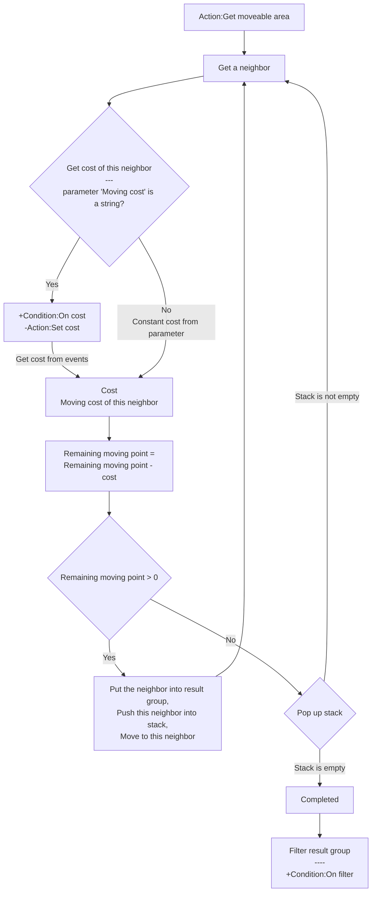

# [Index](index.html) > [Board](board.index.html) > rex_slg_movement

## Introduction

Get move-able area, or moving path between two chess/tiles on an orthogonal or isometric, or hexagonal board.

## Links

- [Plugin](https://dl.dropboxusercontent.com/u/5779181/C2Repo/Zip/plugins/rex_slg_movement.7z)

- [ACE table](https://rexrainbow.github.io/C2RexDoc/c2rexpluginsACE/plugin_rex_slg_movement.html)

- [Discussion thread](https://www.scirra.com/forum/plugin-slg-movement_t75938)

  ​

----

[TOC]

## Dependence

- [rex_board](rex_board.html)
- [rex_ginstgroup plugin](rex_ginstgroup.html)

## Usage##

### Get moveable area

### Get moving path

