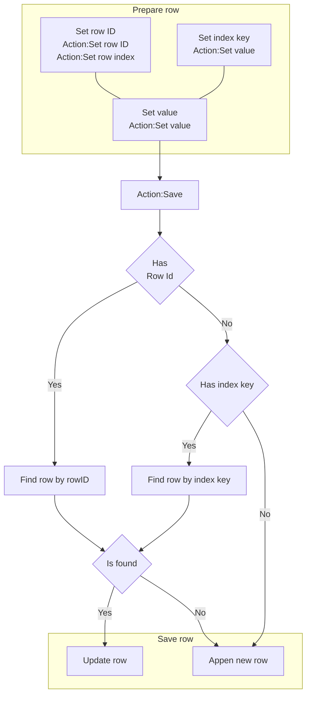

# [Categories](categories.index.html) > [Data structure](datastructure.index.html) > rex_taffydb

## Introduction

In-memory [database](http://www.taffydb.com/) for storing data.

## Links

- [Plugin](https://dl.dropboxusercontent.com/u/5779181/C2Repo/Zip/plugins/rex_taffydb.7z)
- [ACE table](https://rexrainbow.github.io/C2RexDoc/c2rexpluginsACE/plugin_rex_taffydb.html)
- [Discussion thread](https://www.scirra.com/forum/plugin-rex-taffydb-local-database_t149092)


----

[TOC]

## Dependence

None

## Usage

### Write

#### Insert rows by CSV

[Sample capx](https://onedrive.live.com/redir?resid=7497FD5EC94476E!2087&authkey=!AB7GB6cx19-4oQ4&ithint=file%2ccapx)

`Action:Insert CSV data`

- First row : name of keys
- Other rows : data

##### Data type

Property `Eval mode`

- `No` : string

  - `Action:Define type` : define a column to be number type ([Sample capx](https://1drv.ms/u/s!Am5HlOzVf0kHlA43Jyj9zOuNkPqC))

- `Yes` :  parse value by *eval* function of javascrpt

  - number: `10`
  - string: `'hi'`
  - javascript function: `Math.random()`

  For example, 

  ```json
  Name,HP,MP
  'aaa',100,20
  'bbb',80,30
  ```

  will insert 2 rows.

  *Error message* will display on console when eval failed.

#### Insert rows by JSON

[Sample capx](https://onedrive.live.com/redir?resid=7497FD5EC94476E!2099&authkey=!AJQo6EXSmZ7EjCM&ithint=file%2ccapx)

`Action:Insert JSON data`

#### Save row




[Sample capx](https://onedrive.live.com/redir?resid=7497FD5EC94476E!2088&authkey=!AEqmjrdaltuqUu4&ithint=file%2ccapx)

1. prepare row

   - Save data at a specific row, i.e. pick row then update it

     - `Action:Set row ID`, or `Action:Set row index`

     - `Action:Set value` , to set value of index key  ([Sample capx](https://onedrive.live.com/redir?resid=7497FD5EC94476E!2089&authkey=!AJlgO_2V2lG0sNg&ithint=file%2ccapx))

       - Index keys : a set of keys which the values are unique.

         - Property `Index keys`, or `Action:Set index keys`. 
         - Multiple keys are separated by `,`, for example

         ```json
         UID,VarName
         ```

   - Other keys
     - `Action:Set value`
       - options: `if greater` , `if less`
     - `Action:Set boolean value`
     - `Action:Add to`

2. `Action:Save`

   - `Expression:LastSavedRowID`
   - If found row (rowID or index keys)
     - Update this row
   - Else
     - Append a new row

#### Update rows

[Sample capx](https://onedrive.live.com/redir?resid=7497FD5EC94476E!2091&authkey=!AFQA-n86OxSngrk&ithint=file%2ccapx)

Update or append key of queried rows

- `Action:Update value`
- `Action:Update boolean value`

#### Remove

- `Action:Remove by row ID`
- `Action:Remove all`

##### Remove queried rows

- `Action:Remove queried rows`, [sample capx](https://onedrive.live.com/redir?resid=7497FD5EC94476E!2092&authkey=!AG491NEi-rEcvGg&ithint=file%2ccapx)
- `Action:Remove by row index`

----

### Read

#### Read all rows

- `Expression:AllRowsAsJSON`, all rows in JSON string
- `Expression:AllRowsCount`

#### Read by index key

[Sample capx](https://onedrive.live.com/redir?resid=7497FD5EC94476E!2249&authkey=!AEhlpZ5hkP0Fezs&ithint=file%2ccapx)

[Sample capx2-counter](https://onedrive.live.com/redir?resid=7497FD5EC94476E!2097&authkey=!AGhc2-6VDAouTOY&ithint=file%2ccapx)

`Expression:At`, pick row by index key, then get value

- `Expression:At( valueOfIndexKey0, valueOfIndexKey1, .... , dataKey )`
  1. pick row by (indexKey0 == `valueOfIndexKey0`) and (indexKey1 == `valueOfIndexKey1`)
     - Index key is set at property `Index keys`, or `Action:Set index keys`. 
  2. get value at `dataKey`
- `Expression:At( valueOfIndexKey0, valueOfIndexKey1, valueOfIndexKey2, .... , dataKey, defaultValue )`, returns `defaultValue` if row or dataKey is not found.

For example, property `Index keys` is *Name*,

```JSON
DB.At("aaa", "HP")
```

to get row by Name is "aaa", then returns value of key "HP".

#### Querying

````mermaid
graph TB

subgraph Query
NewFilter["New filter<br>----<br>Condition:1. New"] --> Compare["Value comparison<br>----<br>Condition:2. value compare<br>Condition:2. boolean value compare<br>Condition:2. regex matched"]
CurrentFilter["Current filter"] --> Compare
Compare --> Order["Sort<br>----<br>Condition:3. order"]
end

Order --- QueriedRows["Queried rows"]
QueriedRows --> QueriedRowsAsJSON["Expression:QueriedRowsAsJSON"]
QueriedRows --> ExpIndexedQueriedRow["Expression:Index2QueriedRowContent(index)<br>Expression:QueriedRowsCount"]
QueriedRows --> CondForEachQueriedRow["Condition:For each row"]
CondForEachQueriedRow --- ExpCurQueriedRow["Expression:CurRowContent<br>Expression:CurRowIndex"]
````


[Sample capx](https://onedrive.live.com/redir?resid=7497FD5EC94476E!2090&authkey=!AIh098ryKtcvTxA&ithint=file%2ccapx)

##### Build filter

1. Create a new filter, or start from *current filter* ([sample capx](https://onedrive.live.com/redir?resid=7497FD5EC94476E!2393&authkey=!AIng0nkYfu0248Q&ithint=file%2ccapx)), if it does not create a new filter.
   - `Action:1. New`, or`Condition:1. New` 
2. Add conditions
   - `Action:2. value compare`, or `Condition:2. value compare`
   - `Action:2. boolean value compare`, or `Condition:2. boolean value compare`
   - `Action:2. regex matched`, or `Condition:2. regex matched`
3. sort
   - `Action:3. order`, or `Condition:3. order`

##### Read all queried rows

- `Expression:QueriedRowsAsJSON`, all queried rows in JSON string
- `Expression:QueriedRowsCount `
- `Expression:QueriedSum( key )`
- `Expression:QueriedMin( key )`
- `Expression:QueriedMax( key )`

##### Retrieve queried rows

`Condition:For each row`

- `Expression:CurRowContent`
  - `Expression:CurRowContent`, returns key-value pairs of current row in JSON string
  - `Expression:CurRowContent( key )`, returns the value of a specific key, or 0 if the key does not exist
  - `Expression:CurRowContent( key, defaultValue )`, returns the value of a specific key, or `defaultValue` if the key does not exist.
- `Expression:CurRowIndex`

Get queried row by index from 0 to `Expression:QueriedRowsCount`-1 ([sample capx](https://onedrive.live.com/redir?resid=7497FD5EC94476E!2145&authkey=!AB1mMAv5AXtJQ2k&ithint=file%2ccapx))

- `Expression:Index2QueriedRowContent( index )`, returns key-value pairs of the specific row in JSON string
- `Expression:Index2QueriedRowContent( index, key )`, returns the value of a specific key, or 0 if the key does not exist
  - `Expression:Index2QueriedRowID( index )`, returns rowID of the specific row
- `Expression:Index2QueriedRowContent( index, key, defaultValue )`, returns the value of a specific key, or `defaultValue` if the key does not exist.

##### Queried result after database updated

[Sample capx](https://onedrive.live.com/redir?resid=7497FD5EC94476E!2395&authkey=!ADCEy0iPuBeMvys&ithint=file%2ccapx)
Queried rows will be changed after database updated.

----

### Database reference

[Sample capx](https://onedrive.live.com/redir?resid=7497FD5EC94476E!2086&authkey=!ACogBBNRlHh_-24&ithint=file%2ccapx)

Property `Database name`

- Empty string`""` : private database, destroyed when instance had been destroyed
- Not empty string : a global database indexed by this `Database name` property
  - Separate writing and reading into different database instance

----

### Save & load

It supports official saving & loading feature, queried result will also be saved.

----

### Debug panel

All rows will be shown at debug panel in JSON format.