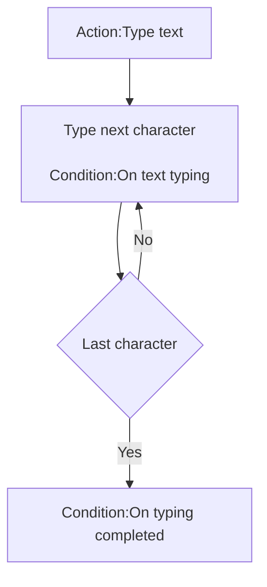

# [Categories](categories.index.html) > [Text](text.index.html) > rex_text_typing

## Introduction

Typing text.

## Links

- [Plugin](https://dl.dropboxusercontent.com/u/5779181/C2Repo/Zip/behaviors/rex_text_typing.7z)
- [ACE table](https://rexrainbow.github.io/C2RexDoc/c2rexpluginsACE/behavior_rex_text_typing.html)
- [Discussion thread](https://www.scirra.com/forum/behavior-typing-for-text-sprite-font-plugin_t67927)

----

[TOC]

## Dependence

- One of these plugins
  - [official text](https://www.scirra.com/manual/116/text)
  - [official sprite font](https://www.scirra.com/manual/166/sprite-font)
  - [rex_tagtext](rex_tagtext.html)
  - [rex_bbcodetext](rex_bbcodetext.html)
- [rex_timeline](rex_timeline.html)

## Usage

1. Put this behavior under
   - [official text](https://www.scirra.com/manual/116/text)
   - [official sprite font](https://www.scirra.com/manual/166/sprite-font)
   - [rex_tagtext](rex_tagtext.html)
   - [rex_bbcodetext](rex_bbcodetext.html)
2. `Action:Type text`, to start typing
3. Type next character
   - `Condition:On text typing`
   - `Condition:Is text typing`, returns true
   - `Expression:TypingIndex`
   - Timer of typing
     - Typing speed
       - `Action:Set typing speed`
       - `Expression:TypingSpeed `
     - Timer control
       - `Action:Stop typing`
         - Stop at current character, or show all text
       - `Action:Pause typing`
       - `Action:Resume typing`
     - `Action:Setup`, to assign timeline object, if there are more then one [rex_timeline](rex_timeline.html) object
   - `Action:Append text `
4. Type last character
   - `Condition:On typing completed`