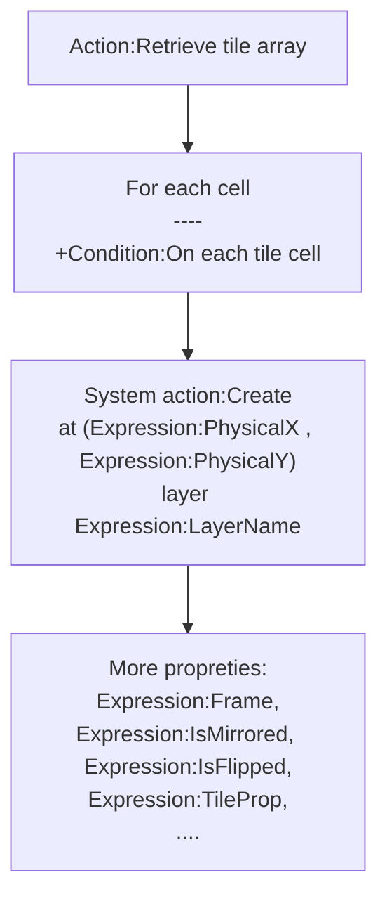
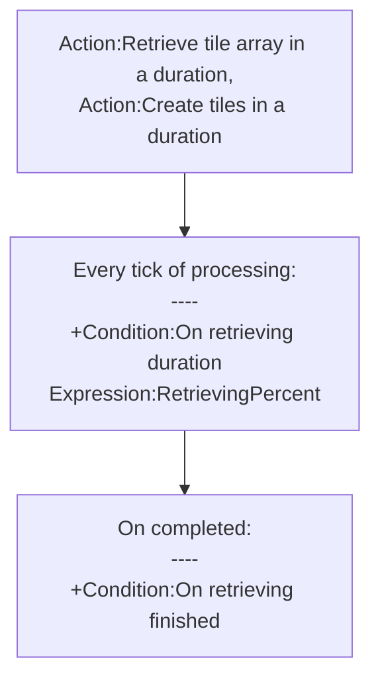
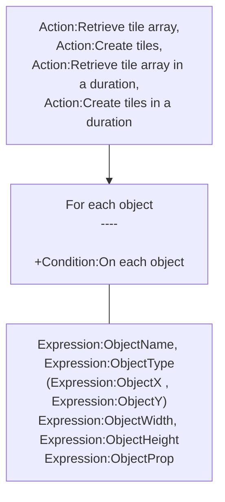

# [Categories](categories.index.html) > [Board](board.index.html) > rex_tmx_importer_v2

## Introduction

Retrieve or create tiles by tmx string which is the exported file of [tile map editor](http://www.mapeditor.org/).

## Links

- [Plugin](https://dl.dropboxusercontent.com/u/5779181/C2Repo/Zip/plugins/rex_tmx_importer_v2.7z)

- [ACE table](https://rexrainbow.github.io/C2RexDoc/c2rexpluginsACE/plugin_rex_tmx_importer_v2.html)

- [Discussion thread](https://www.scirra.com/forum/plugin-rex-tmx-importer-v2_t103854)

----

[TOC]

## Dependence

- [rex_tmx_JSON_parser](rex_tmx_json_parser.html), or 
- [rex_tmx_XML_parser](rex_tmx_xml_parser.html)

## Usage

[Sample capx](https://onedrive.live.com/redir?resid=7497FD5EC94476E!558&authkey=!AMbD2IBIdygRjWE&ithint=file%2c.capx)

### Import tmx file

Calls `Action:Import tmx` to import tmx string with a parser.

- [rex_tmx_JSON_parser](rex_tmx_json_parser.html), to parse tmx in JSON format
- [rex_tmx_XML_parser](rex_tmx_xml_parser.html), to parse tmx in XML format

### Offset of tiles

The offset of tiles is defined in 

- property `X at (0,0)`, `Y at (0,0)`, or
- `Action:Set instance position of (0,0)`. 

It affects the created tiles (`Action:Create tiles`, or `Action:Create tiles in a duration`), and `Expression:PhysicalX`, `Expression:PhysicalY`.

### Create tiles

Calls one of these action after importing tmx string  (`Action:Import tmx`)

#### Single tick mode

- `Action:Retrieve tile array`, retrieves each cell in a single tick.
  - Trigger `Condition:On each tile cell` for each cell
    - Create tile instance manually by `System action:Create` 
      - at physical position (`Expression:PhysicalX ` , `Expression:PhysicalY`), 
      - layer `Expression:LayerName` , and 
      - frame index to `Expression:Frame`
    - More properties of tiles
      - `Expression:TileID`
      - (`Expression:LogicX`, `Expression:LogicY`)
      - ``Expression:IsMirrored`, `Expression:IsFlipped`
      - `Expression:TileProp( name )`
    - Properties of layer
      - `Expression:LayerProp( name )`, 
      - `Expression:LayerOpacity`
    - Properties of tileset
      - `Expression:TilesetName`
      - `Expression:TilesetProp( name )`
      - `Expression:ImageSource`, `Expression:ImageWidth`, `Expression:ImageHeight`
    - And properties of map
      - `Expression:MapProp( name )`
      - `Expression:BackgroundColor`
      - `Expression:MapWidth` , `Expression:MapHeight`
      - `Expression:TileWidth`, `Expression:TileHeight`
      - `Expression:TotalWidth`, `Expression:TotalHeight`
      - `Expression:POX`, `Expression:POY`

- `Action:Create tiles`, creates tile instances at the layer with the same name defined in tmx string, in a single tick.
  - Triggers `Condition:On each tile cell` for each cell, and picks created instance into SOL.

#### Multiple ticks mode

- `Action:Retrieve tile array in a duration`, retrieves each cell in multiple ticks. ([sample capx](https://onedrive.live.com/redir?resid=7497FD5EC94476E!2153&authkey=!AE_Wp947VpMJrPQ&ithint=file%2ccapx))
  - Triggers `Condition:On each tile cell` for each cell.
  - Triggers `Condition:On retrieving duration` for each processing tick, 
    - `Expression:RetrievingPercent`, to get percentage of processing
  - Triggers `Condition:On retrieving finished` when processing completed.
  - Set processing time of each tick in property `Processing time`
    - processing time = (1/60) * `Processing time` second, assume that 1 tick = 1/60 second
- `Action:Create tiles in a duration`, creates tile instances in multiple ticks.

### Release tmx object

Calls `Action:Release tmx object` to release parsing result from memory.

DO NOT release tmx object during retrieving processing (`Action:Retrieve tile array in a duration`, `Action:Create tiles in a duration`)

### Object layer

It retrieves object layers under `Condition:On each object` , get properties of object by

- `Expression:ObjectName`, `Expression:ObjectType`, 
- (`Expression:ObjectX ` , `Expression:ObjectY`) , logical position
- `Expression:ObjectWidth`, `Expression:ObjectHeight `
- `Expression:ObjectProp( name )`

### Retrieve properties

#### Retrieve properties

- `Condition:For each map property`, to retrieve map properties
  - `Expression:CurMapPropName`, `Expression:CurMapPropValue`
- `Condition:For each layer property`, to retrieve layer properties
  - `Expression:CurLayerPropName`, `Expression:CurLayerPropValue`
- `Condition:For each tileset property`, to retrieve tileset properties
  - `Expression:CurTilesetPropName`, `Expression:CurTilesetPropValue`
- `Condition:For each tile property`, to retrieve tile properties
  - `Expression:CurTilePropName`, `Expression:CurTilePropValue`

#### Retrieve layers

`Condition:For each layer`, to retrieve layers, 

- `Expression:LayerName`
- `Condition:For each layer property` , to retrieve layer properties

#### Retrieve tiles at logic X,Y

[Sample capx](https://onedrive.live.com/redir?resid=7497FD5EC94476E!2156&authkey=!AB9QYNUJqBaf9JI&ithint=file%2ccapx)
Call `Condition:For each tile at logic XY` to get properties of tiles at logic X,Y, to create a part of tiles in a specific logic position.

------

### Configure board object

Configure these objects to store tiles in [rex_board](http://c2rexplugins.weebly.com/rex_board.html) object.

- [Board](rex_board.html)

| Action of board         | Expression of TMX    |
| ----------------------- | -------------------- |
| Action:Set board width  | Expression:MapWidth  |
| Action:Set board height | Expression:MapHeight |

- [Square layout](rex_board_squaretx.html)

| Action of squareTx               | Expression of TMX                        |
| -------------------------------- | ---------------------------------------- |
| Action:Set orientation by number | Expression:IsIsometric                   |
| Action:Set cell size             | Expression:TileWidth, Expression:TileHeight |

- [Hexagon layout](rex_board_hextx.html)

| Action of hexTx             | Expression of TMX                        |
| --------------------------- | ---------------------------------------- |
| Action:Set layout by number | Expression:IsUp2Down, Expression:IsIndent |
| Action:Set cell size        | Expression:TileWidth, Expression:TileHeight |

----

### Filling tilemap

[Sample capx](https://onedrive.live.com/redir?resid=7497FD5EC94476E!2206&authkey=!AJm76TJpfXwW-wc&ithint=file%2ccapx)
Calls `Action:Reset tilemap` to resize the [official tilemap object](https://www.scirra.com/manual/172/tilemap) and fill tile ID with a tmx layer.

----

### Official save/load

[Sample capx](https://onedrive.live.com/redir?resid=7497FD5EC94476E!2157&authkey=!AFGyKtekHqaMV_8&ithint=file%2ccapx)
This plugin support official save/load.