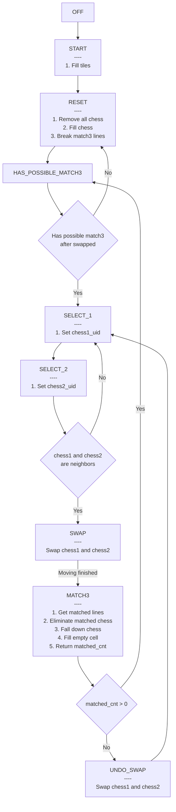
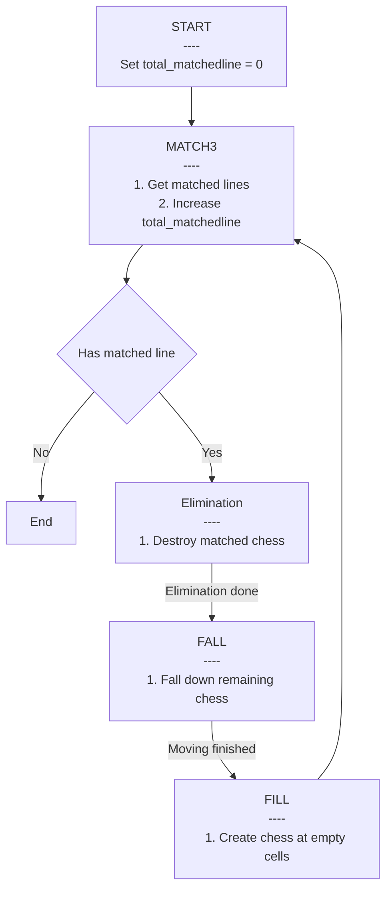

# [Categories](categories.index.html) > [Board](board.index.html) > Bejeweled

- Last updated: 12/15/2016
- [Live demo](https://rexrainbow.github.io/C2Demo/Bejeweled/index.html)
  - Drag two chess to swap them
- [Source capx](https://1drv.ms/u/s!Am5HlOzVf0kHjxm7K2q2LwBSTF3a)
- [Discussion thread](https://www.scirra.com/forum/bejeweled-plugins-demo_t78318)

----

[TOC]

## Related plugins

- [Finite state machine](https://rexrainbow.github.io/C2RexDoc/plugins.md/rex_gfsm.html)
- [Board](https://rexrainbow.github.io/C2RexDoc/plugins.md/rex_board.html)
  - [SquareTx](https://rexrainbow.github.io/C2RexDoc/plugins.md/rex_board_squaretx.html)
  - [Matching](https://rexrainbow.github.io/C2RexDoc/plugins.md/rex_matcher.html)
  - [Grid Move](https://rexrainbow.github.io/C2RexDoc/plugins.md/rex_grid_move.html)
- Wait event

## Flow chart

### State matchine of main

Event sheets

- E_main
- FSM-main
- Board
- UI

### State matchine of MATCH3

Event sheets

- FSM-match3
- FSM-match3-MATCH3
- FSM-match3-ELIMINATION
- FSM-match3-FALL

## State machine

### Main state machine

- **OFF **
  - Event sheet: *FSM-main*
  - Initial state
  - Steps
    1. Go to **START**
- **START**
  - Event sheet: *FSM-main*, *Board*
  - Steps
    1. Fill tiles
       - `Call "Board.Init"`
         - Board size is *10x20*, separated in up and down parts
           - Bottom part:
             - 10x10
             - visible, swap chess and eliminate match3
           - Top part
             - 10x10
             - invisible, to drop chess down
       - Symbol of each chess is its frame index
         - Event sheet: *Board*, `Chess Condition: On created`
    2. Go to **RESET**
- **RESET**
  - Event sheet: *FSM-main*, *Board*
  - Fill chess and exclude all match3 lines
  - Steps
    1. `Call "Board.Reset"`
       1. Destroy all chess
       2. Fill empty cells
          - `Call "Board.Fill"`
       3. Exclude all match3 lines
          - `Call "Boad.BreakMatch3"`
            1. For each match3 line (tiles)
               1. Pick a random chess on these tiles
               2. Change frame index to a different frame of all neighbors
    2. Go to **HAS_POSSIBLE_MATCH3**
- **HAS_POSSIBLE_MATCH3**
  - Event sheet: *FSM-main*, *Board*
  - Test if there has any possible match3 line *after swapped*
  - Steps
    1. `Call "Board.HasMatch3AfterSwapped"`
       1. For each chess
          1. `Call "testSwap"`, has match3 after swapped with its right neighbor?
             1. Swap with neighbor
             2. has any match3
             3. Swap back
          2. `Call "testSwap"`, has match3 after swapped with its right neighbor?
          3. Stop testing when found a possible match3
    2. If found a posible match3
       - Go to **SELECT_1**
       - Else, go to **RESET**
- **SELECT_1**
  - Event sheet: *FSM-main*
  - Get `chess_uid1` from input (touch)
  - Steps
    1. On touch
       1. Set `chess_uid1`
       2. Go to **SELECT_2**
- **SELECT_2**
  - Event sheet: *FSM-main*
  - Get `chess_uid2` from input (touch), and make sure chess_uid1 and chess uid2 are neighbors
  - Steps
    1. On touch end
       1. Set `chess_uid2`
       2. If `chess_uid1` and `chess uid2` are neighbors
          - Go to **SWAP**
          - Else, go to **SELECT_1**
- **SWAP**
  - Event sheet: *FSM-main*
  - Swap `chess_uid1` and `chess_uid2`
  - Steps
    1. Swap `chess_uid1` and `chess_uid2`
    2. Wait a moment
    3. Go to **MATCH3**
- **MATCH3**
  - Event sheet: *FSM-main*, *FSM-match3*
  - Run sub state machine **match3** until finished
  - Steps
    1. Invoke sub state machine **match3**, with callback `On function "FSM.main.MATCH3.request"`
    2. `On function "FSM.main.MATCH3.request"`, to get total matched lines
       1. If amount of total matched lines = 0
          - Go to **UNDO_SWAP**
          - Else, go to **HAS_POSSIBLE_MATCH3**
- **UNDO_SWAP**
  - Event sheet: *FSM-main*
  - Swap `chess_uid1` and `chess_uid2`
  - Steps
    1. Swap `chess_uid1` and `chess_uid2`
    2. Wait a moment
    3. Go to **SELECT_1**

### Sub state machine match3

- **START**

  - Event sheet: *FSM-match3*
  - Initial variables
  - Steps
    1. Set `total_matchedlines` = 0
    2. Go to **MATCH3**

- **MATCH3**

  - Event sheet: *FSM-match3-MATCH3*

  - Get matched lines

  - Steps

    1. Set `matchedline` = 0, which is the *index of matched lines*

    2. Get matched lines in group `match-1`...`match-matchedline`

       1. *Pick match5 line*. For each match5 line
          1. Add 1 to `matchedline`
          2. Copy line to group ``"match-" & match3.matchedlines``
       2. *Pick match4 line*. For each match4 line
          1. If this line is *Not* a sub set of current matched lines (A match5 contains 2 match4 lines)
             1. Add 1 to `matchedline`
             2. Copy line to group ``"match-" & match3.matchedlines``
       3. *Pick match3 line*. For each match3 line
          1. If this line is *Not* a sub set of current matched lines (A match4/match5 contains 2/3 match3 lines)
             1. Add 1 to `matchedline`
             2. Copy line to group `"match-" & match3.matchedlines`
       4. (Optional) Get intersection chess of matched lines
          1. For each 2 matched lines i and j
             1. Set group "intersect" is  line i *AND* line j
                1. If group "intersect" is not empty
                   1. line i and line j has intersection

       - All instances in matched lines are *tiles*

    3. If `matchedline` = 0

       - Go to **END**
       - Else, go to **ELIMINATION**

- **ELIMINATION**

  - Event sheet: *FSM-match3-ELIMINATION*
  - Destroy matched chess
  - Steps
    1. Pick chess above matched tile
    2. Fade out chess
    3. Wait a moment
    4. Go to **FALL**

- **FALL**

  - Event sheet: *FSM-match3-FALL*

  - Fall down all chess

  - Steps

    1. `Call "Bord.Fall"`, with callback `On function "match3.OnFallComplete"`

       1. For each cell, *bottom to top*
       2. Pick chess
       3. (Move down chess if possible) If can move down
          1. Move chess down
          2. Add a wait event

       - `Grid move condition:On hit target`
         1. Remove a wait event
       - `Wait event condition:On all event finished`
         1. Invoke callback

    2. `On function "match3.OnFallComplete"`

       1. Go to **FILL**

- **FILL**

  - Event sheet: *FSM-match3*
  - Fill empty cells
  - Steps
    1. `Call "Board.Fill"`
    2. Go to **MATCH3**

- **END**

  - Event sheet: *FSM-match3*
  - Invoke callback
  - Steps
    1. `Call match3.callback`

### Symbol of tile

- Event sheet: *Board*, `Matcher condition:On get symbol`
  1. If tile is in bottom part
  2. Pick chess above this tile
  3. Set symbol to frame index of chess

----

## How to

- Change board size
  - Property `Width`, `Height` of board object
- Control the frame of new chess
  - Event sheet: *Board*, `Chess Condition: On created`
- Select two swapping chess
  - Event sheet: *FSM-main*, state **SELECT_1**. **SELECT_2**
- Symbol of tile
  - Event sheet: *Board*, `Matcher condition:On get symbol`
- Add matching rules
  - Event sheet: *FSM-match3-MATCH3*
- Add chess elimination rules
  - Event sheet: *FSM-match3-ELIMINATION*
- Modify chess falling
  - Event sheet: *FSM-match3-FALL*